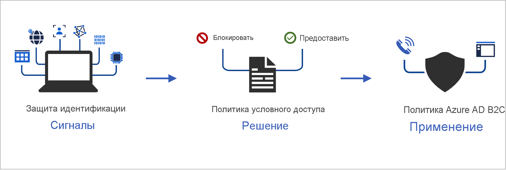
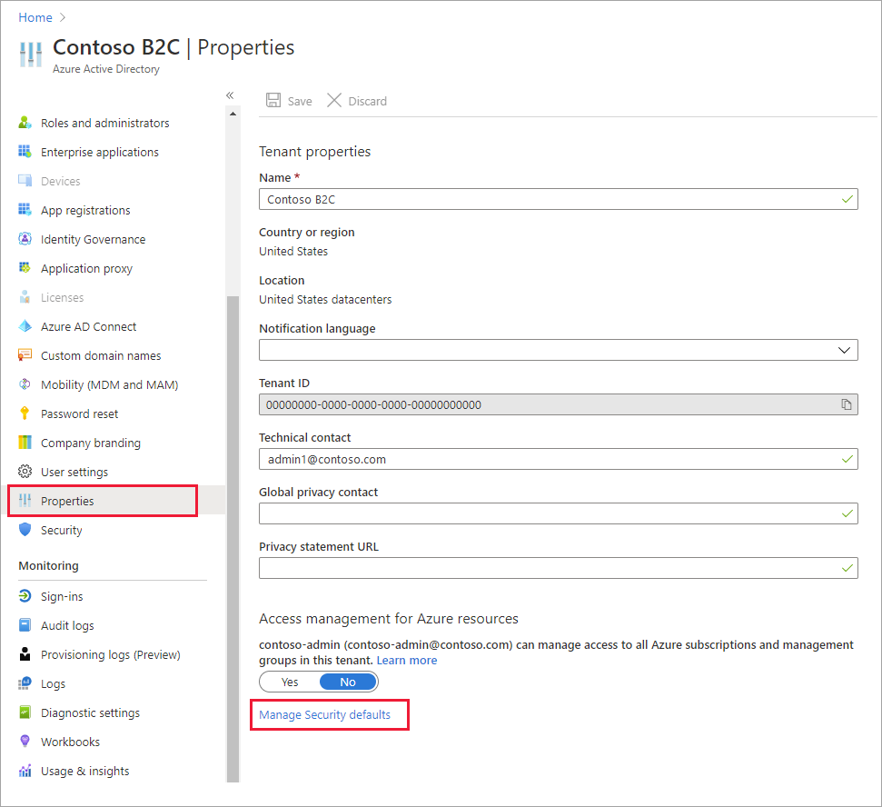
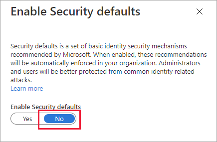
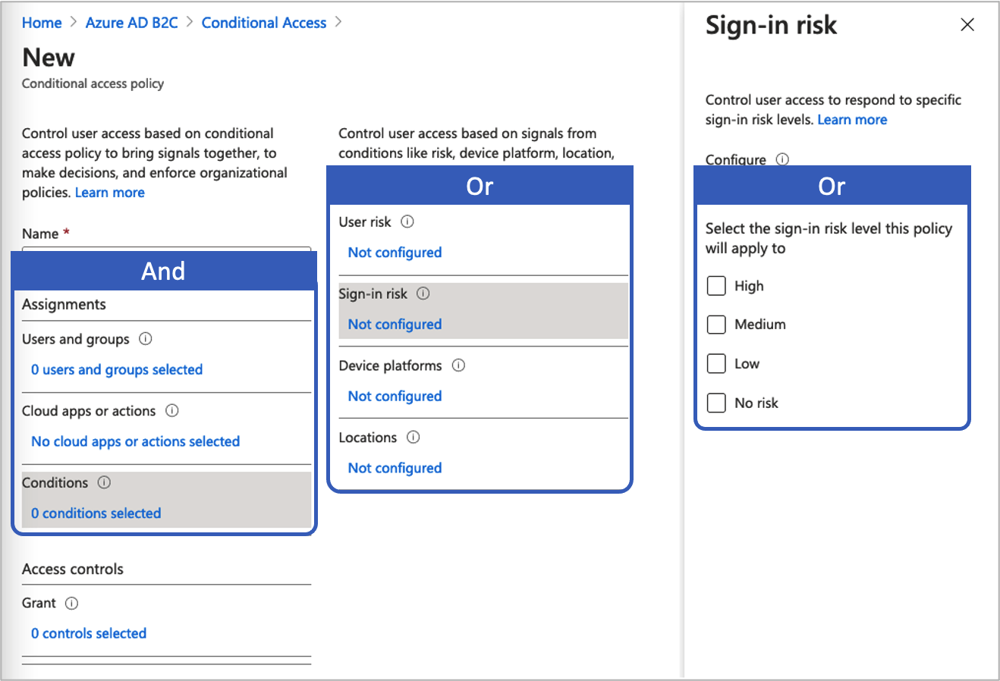

# <a name="add-conditional-access-to-user-flows-in-azure-active-directory-b2c"></a>Добавление условного доступа к потокам пользователей в Azure Active Directory B2C

[!INCLUDE [active-directory-b2c-choose-user-flow-or-custom-policy](../../includes/active-directory-b2c-choose-user-flow-or-custom-policy.md)]

В потоки пользователей или настраиваемые политики Azure Active Directory B2C (Azure AD B2C) можно добавить функцию условного доступа для управления рискованными входами в приложения. Условный доступ Azure Active Directory (Azure AD) — это средство, которое помогает Azure AD B2C объединять сигналы, принимать решения и применять политики организации.



Автоматизация оценки рисков с помощью условий политики позволяет моментально обнаруживать рискованные входы и исправлять их либо блокировать.

[!INCLUDE [b2c-public-preview-feature](../../includes/active-directory-b2c-public-preview.md)]

## <a name="service-overview"></a>Обзор службы

Azure AD B2C оценивает каждое событие входа и обеспечивает соблюдение всех требований политики, прежде чем предоставить пользователю доступ. На этапе **оценки** служба условного доступа оценивает сигналы, собранные во время событий входа с помощью функции Защиты идентификации по обнаружению рисков. В результате этого процесса оценки создается набор утверждений, указывающий, следует ли предоставить или заблокировать вход. Политика Azure AD B2C использует эти утверждения для выполнения действий в потоке пользователя, например чтобы заблокировать доступ или предложить пользователю пройти одну из процедур восстановления доступа, в частности многофакторную проверку подлинности (MFA). Блокировка доступа переопределяет все остальные параметры.

::: zone pivot="b2c-custom-policy"
В следующем примере показан технический профиль условного доступа, который используется для оценки угрозы входа.

```XML
<TechnicalProfile Id="ConditionalAccessEvaluation">
  <DisplayName>Conditional Access Provider</DisplayName>
  <Protocol Name="Proprietary" Handler="Web.TPEngine.Providers.ConditionalAccessProtocolProvider, Web.TPEngine, Version=1.0.0.0, Culture=neutral, PublicKeyToken=null" />
  <Metadata>
    <Item Key="OperationType">Evaluation</Item>
  </Metadata>
  ...
</TechnicalProfile>
```

::: zone-end

На этапе **восстановления доступа**, который следует за оценкой, пользователю предлагается пройти многофакторную проверку подлинности. После завершения Azure AD B2C информирует службу Защиты идентификации, что обнаруженная угроза входа была устранена и как именно. В этом примере Azure AD B2C сигнализирует, что пользователь успешно прошел многофакторную проверку подлинности. 

::: zone pivot="b2c-custom-policy"

В следующем примере показан технический профиль условного доступа, используемый для устранения обнаруженной угрозы.

```XML
<TechnicalProfile Id="ConditionalAccessRemediation">
  <DisplayName>Conditional Access Remediation</DisplayName>
  <Protocol Name="Proprietary" Handler="Web.TPEngine.Providers.ConditionalAccessProtocolProvider, Web.TPEngine, Version=1.0.0.0, Culture=neutral, PublicKeyToken=null"/>
  <Metadata>
    <Item Key="OperationType">Remediation</Item>
  </Metadata>
  ...
</TechnicalProfile>
```

::: zone-end

## <a name="components-of-the-solution"></a>Компоненты решения

Следующие компоненты обеспечивают условный доступ в Azure AD B2C.

- **Поток пользователя** или **настраиваемая политика**, регламентирующие процесс входа или регистрации пользователя.
- **Политика условного доступа**, которая объединяет сигналы для принятия решений и применения политик организации. Когда пользователь входит в приложение с помощью политики Azure AD B2C, политика условного доступа использует сигналы Защиты идентификации Azure AD для обнаружения рискованных входов и предоставляет соответствующее действие по исправлению.
- **Зарегистрированное приложение**, направляющее пользователей соответствующему потоку пользователя или настраиваемой политике Azure AD B2C.
- [Браузер TOR](https://www.torproject.org/download/) для имитации рискованного входа в систему.

## <a name="service-limitations-and-considerations"></a>Ограничения службы и рекомендации

При использовании условного доступа Azure AD учитывайте следующие аспекты.

- Защита идентификации доступна для локальных удостоверений и удостоверений социальных сетей, таких как Google или Facebook. Для удостоверений социальных сетей условный доступ необходимо активировать вручную. Возможности обнаружения ограничены, так как учетными данными учетных записей социальной сети управляет внешний поставщик удостоверений.
- В клиентах Azure AD B2C доступно только подмножество политик [условного доступа Azure AD](../active-directory/conditional-access/overview.md).


## <a name="prerequisites"></a>Предварительные требования

[!INCLUDE [active-directory-b2c-customization-prerequisites-custom-policy](../../includes/active-directory-b2c-customization-prerequisites-custom-policy.md)]

## <a name="pricing-tier"></a>Ценовая категория

Для создания политик рискованного входа требуется Azure AD B2C **Premium P2**. Клиенты уровня **Premium P1** могут создавать политики на основе расположения, приложения, пользователя или группы. Подробнее см. в разделе [Изменение ценовой категории Azure AD B2C](billing.md#change-your-azure-ad-pricing-tier)

## <a name="prepare-your-azure-ad-b2c-tenant"></a>Подготовка клиента Azure AD B2C

Чтобы добавить политику условного доступа, отключите заданные по умолчанию параметры безопасности.

1. Войдите на [портал Azure](https://portal.azure.com/).
2. Выберите значок **Каталог и подписка** в верхней панели инструментов портала, а затем выберите каталог, содержащий клиент Azure AD B2C.
3. В разделе **Службы Azure** выберите **Azure AD B2C**. Или используйте поле поиска, чтобы найти и выбрать **Azure AD B2C**.
4. Выберите **Свойства** и **Управление параметрами безопасности по умолчанию**.

   

5. В разделе **Включить параметры безопасности по умолчанию** выберите значение **Нет**.

   

## <a name="add-a-conditional-access-policy"></a>Добавление политики условного доступа

Политика условного доступа — это инструкция с условиями для назначений и управления доступом. Она объединяет сигналы для принятия решений и применения политик организации. Между назначениями устанавливается логический оператор *И*. Внутри назначений используется оператор *ИЛИ*.



Чтобы добавить политику условного доступа, выполните следующие действия.

1. На портале Azure найдите и выберите **Azure AD B2C**.
1. В разделе **Безопасность** выберите **Условный доступ (предварительная версия)** . Откроется страница **Политики условного доступа**.
1. Щелкните **+ Создать политику**.
1. Укажите имя политики, например *Блокировка рискованного входа*.
1. В разделе **Назначения** откройте **Пользователи и группы** и выберите одну из следующих поддерживаемых конфигураций.

    |Включение  |Лицензия | Примечания  |
    |---------|---------|---------|
    |**Все пользователи** | P1, P2 |Если вы выберете параметр **Все пользователи**, эта политика повлияет на всех пользователей. Чтобы случайно не заблокировать себя, исключите учетную запись администратора. Для этого в разделе **Исключить** выберите **Роли каталога**, а затем пункт **Глобальный администратор**. Можно также открыть раздел **Пользователи и группы** и выбрать свою учетную запись в списке **Выбор исключенных пользователей**.  | 
 
1. Выберите пункт **Облачные приложения или действия** и щелкните **Выбрать приложения**. Найдите [приложение проверяющей стороны](tutorial-register-applications.md).

1. Откройте **Условия** и выберите требуемое из следующих условий. Например, выберите **Риск при входе** и его уровни: **Высокий**, **Средний** и **Низкий**.
    
    |Условие  |Лицензия  |Примечания  |
    |---------|---------|---------|
    |**Риск пользователя**|P2|Риск пользователя обозначает вероятность того, что данное удостоверение или учетная запись скомпрометированы.|
    |**Риск при входе**|P2|Риск при входе указывает на вероятность того, что данный запрос проверки подлинности отправлен не владельцем удостоверения.|
    |**Платформы устройств**|Не поддерживается| Зависит от операционной системы, управляющей устройством. Подробнее см. в разделе [Платформы устройств](../active-directory/conditional-access/concept-conditional-access-conditions.md#device-platforms).|
    |**Расположения**|P1, P2|Именованные расположения могут включать сведения об общедоступной сети IPv4, стране или регионе, а также о неизвестных областях, не соответствующих определенным странам или регионам. Дополнительные сведения см. в разделе [Расположения](../active-directory/conditional-access/concept-conditional-access-conditions.md#locations). |
 
1. В разделе **Элементы управления доступом** выберите **Предоставить**. Затем укажите, следует ли блокировать или предоставлять доступ.
    
    |Параметр  |Лицензия |Примечание  |
    |---------|---------|---------|
    |**Блокировка доступа**|P1, P2| Предотвращает доступ на основе условий, указанных в этой политике условного доступа.|
    |**Разрешить доступ** с параметром **Требовать многофакторную проверку подлинности**|P1, P2|В соответствии с условиями, указанными в этой политике условного доступа, пользователь должен пройти многофакторную проверку подлинности Azure AD B2C.|

1. В разделе **Включить политику** выберите один из следующих параметров.
    
    |Параметр  |Лицензия |Примечание  |
    |---------|---------|---------|
    |**Только отчет**|P1, P2| Режим “Только отчет” позволяет администраторам оценить влияние политик условного доступа, прежде чем активировать их в своей среде. Мы рекомендуем проверить политику с помощью этого состояния и определить последствия для конечных пользователей, не прибегая к многофакторной проверке подлинности или блокировке пользователей. Подробнее см. разделе [Проверка результатов условного доступа в отчете об аудите](#review-conditional-access-outcomes-in-the-audit-report).|
    | **On** (Вкл.)| P1, P2| Политика доступа оценивается, но не применяется. |
    | **Выключено** | P1, P2| Политика доступа не активирована и не влияет на пользователей. |

1. Включите тестовую политику условного доступа, нажав кнопку **Создать**.

## <a name="add-conditional-access-to-a-user-flow"></a>Добавление условного доступа к потоку пользователя

Добавив политику условного доступа Azure AD, включите условный доступ в потоке пользователя или настраиваемой политике. При включении условного доступа не нужно указывать имя политики.

К одному пользователю можно в любой момент применить несколько политик условного доступа. В этом случае приоритет получит самая строгая политика управления доступом. Например, если одна политика требует проходить многофакторную проверку подлинности (MFA), а другая блокирует доступ, пользователь будет заблокирован.

## <a name="enable-multi-factor-authentication-optional"></a>Включение многофакторной проверки подлинности (необязательно)

При добавлении условного доступа к потоку пользователя рекомендуется использовать **многофакторную проверку подлинности (MFA)** . Для этого можно сообщить пользователю одноразовый код в SMS или голосовом сообщении либо отправить одноразовый пароль на электронную почту. Параметры MFA не зависят от параметров условного доступа. Вы можете указать для MFA режим **Всегда включено**, чтобы многофакторная проверка подлинности применялась всегда независимо от конфигурации условного доступа. Также можно указать для MFA режим **Условный**, чтобы многофакторная проверка подлинности применялась, только когда этого требует активная политика условного доступа.

> [!IMPORTANT]
> Если политика условного доступа предоставляет доступ с помощью MFA, пользователь, не зарегистрировавший номер телефона, может быть заблокирован.

::: zone pivot="b2c-user-flow"

Чтобы включить условный доступ для потока пользователя, убедитесь, что версия поддерживает эту функцию. Такие версии потоков пользователей помечены как **рекомендуемые**.

1. Войдите на [портал Azure](https://portal.azure.com).

1. Выберите значок **Каталог и подписка** в верхней панели инструментов портала, а затем выберите каталог, содержащий клиент Azure AD B2C.

1. В разделе **Службы Azure** выберите **Azure AD B2C**. Или используйте поле поиска, чтобы найти и выбрать **Azure AD B2C**.

1. В разделе **Политики** выберите **Потоки пользователей**. Затем выберите поток пользователя.

1. Щелкните **Свойства** и убедитесь, что поток пользователя поддерживает условный доступ. Для этого проверьте параметр **Условный доступ**.
 
   

1. В разделе **Многофакторная проверка подлинности** выберите нужный **метод MFA**, а затем в разделе **Принудительное применение MFA** выберите вариант **Условный (рекомендуется)** .
 
1. В разделе **Условный доступ** установите флажок **Принудительное применение политик условного доступа**.

1. Щелкните **Сохранить**.


::: zone-end

::: zone pivot="b2c-custom-policy"

## <a name="add-conditional-access-to-your-policy"></a>Добавление условного доступа в политику

1. Пример политики условного доступа можно найти на [GitHub](https://github.com/azure-ad-b2c/samples/tree/master/policies/conditional-access).
1. Замените строку `yourtenant` именем вашего клиента Azure AD B2C в каждом файле. Например, если имя вашего клиента B2C — *contosob2c*, все экземпляры `yourtenant.onmicrosoft.com` должны иметь вид `contosob2c.onmicrosoft.com`.
1. Отправьте файлы политики.

## <a name="test-your-custom-policy"></a>Тестирование настраиваемой политики

1. Выберите политику `B2C_1A_signup_signin_with_ca` или `B2C_1A_signup_signin_with_ca_whatif`, чтобы открыть соответствующую страницу обзора. Выберите **Выполнить поток пользователя**. В поле **Приложение** выберите *webapp1*. В поле **URL-адрес ответа** должно содержаться значение `https://jwt.ms`.
1. Скопируйте URL-адрес в разделе **Конечная точка выполнения потока пользователя**.

1. Чтобы имитировать рискованный вход, откройте [браузер Tor](https://www.torproject.org/download/) и используйте скопированный в предыдущем шаге URL-адрес, чтобы войти в зарегистрированное приложение.

1. Введите требуемые сведения на странице входа и попробуйте выполнить вход. Токен должен вернуться по адресу `https://jwt.ms` и отобразиться пользователю. В декодированном токене jwt.ms вы увидите, что вход был заблокирован.

::: zone-end

::: zone pivot="b2c-user-flow"

## <a name="test-your-user-flow"></a>Тестирование потока пользователя

1. Выберите созданный поток пользователя, чтобы открыть соответствующую страницу обзора, а затем щелкните **Выполнить поток пользователя**. В поле **Приложение** выберите *webapp1*. В поле **URL-адрес ответа** должно содержаться значение `https://jwt.ms`.

1. Скопируйте URL-адрес в разделе **Конечная точка выполнения потока пользователя**.

1. Чтобы имитировать рискованный вход, откройте [браузер Tor](https://www.torproject.org/download/) и используйте скопированный в предыдущем шаге URL-адрес, чтобы войти в зарегистрированное приложение.

1. Введите требуемые сведения на странице входа и попробуйте выполнить вход. Токен должен вернуться по адресу `https://jwt.ms` и отобразиться пользователю. В декодированном токене jwt.ms вы увидите, что вход был заблокирован.

::: zone-end

## <a name="review-conditional-access-outcomes-in-the-audit-report"></a>Проверка результатов условного доступа в отчете об аудите

Чтобы проверить результат события условного доступа, выполните следующие действия:

1. Войдите на [портал Azure](https://portal.azure.com/).

2. Выберите значок **Каталог и подписка** в верхней панели инструментов портала, а затем выберите каталог, содержащий клиент Azure AD B2C.

3. В разделе **Службы Azure** выберите **Azure AD B2C**. Или используйте поле поиска, чтобы найти и выбрать **Azure AD B2C**.

4. В разделе **Действия** выберите **Журналы аудита**.

5. Отфильтруйте журнал аудита, задав для параметра **Категория** значение **B2C**, а для параметра **Тип ресурса действия** — значение **IdentityProtection**. Затем выберите **Применить**.

6. Проверьте действия аудита за последние семь дней. В отчет включаются следующие типы действий:

   - **Evaluate conditional access policies** (Оценка политик условного доступа). Эта запись журнала аудита указывает, что во время проверки подлинности выполнялась проверка условного доступа.
   - **Remediate user** (Восстановление доступа пользователей). Эта запись указывает, что пользователь выполнил процедуру предоставления разрешения или обеспечил требования политики условного доступа, и информация об этом действии передана в подсистему оценки риска, чтобы смягчить (снизить) уровень риска для этого пользователя.

7. Выберите в списке запись журнала **Evaluate conditional access policy** (Оценка политик условного доступа), чтобы открыть страницу **Сведения о действиях. Журнал аудита**, на которой отображаются идентификаторы журналов аудита, а также сведения из раздела **Дополнительные сведения**:

   - **ConditionalAccessResult.** Предоставление разрешения, требуемое для оценки политики условного доступа.
   - **AppliedPolicies.** Список всех включенных политик условного доступа, условия которых были выполнены.
   - **ReportingPolicies.** Список политик условного доступа с установленным режимом "только отчет", условия которых были выполнены.

## <a name="next-steps"></a>Дальнейшие действия

[Настройка пользовательского интерфейса в потоке пользователя Azure AD B2C](customize-ui-with-html.md)
