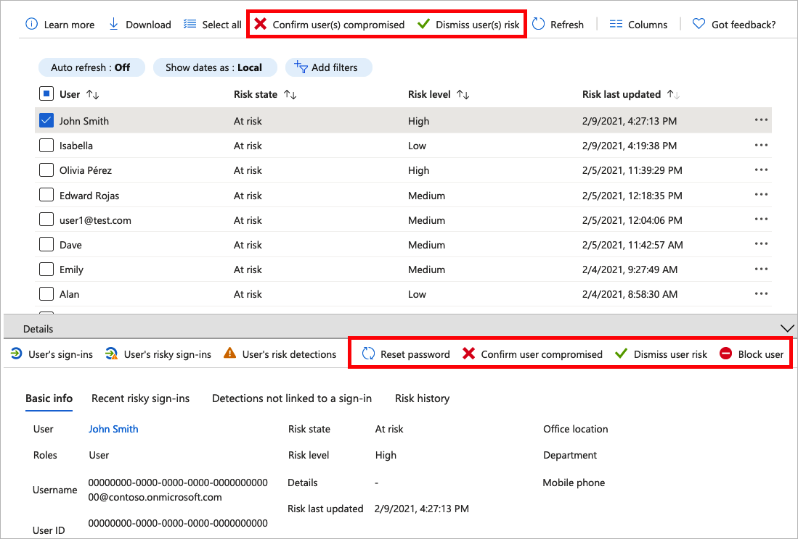

# Исследование рисков с помощью Защиты идентификации в Azure AD B2C

[!INCLUDE [b2c-public-preview-feature](../../includes/active-directory-b2c-public-preview.md)]

Защита идентификации обеспечивает постоянное обнаружение риска для клиента Azure AD B2C. Она позволяет организациям обнаруживать, исследовать и устранять риски на основе удостоверений. Служба "Защита идентификации" содержит отчеты о рисках, которые можно использовать для исследования рисков идентификации в клиентах Azure AD B2C. Их этой статьи вы узнаете, как исследовать и устранять риски.

## Обзор

Защита идентификации Azure AD B2C предоставляет два отчета. В отчете о *пользователях, совершающих рискованные действия,* администраторы могут найти пользователей, которые подвергаются риску, и сведения об обнаружении. Отчет об *обнаружении рисков* содержит сведения о каждом обнаружении рисков, включая сведения о типе, других рисках, активированных одновременно, расположении попытки входа и многое другое.

Каждый отчет содержит список всех обнаружений за период, показанный в верхней части отчета. С помощью фильтров в верхней части отчета можно фильтровать данные в отчете. Администраторы могут загрузить данные или использовать [MS API Graph и пакет SDK для Microsoft Graph PowerShell](../active-directory/identity-protection/howto-identity-protection-graph-api.md) для непрерывного экспорта данных.

## Ограничения службы и рекомендации

При использовании службы "Защита идентификации" учитывайте указанные ниже аспекты.

- Защита идентификации включена по умолчанию.
- Защита идентификации доступна для локальных удостоверений и удостоверений социальных сетей, таких как Google или Facebook. Для удостоверений социальных сетей необходимо активировать условный доступ. Возможности обнаружения ограничены, так как учетными данными учетных записей социальной сети управляет внешний поставщик удостоверений.
- В клиентах Azure AD B2C предоставляется только подмножество [обнаружений риска, существующих в Защите идентификации Azure AD](../active-directory/identity-protection/overview-identity-protection.md). Для Azure AD B2C поддерживаются указанные ниже обнаружения риска.  

|Тип обнаружения риска  |Описание  |
|---------|---------|
| Необычный переход     | Вход из необычного расположения (на основе недавних входов пользователя).        |
|Анонимный IP-адрес     | Вход с анонимного IP-адреса (например, браузер Tor, анонимайзеры VPN).        |
|IP-адрес, который помечен как вредоносный     | Вход с вредоносного IP-адреса.         |
|Неизвестные свойства входа     | Вход с использованием свойств, в последнее время не наблюдавшихся у пользователя.        |
|Подтвержденная администратором компрометация пользователя    | Администратор указал, что пользователь был скомпрометирован.             |
|Распыление пароля     | Вход с использованием атаки путем распыления пароля.      |
|Аналитика угроз Azure AD     | Источниками внутренней и внешней аналитики угроз Майкрософт обнаружено известный шаблон атак.        |

## Ценовая категория

Для некоторых функций Защиты идентификации требуется Azure AD B2C ценовой категории Premium P2. При необходимости [повысьте ценовую категорию Azure AD B2C до уровня Premium P2](./billing.md). В указанной ниже таблице перечислены функции Защиты идентификации и требуемая ценовая категория.  

|Функция   |P1   |P2|
|----------|:-----------:|:------------:|
|Отчет о пользователях, выполняющих рискованные действия     |&#x2713; |&#x2713; |
|Сведения отчета о пользователях, совершающих рискованные действия  | |&#x2713; |
|Отчет со сведениями об исправлении проблем пользователей, совершающих рискованные действия    | &#x2713; |&#x2713; |
|Отчет об обнаружении рисков   |&#x2713;|&#x2713;|
|Сведения об отчете об обнаружении рисков  ||&#x2713;|
|Скачивание отчета |  &#x2713;| &#x2713;|
|Доступ к MS API Graph |  &#x2713;| &#x2713;|

## Предварительные требования

[!INCLUDE [active-directory-b2c-customization-prerequisites](../../includes/active-directory-b2c-customization-prerequisites.md)]

## Изучение поведения пользователей, действия которых представляют риск

Информация, доступная в отчете о пользователях, выполняющих рискованные действия, поможет администратору найти следующие сведения:

- какие пользователи являются рискованными, были ли риски исправлены или отклонены?
- Детальные сведения об обнаружении
- Все события рисков при входе
- Журнал рисков
 
Затем администраторы могут предпринять действия с этими событиями. Администраторы могут:

- Сбросить пароль пользователя
- Подтвердить компрометацию пользователя
- Параметр "Закрыть уведомление о риске для пользователя"
- Блокировать вход для выбранного пользователя
- Изучать с помощью Azure ATP

### Перемещение по отчету о пользователях, совершающих рискованные действия

1. Войдите на [портал Azure](https://portal.azure.com/).

1. Выберите значок **Каталог и подписка** в верхней панели инструментов портала, а затем выберите каталог, содержащий клиент Azure AD B2C.

1. В разделе **Службы Azure** выберите **Azure AD B2C**. Или используйте поле поиска, чтобы найти и выбрать **Azure AD B2C**.

1. В разделе **Безопасность** выберите **Пользователи, выполняющие рискованные действия (предварительная версия)** .

   

    Выбор отдельных записей расширяет окно сведений под обнаружением. Детальный вид позволяет администраторам исследовать и выполнять действия при каждом обнаружении.

    

## Отчет об обнаружении рисков

Отчет об обнаружении потенциальных рисков содержит фильтруемые данные за последние 90 дней (3 месяца).

Информация, доступная в отчете об обнаружении рисков, поможет администратору найти следующие сведения:

- сведения о каждом обнаружении рисков, включая тип.
- Другие риски, активированные одновременно.
- Расположение попытки входа.

Затем администраторы могут вернуться к отчету о рисках или о входах пользователей для выполнения действий на основе собранных данных.

### Перемещение по отчету об обнаружении рисков

1. На портале Azure найдите и выберите **Azure AD B2C**.
1. В разделе **Безопасность** выберите **Обнаружение рисков (предварительная версия)** .

   

## Дальнейшие действия

- [Добавление условного доступа к пользовательскому потоку.](conditional-access-user-flow.md)