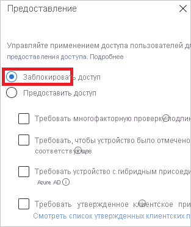
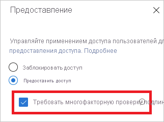

# Что такое диагностика входа в Azure AD?

Azure AD предоставляет гибкую модель безопасности для управления тем, что пользователи могут делать с управляемыми ресурсами. Контроль доступа к этим ресурсам учитывает не только то, **кто** вы, но и то, **как** именно вы обращаетесь к ресурсам. Как правило, гибкость связана с определенной степенью сложности, зависящей от числа вариантов конфигурации. Чем выше эта степень, тем выше риск возникновения ошибок.

Как ИТ-администратору вам требуется решение, которое предоставит определенные возможности анализа действий в системе, чтобы вы могли легко диагностировать и устранять возникающие проблемы. Пример такого решения — диагностика входа в Azure AD. Используйте диагностику для анализа событий, произошедших во время входа, и определения действий, которые можно предпринять для устранения проблем без участия специалистов службы поддержки Майкрософт.

В этой статье приводятся общие сведения о возможностях такого решения и способе его использования.

## Требования

Диагностика входа доступна во всех выпусках Azure AD.  Чтобы использовать ее, вы должны быть глобальным администратором в Azure AD.

## Принципы работы

В Azure AD ответ на попытку входа зависит от того, **кто** вы и **как** именно вы обращаетесь к арендатору. Например, администратор может настроить конфигурацию арендатора, выполнив вход из корпоративной сети. Но даже при использовании одной и той же учетной записи вы можете быть заблокированы, если вход выполняется из ненадежной сети.
 
Из-за высокой степени гибкости системы в контексте реагирования на попытки входа вы можете столкнуться со сценариями, в которых необходимо устранить неполадки с самим входом. Диагностика входа — это функция, которая:

- анализирует данные о попытках входа; 

- отображает, что произошло, и предоставляет рекомендации по устранению неполадок. 

Диагностика входа для Azure AD предназначена для самостоятельной диагностики ошибок входа. Для завершения процесса диагностики можно использовать следующую схему:

 
1. **Определите** область интересующих вас событий входа.

2. **Выберите** событие входа для проверки.

3. **Просмотрите** результаты диагностики.

4. **Выполните** нужные действия.

 
### Определение области

Цель этого шага — определить область тех событий входа, которые необходимо исследовать. Область связана с пользователем или идентификатором (correlationId, requestId) и диапазоном времени. Чтобы сузить область, можно также указать имя приложения. Azure AD использует сведения об области для поиска нужных событий.  

### Выбор события входа  

С учетом критериев поиска Azure AD извлекает все соответствующие события входа и представляет их в представлении сводных сведений о проверке подлинности. 

 
Вы можете настроить столбцы, отображаемые в этом представлении.

### Просмотр сведений диагностики 

Для выбранного события входа Azure AD предоставляет результаты диагностики. 

 
Результат начинается с оценки. Это текст, состоящий из нескольких предложений, с описанием того, что именно произошло. Объяснение помогает понять поведение системы. 

На следующем шаге вы получите сводные сведения о связанных политиках условного доступа, которые были применены к выбранному событию входа. Эта часть завершается рекомендуемыми действиями по исправлению неполадок. Так как не всегда можно устранить неполадки без дополнительной помощи, рекомендуется отправить запрос в службу поддержки. 

### Выполнить действие 
На этом этапе у вас должны быть сведения, требуемые для устранения неполадок.

## Сценарии

В этом разделе описываются сценарии диагностики. Реализуются следующие сценарии: 
 
- блокировка политикой условного доступа;

- сбой политики условного доступа;

- MFA с применением условного доступа;

- MFA с применением других требований;

- обязательная проверка MFA;

- обязательная проверка MFA с попыткой входа пользователя из небезопасного расположения;

- успешный вход.

### Блокировка политикой условного доступа

Этот сценарий предполагает попытку входа, заблокированную политикой условного доступа.

Диагностика для этого сценария предоставляет сведения о попытке входа пользователя и примененных политиках.

### Сбой политики условного доступа

Этот сценарий предусматривает попытку входа, которая завершилась сбоем, так как требования политики условного доступа не были удовлетворены. Ниже приведены распространенные примеры.

- Требовать устройство с гибридным присоединением к Azure AD.

- Требовать утвержденное клиентское приложение.

- Требовать политику защиты приложений.   

Диагностика для этого сценария предоставляет сведения о попытке входа пользователя и примененных политиках.

### MFA с применением условного доступа

Этот сценарий предусматривает применение политики условного доступа, которая требует выполнять вход с использованием многофакторной проверки подлинности (MFA).

Диагностика для этого сценария предоставляет сведения о попытке входа пользователя и примененных политиках.

### MFA с применением других требований

Этот сценарий предусматривает выполнение многофакторной проверки подлинности без применения политики условного доступа. Например, это может быть многофакторная проверка подлинности для пользователя.

Цель этого сценария диагностики — предоставить дополнительные сведения:

- об источнике прерывания многофакторной проверки подлинности; 
- о результате взаимодействия с клиентом.

Кроме того, этот раздел содержит все сведения о попытках входа пользователя. 

### Обязательная проверка MFA

Этот сценарий предусматривает попытки входа, прерванные запросами на настройку многофакторной проверки подлинности. Эта настройка также называется проверкой.

Проверка многофакторной проверки подлинности требуется, когда пользователь должен использовать многофакторную проверку подлинности, но еще не настроил ее, или когда администратор разрешил пользователю настроить ее.

Цель этого сценария диагностики — проверить то, что многофакторная проверка подлинности была прервана для ее настройки, и получить рекомендацию о том, чтобы пользователь выполнил проверку.

### Обязательная проверка MFA при рискованном входе

Этот сценарий предусматривает попытки входа, прерванные запросом на настройку многофакторной проверки подлинности при рискованном входе. 

Цель этого сценария диагностики — проверить то, что многофакторная проверка подлинности была прервана для ее настройки, и получить рекомендацию о том, чтобы пользователь выполнил проверку. Расположение в сети при этом не должно быть рискованным. Например, если корпоративная сеть определена как именованное расположение, следует выполнить проверку из нее.

### Успешный вход

Этот сценарий предусматривает попытки входа, которые не были прерваны политикой условного доступа или запросом на многофакторную проверку подлинности.

Цель этого сценария диагностики — узнать о том, как пользователь выполнил вход, если применялась политика условного доступа (или другие политики) или была настроена многофакторная проверка подлинности, которая должна была прервать попытку входа пользователя.

## Дальнейшие действия

* [Что такое отчеты в Azure Active Directory](overview-reports.md)
* [Мониторинг в Azure Active Directory](overview-monitoring.md)
