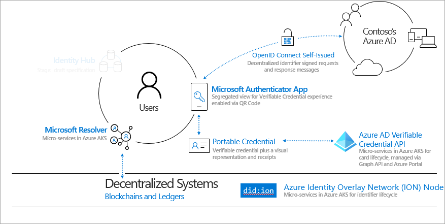
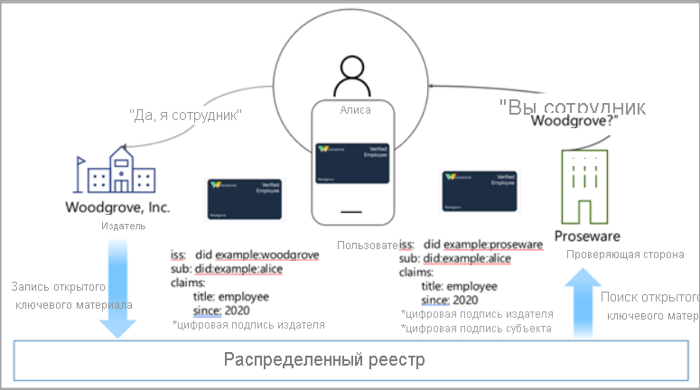
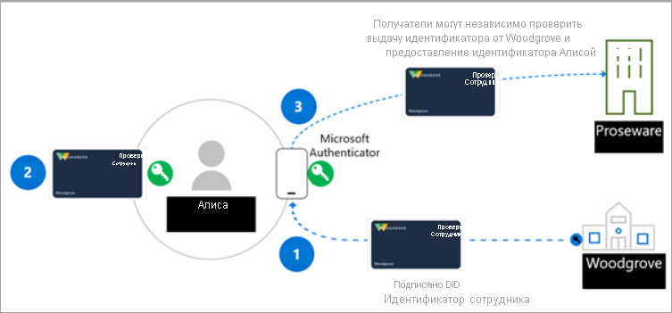

# <a name="introduction-to-azure-active-directory-verifiable-credentials-preview"></a>Общие сведения о проверяемых удостоверениях Azure Active Directory (предварительная версия)

> [!IMPORTANT]
> В настоящее время проверяемые удостоверения Azure Active Directory доступны в виде предварительной версии.
> Эта предварительная версия предоставляется без соглашения об уровне обслуживания и не рекомендована для использования рабочей среде. Некоторые функции могут не поддерживаться или их возможности могут быть ограничены. Дополнительные сведения см. в статье [Дополнительные условия использования предварительных выпусков Microsoft Azure](https://azure.microsoft.com/support/legal/preview-supplemental-terms/).

Наша цифровая и повседневная жизнь тесно связаны с различными приложениями, службами и устройствами, которыми мы пользуемся каждый день. Цифровая трансформация позволяет нам взаимодействовать с сотнями компаний и тысячами других пользователей так, как раньше нельзя было представить.

Однако персональные данные часто оказываются уязвимыми при нарушениях безопасности. Эти нарушения влияют на нашу социальную, профессиональную и финансовую жизнь. Корпорация Майкрософт считает, что существует другой способ справиться с проблемой. Каждый человек имеет право на личные данные, которыми он владеет и управляет самостоятельно, которые надежно защищены и сохраняют его конфиденциальность. В этом руководстве описано, как мы сотрудничаем с широким кругом людей, чтобы создать открытое и надежное решение с возможностью взаимодействия для работы с децентрализованными удостоверениями: как для людей, так и для организаций.

## <a name="why-we-need-decentralized-identity"></a>Почему необходимо децентрализованное удостоверение

Мы пользуемся своим цифровым удостоверением на работе, дома и в каждом приложении, службе и устройстве, которое мы используем. Наша цифровая личность состоит из всего, что мы делаем каждый день: покупки билетов на мероприятие, заезда в отель и даже заказа обеда. В настоящее время наши цифровые личности и взаимодействия принадлежат третьим сторонами и управляются ими, а о некоторых из них мы даже не осведомлены.

Как правило, пользователи предоставляют разрешения нескольким приложениям и устройствам. Этот подход требует высокой степени бдительности от пользователя, ведь ему нужно помнить, кто имеет доступ к какой информации. На корпоративном уровне для совместной работы с потребителями и партнерами требуется сложная оркестрация для безопасного обмена данными с сохранением конфиденциальности.

Мы считаем, что стандартизированная система децентрализованных удостоверений, основанная на стандартах, предоставит нам новые возможности, позволяющие пользователям и организациям лучше контролировать свои данные, а также предоставлять более высокий уровень доверия и безопасности для приложений, устройств и поставщиков услуг.

## <a name="lead-with-open-standards"></a>Развитие с открытыми стандартами

Чтобы создать решения нового поколения на основе децентрализованных удостоверений, мы стремимся тесно сотрудничать с нашими клиентами, партнерами и пользователями. Для развития системы децентрализованных удостоверений необходимо, чтобы стандарты, технические компоненты и их открытый код были доступны всем.

Корпорация Майкрософт активно взаимодействует с членами организации Decentralized Identity Foundation (DIF), группой W3C Credentials Community Group и многими другими компаниями, работающими в этой сфере. Вместе мы разрабатываем наиболее важные стандарты, а в наших службах реализованы следующие стандарты.

* [W3C Decentralized Identifiers](https://www.w3.org/TR/did-core/)
* [W3C Verifiable Credentials](https://www.w3.org/TR/vc-data-model/)
* [DIF Sidetree](https://identity.foundation/sidetree/spec/)
* [DIF Well Known DID Configuration](https://identity.foundation/specs/did-configuration/)
* [DIF DID-SIOP](https://identity.foundation/did-siop/)
* [DIF Presentation Exchange](https://identity.foundation/presentation-exchange/)


## <a name="what-are-dids"></a>Что такое децентрализованные удостоверения?

Чтобы легче понять, что такое децентрализованные удостоверения, давайте сравним их с существующими системами удостоверений. Адреса электронной почты и идентификаторы социальных сетей выступают понятными людям псевдонимами для совместной работы и общения. Но теперь нагрузка на них растет, так как они используются для контроля доступа к данным во множестве различных ситуаций, даже не связанных с общением. Это может привести к проблеме: доступ к этим удостоверениям может в любой момент контролироваться третьими сторонами.

Децентрализованные идентификаторы (DID) работают иначе. DID — глобально уникальные идентификаторы, которые создаются пользователями и принадлежат им и основываются на децентрализованных системах (например, ION). Они более надежные, не подвержены цензуре и стороннему вмешательству. Это чрезвычайно важные характеристики для любой системы идентификации, направленной на предоставление пользователям контроля над своими данными. 

Решение корпорации Майкрософт для проверяемых удостоверений использует децентрализованные удостоверения (DID) для создания криптографических подписей, с помощью которых проверяющая сторона доказывает свое владение проверяемым удостоверением. Всем, кто хочет создать решение с использованием проверяемых удостоверений на основе предложения Майкрософт, рекомендуется ознакомиться с принципами работы децентрализованных удостоверений.
## <a name="what-are-verifiable-credentials"></a>Что такое проверяемое удостоверение?

 Мы используем документы, подтверждающие личность, каждый день. Водительские права подтверждают нашу способность водить автомобиль. Университеты выдают дипломы, которые подтверждают достижение уровня образования. А с помощью паспортов мы подтверждаем свою личность при поездках за границу. Эта модель данных описывает, как можно выполнять эти действия через Интернет, обеспечивая конфиденциальность и безопасность данных пользователей. Дополнительные сведения см. в статье [Модель данных проверяемых удостоверений 1.0](https://www.w3.org/TR/vc-data-model/)

Вкратце, проверяемые учетные данные — это объекты данных, состоящие из утверждений о каком-либо объекте, предоставленных издателем данных. Эти утверждения идентифицируются схемой и включают в себя DID издателя и объекта. DID издателя создает цифровую подпись в качестве доказательства того, что издатель подтверждает эту информацию.


## <a name="how-does-decentralized-identity-work"></a>Как работают децентрализованные удостоверения?

Нам нужна новая форма удостоверения. Форма удостоверения, которая объединяет в себе передовые технологии и стандарты и обеспечивает самостоятельность владения данными и сопротивление цензуре. Этого сложно добиться, используя существующие системы.

Чтобы превратить эту идею в реальность, нам нужна новая техническая база, состоящая из семи нововведений. Одно из главных нововведений — система, состоящая из идентификаторов, которые принадлежат пользователю, пользовательского агента для управления ключами, связанными с этими идентификаторами, и зашифрованных хранилищ данных под управлением пользователя.



**1. Децентрализованные удостоверения W3C (DID)** Идентификаторы, которые создаются и управляются пользователями и принадлежат им. Они не зависят от организаций и правительств. DID — это глобально уникальные идентификаторы, связанные с метаданными децентрализованной инфраструктуры открытых ключей (DPKI), состоящие из документов JSON, которые содержат материал открытых ключей, дескрипторы аутентификации и конечные точки служб.

**2. Децентрализованная система: ION (Identity Overlay Network)** ION — открытая сеть уровня 2 без разрешений, основанная на полностью детерминированном протоколе Sidetree. Для ее работы не требуются специальные токены, доверенные проверяющие элементы и другие механизмы; необходимо только линейное продвижение цепочки времени Bitcoin. Мы предоставили [открытый доступ к пакету npm](https://www.npmjs.com/package/@decentralized-identity/ion-tools), что позволяет легко встроить функции работы с сетью ION в приложения и службы. В число библиотек входят библиотеки для создания нового DID, генерации ключей и привязке DID к блокчейну Bitcoin. 

**3. Агент пользователя/кошелек DID: приложение Microsoft Authenticator** Позволяет людям использовать децентрализованные и проверяемые удостоверения. Authenticator создает DID, обеспечивает выпуск и запросы предоставления проверяемых удостоверений и управляет резервным копированием начального значения DID через зашифрованный файл-кошелек.

**4. Microsoft Resolver** API, который подключается к нашему узлу ION, ищет и определяет DID с помощью метода ```did:ion``` и возвращает объект документа DID (DDO). DDO включает метаданные DPKI, связанные с DID, в частности открытые ключи и конечные точки служб. 

**5. Служба проверяемых удостоверений Azure Active Directory** Пакет SDK с открытым кодом и API выдачи и проверки [проверяемых удостоверений W3C](https://www.w3.org/TR/vc-data-model/), подписанных методом ```did:ion```. Они позволяют владельцам удостоверений создавать, представлять и проверять утверждения. Это — основа доверия между пользователями систем.

## <a name="a-sample-scenario"></a>Пример сценария

Участники сценария, с помощью которого мы объясняем принцип работы проверяемых удостоверений:

- Компания Woodgrove Inc.
- Proseware, компания, которая предоставляет сотрудникам Woodgrove скидки.
- Алиса, сотрудница Woodgrove, Inc., которая хочет получить скидку от Proseware.


Алиса авторизуется в сети Woodgrove с помощью имени пользователя и пароля. Woodgrove развертывает решение с использованием проверяемых удостоверений, чтобы Алисе было легче доказать, что она сотрудница Woodgrove. Proseware использует решение на основе проверяемых удостоверений, совместимое с решением Woodgrove, и принимает учетные данные, созданные Woodgrove, в качестве доказательства места работы.

Издатель учетных данных Woodgrove Inc. создает открытый ключ и закрытый ключ. Открытый ключ хранится в сети ION. Когда ключ добавляется к инфраструктуре, в децентрализованном реестре, основанном на блокчейне, делается соответствующая запись. Издатель предоставляет Алисе закрытый ключ, хранящийся в приложении-кошельке. Каждый раз, когда Алиса успешно использует закрытый ключ, транзакция регистрируется в приложении.



## <a name="roles-in-a-verifiable-credential-solution"></a>Роли в решении с проверяемыми удостоверениями 

В решении проверяемых удостоверений участвуют три основных субъекта. Рассмотрим схему ниже.

- **Шаг 1**. **Пользователь** запрашивает проверяемое удостоверение от издателя.
- **Шаг 2**. **Издатель** учетных данных удостоверяет, что предоставленное пользователем подтверждение является точным, и создает проверяемое удостоверение, подписанное с помощью DID (DID — субъект).
- **На шаге 3** пользователь подписывает проверяемое удостоверение с помощью DID и отправляет его в **средство проверки.** Затем проверяющий подтверждает учетные данные, сопоставляя их с открытым ключом, находящимся в DPKI.

Участники этого сценария:



**Издатель** — это организация, которая создает решение выдачи, запрашивающее информацию от пользователя. Эта информация используется для проверки личности пользователя. Например, в Woodgrove, Inc. имеется решение для выдачи, которое позволяет им создавать проверяемые удостоверения (VC) для всех своих сотрудников. Сотрудник использует Authenticator для входа с использованием имени пользователя и пароля, которое передает маркер идентификации в службу выдачи. После того как Woodgrove, Inc. проверяет отправленный маркер идентификации, решение выдачи создает проверяемое удостоверение, включающее утверждения о сотруднике и подписанное Woodgrove, Inc. Теперь у сотрудника есть проверяемое удостоверение, подписанное их работодателем. DID субъекта — DID сотрудника.  

**Пользователь** — пользователь или сущность, запрашивающие VC. Например, Алиса является новой сотрудницей Woodgrove, Inc. и ранее получила проверяемое удостоверение для подтверждения ее места работы. Чтобы подтвердить свою личность и место работы для получения скидки в Proseware, Алиса предоставляет доступ к свои учетным данным через приложение Authenticator. Для этого она подписывает проверяемое удостоверение, которое доказывает, что Алиса владеет DID. Proseware проверяет и удостоверяется, что издателем является Woodgrove, Inc., а Алиса выступает владельцем учетных данных. 

**Подтверждающий** — компания или сущность, которым необходимо проверять утверждения от одного или нескольких издателей, которым они доверяют. Например, Proseware доверяет Woodgrove, Inc. и считает, что компания добросовестно выполняет проверку личности своих сотрудников и выдает подлинные и допустимые VC. Алиса хочет заказать оборудование для работы в Proseware. Proseware запрашивает учетные данные пользователя с помощью открытых стандартов, например SIOP и Presentation Exchange, чтобы убедиться, что Алиса — действительно сотрудница Woodgrove, Inc. Например, Proseware может отправить Алисе ссылку на сайт с QR-кодом, который ей нужно будет просканировать. При этом будет отправлен запрос для определенного проверяемого удостоверения. Authenticator проанализирует удостоверение и даст Алисе возможность одобрить или отклонить запрос на проверку ее места работы от Proseware. Proseware может использовать API-интерфейс службы проверяемых удостоверений или пакет SDK для проверки подлинности удостоверения. На основе информации, предоставляемой Алисой, Алисе предоставляют скидку. Если другие компании и организации знают, что Woodgrove, Inc. выдает своим сотрудникам проверяемые удостоверения, они также могут создать решения для проверки и использовать проверяемые удостоверения Woodgrove, Inc. для предоставления специальных предложений сотрудникам Woodgrove, Inc.

## <a name="next-steps"></a>Дальнейшие действия

Теперь вы знаете, что такое DID и проверяемые удостоверения. Вы можете начать работу с ними или ознакомиться с более подробными статьями о проверяемых удостоверениях.

- [Начало работы с проверяемыми удостоверениями](get-started-verifiable-credentials.md)
- [Настройка учетных данных](credential-design.md)
- [Проверяемые удостоверения: вопросы и ответы](verifiable-credentials-faq.md)