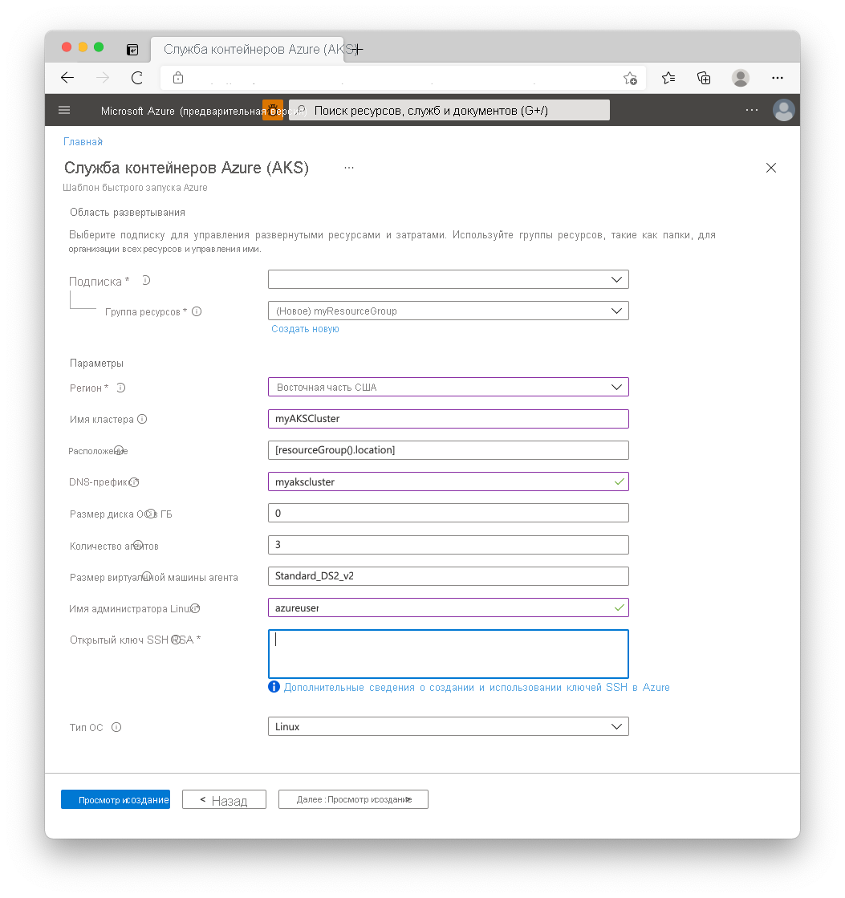

# <a name="quickstart-deploy-an-azure-kubernetes-service-aks-cluster-using-an-arm-template"></a>Краткое руководство. Развертывание кластера Службы Azure Kubernetes (AKS) с помощью шаблона ARM

Служба Azure Kubernetes (AKS) — это управляемая служба Kubernetes, которая позволяет быстро развертывать кластеры и управлять ими. В этом кратком руководстве вы выполните указанные ниже задачи.
* Развертывание кластера AKS с использованием шаблона Azure Resource Manager. 
* Запуск многоконтейнерного приложения, которое включает в себя веб-интерфейс и экземпляр Redis в кластере. 


[!INCLUDE [About Azure Resource Manager](../../includes/resource-manager-quickstart-introduction.md)]

В этом руководстве предполагается, что у вас есть некоторое представление о функциях Kubernetes. Дополнительные сведения см. в статье [Ключевые концепции Kubernetes для службы Azure Kubernetes (AKS)][kubernetes-concepts].

Если среда соответствует предварительным требованиям и вы знакомы с использованием шаблонов ARM, нажмите кнопку **Развертывание в Azure**. Шаблон откроется на портале Azure.

[](https://portal.azure.com/#create/Microsoft.Template/uri/https%3A%2F%2Fraw.githubusercontent.com%2FAzure%2Fazure-quickstart-templates%2Fmaster%2F101-aks%2Fazuredeploy.json)

[!INCLUDE [quickstarts-free-trial-note](../../includes/quickstarts-free-trial-note.md)]

[!INCLUDE [azure-cli-prepare-your-environment.md](../../includes/azure-cli-prepare-your-environment.md)]

- Для работы с этой статьей требуется Azure CLI версии 2.0.61 или более поздней. Если вы используете Azure Cloud Shell, последняя версия уже установлена.

- Чтобы создать кластер AKS с использованием шаблона Resource Manager, укажите открытый ключ SSH. Если вам требуется этот ресурс, выполните инструкции из следующего раздела. В противном случае перейдите к разделу [Изучение шаблона](#review-the-template).

### <a name="create-an-ssh-key-pair"></a>Создание пары ключей SSH

Подключение к узлам AKS выполняется с парой ключей SSH (открытого и закрытого), которые создаются с помощью команды `ssh-keygen`. По умолчанию эти файлы хранятся в каталоге *~/.ssh*. При выполнении команды `ssh-keygen` перезаписывается пара ключей SSH с тем же именем, если она существует в этом расположении.

1. Перейдите по адресу [https://shell.azure.com](https://shell.azure.com), чтобы открыть Cloud Shell в браузере.

1. Выполните команду `ssh-keygen`. Следующий пример создает пару 2048-разрядных ключей SSH с шифрованием RSA:

    ```console
    ssh-keygen -t rsa -b 2048
    ```

Дополнительные сведения о создании ключей SSH см. в статье [Detailed steps: Create and manage SSH keys for authentication to a Linux VM in Azure][ssh-keys] (Подробные инструкции. Создание ключей SSH для проверки подлинности на виртуальной машине Linux в Azure и управление этими ключами).

## <a name="review-the-template"></a>Изучение шаблона

Шаблон, используемый в этом кратком руководстве, взят из [шаблонов быстрого запуска Azure](https://azure.microsoft.com/resources/templates/101-aks/).

:::code language="json" source="~/quickstart-templates/101-aks/azuredeploy.json":::

Дополнительные примеры AKS см. на странице [Шаблоны быстрого запуска Azure][aks-quickstart-templates].

## <a name="deploy-the-template"></a>Развертывание шаблона

1. Нажмите следующую кнопку, чтобы войти на портал Azure и открыть шаблон.

    [](https://portal.azure.com/#create/Microsoft.Template/uri/https%3A%2F%2Fraw.githubusercontent.com%2FAzure%2Fazure-quickstart-templates%2Fmaster%2F101-aks%2Fazuredeploy.json)

2. Введите или выберите следующие значения.

    В этом кратком руководстве оставьте значения по умолчанию для параметров *OS Disk Size GB* (Размер диска операционной системы в ГБ), *Число агентов*, *Размер виртуальной машины агента*, *Тип ОС* и *Версия Kubernetes*. Укажите собственные значения для следующих параметров шаблона:

    * **Подписка**: Выберите подписку Azure.
    * **Группа ресурсов.** Выберите **Создать**. Введите уникальное имя для группы ресурсов, например *myResourceGroup*, а затем нажмите кнопку **ОК**.
    * **Расположение.** Выберите расположение, например **восточная часть США**.
    * **Имя кластера**. Введите уникальное имя для кластера AKS, например *myAKSCluster*.
    * **DNS-префикс**. Введите уникальный префикс DNS для своего кластера, например *myakscluster*.
    * **Имя администратора Linux**. Введите имя пользователя для подключения с помощью SSH, например *azureuser*.
    * **Открытый ключ SSH RSA**. Скопируйте и вставьте *открытую* часть пары ключей SSH (по умолчанию содержимое *~/.ssh/id_rsa.pub*).

    

3. Выберите **Review + Create** (Просмотреть и создать).

Создание кластера AKS занимает несколько минут. Дождитесь успешного развертывания кластера, прежде чем перейти к следующему шагу.

## <a name="validate-the-deployment"></a>Проверка развертывания

### <a name="connect-to-the-cluster"></a>Подключение к кластеру

Кластером Kubernetes можно управлять при помощи [kubectl][kubectl] клиента командной строки Kubernetes. Если вы используете Azure Cloud Shell, `kubectl` уже установлен. 

1. Чтобы установить `kubectl` локально, выполните команду [az aks install-cli][az-aks-install-cli]:

    ```azurecli
    az aks install-cli
    ```

2. Настройте в `kubectl` подключение к кластеру Kubernetes, выполнив команду [az aks get-credentials][az-aks-get-credentials]. Эта команда скачивает учетные данные и настраивает интерфейс командной строки Kubernetes для их использования.

    ```azurecli-interactive
    az aks get-credentials --resource-group myResourceGroup --name myAKSCluster
    ```

3. Проверьте подключение к кластеру, выполнив команду [kubectl get][kubectl-get]. Эта команда возвращает список узлов кластера.

    ```console
    kubectl get nodes
    ```

    В выходных данных вы увидите узлы, созданные на предыдущих шагах. Убедитесь, что узлы находятся в состоянии *Готово*:

    ```output
    NAME                       STATUS   ROLES   AGE     VERSION
    aks-agentpool-41324942-0   Ready    agent   6m44s   v1.12.6    
    aks-agentpool-41324942-1   Ready    agent   6m46s   v1.12.6
    aks-agentpool-41324942-2   Ready    agent   6m45s   v1.12.6
    ```

### <a name="run-the-application"></a>Выполнение приложения

[Файл манифеста Kubernetes][kubernetes-deployment] используется для определения требуемого состояния кластера, например выполняемых в нем образов контейнеров. 

В этом кратком руководстве вы примените манифест для создания всех объектов, необходимых для запуска [приложения Azure для голосования][azure-vote-app]. Этот манифест содержит два [развертывания Kubernetes][kubernetes-deployment]:
* пример приложения Azure для голосования на языке Python;
* экземпляр Redis. 

Кроме того, создаются две [Службы Kubernetes][kubernetes-service]:
* внутренняя служба для экземпляра Redis;
* внешняя служба для доступа к приложению Azure для голосования из Интернета.

1. Создайте файл с именем `azure-vote.yaml`.
    * Если вы используете Azure Cloud Shell, этот файл можно создать с помощью `vi` или `nano`, как при обычной работе в виртуальной или физической системе.
1. Скопируйте в него следующее определение YAML:

    ```yaml
    apiVersion: apps/v1
    kind: Deployment
    metadata:
      name: azure-vote-back
    spec:
      replicas: 1
      selector:
        matchLabels:
          app: azure-vote-back
      template:
        metadata:
          labels:
            app: azure-vote-back
        spec:
          nodeSelector:
            "beta.kubernetes.io/os": linux
          containers:
          - name: azure-vote-back
            image: mcr.microsoft.com/oss/bitnami/redis:6.0.8
            env:
            - name: ALLOW_EMPTY_PASSWORD
              value: "yes"
            resources:
              requests:
                cpu: 100m
                memory: 128Mi
              limits:
                cpu: 250m
                memory: 256Mi
            ports:
            - containerPort: 6379
              name: redis
    ---
    apiVersion: v1
    kind: Service
    metadata:
      name: azure-vote-back
    spec:
      ports:
      - port: 6379
      selector:
        app: azure-vote-back
    ---
    apiVersion: apps/v1
    kind: Deployment
    metadata:
      name: azure-vote-front
    spec:
      replicas: 1
      selector:
        matchLabels:
          app: azure-vote-front
      template:
        metadata:
          labels:
            app: azure-vote-front
        spec:
          nodeSelector:
            "beta.kubernetes.io/os": linux
          containers:
          - name: azure-vote-front
            image: mcr.microsoft.com/azuredocs/azure-vote-front:v1
            resources:
              requests:
                cpu: 100m
                memory: 128Mi
              limits:
                cpu: 250m
                memory: 256Mi
            ports:
            - containerPort: 80
            env:
            - name: REDIS
              value: "azure-vote-back"
    ---
    apiVersion: v1
    kind: Service
    metadata:
      name: azure-vote-front
    spec:
      type: LoadBalancer
      ports:
      - port: 80
      selector:
        app: azure-vote-front
    ```

1. Разверните приложение с помощью команды [kubectl apply][kubectl-apply] и укажите имя манифеста YAML:

    ```console
    kubectl apply -f azure-vote.yaml
    ```

    В выходных данных показаны успешно созданные развертывания и службы:

    ```output
    deployment "azure-vote-back" created
    service "azure-vote-back" created
    deployment "azure-vote-front" created
    service "azure-vote-front" created
    ```

### <a name="test-the-application"></a>Тестирование приложения

При запуске приложения Служба Kubernetes предоставляет внешний интерфейс приложения в Интернете. Процесс создания может занять несколько минут.

Ход выполнения можно отслеживать с помощью команды [kubectl get service][kubectl-get] с аргументом `--watch`.

```console
kubectl get service azure-vote-front --watch
```

Параметр **EXTERNAL-IP** для службы `azure-vote-front` в выходных данных изначально будут иметь значение *pending* (Ожидается).

```output
NAME               TYPE           CLUSTER-IP   EXTERNAL-IP   PORT(S)        AGE
azure-vote-front   LoadBalancer   10.0.37.27   <pending>     80:30572/TCP   6s
```

Когда параметр **EXTERNAL-IP** вместо *pending* примет значение общедоступного IP-адреса, выполните команду `CTRL-C`, чтобы остановить процесс отслеживания `kubectl`. В следующем примере выходных данных показан общедоступный IP-адрес, присвоенный службе.

```output
azure-vote-front   LoadBalancer   10.0.37.27   52.179.23.131   80:30572/TCP   2m
```

Чтобы увидеть приложение для голосования Azure в действии, откройте в веб-браузере внешний IP-адрес вашей службы.


## <a name="clean-up-resources"></a>Очистка ресурсов

Чтобы не оплачивать ненужные ресурсы Azure, удалите их. Используйте команду [az group delete][az-group-delete], чтобы удалить группу ресурсов, службу контейнеров и все связанные с ними ресурсы.

```azurecli-interactive
az group delete --name myResourceGroup --yes --no-wait
```

> [!NOTE]
> Когда вы удаляете кластер, субъект-служба Azure Active Directory, используемый в кластере AKS, не удаляется. Инструкции по удалению субъекта-службы см. в разделе с [дополнительными замечаниями][sp-delete].
> 
> Управляемые удостоверения администрируются платформой, и их не нужно удалять.

## <a name="get-the-code"></a>Получение кода

В этом кратком руководстве для создания развертывания Kubernetes вы применили предварительно созданные образы контейнеров. Вы можете получить код приложений, файл Dockerfile и файл манифеста Kubernetes для этих образов [на сайте GitHub.][azure-vote-app]

## <a name="next-steps"></a>Дальнейшие действия

С помощью этого краткого руководства вы развернули кластер Kubernetes, а затем многоконтейнерное приложение в нем. Узнайте, как [открыть веб-панель мониторинга Kubernetes][kubernetes-dashboard] для кластера AKS.

Дополнительные сведения о AKS и инструкции по созданию полного кода для примера развертывания см. в руководстве по кластерам Kubernetes.

> [!div class="nextstepaction"]
> [Руководство по AKS][aks-tutorial]

<!-- LINKS - external -->
[azure-vote-app]: https://github.com/Azure-Samples/azure-voting-app-redis.git
[kubectl]: https://kubernetes.io/docs/user-guide/kubectl/
[kubectl-apply]: https://kubernetes.io/docs/reference/generated/kubectl/kubectl-commands#apply
[kubectl-get]: https://kubernetes.io/docs/reference/generated/kubectl/kubectl-commands#get
[azure-dev-spaces]: ../dev-spaces/index.yml
[aks-quickstart-templates]: https://azure.microsoft.com/resources/templates/?term=Azure+Kubernetes+Service

<!-- LINKS - internal -->
[kubernetes-concepts]: concepts-clusters-workloads.md
[aks-monitor]: ../azure-monitor/containers/container-insights-onboard.md
[aks-tutorial]: ./tutorial-kubernetes-prepare-app.md
[az-aks-browse]: /cli/azure/aks#az-aks-browse
[az-aks-create]: /cli/azure/aks#az-aks-create
[az-aks-get-credentials]: /cli/azure/aks#az-aks-get-credentials
[az-aks-install-cli]: /cli/azure/aks#az-aks-install-cli
[az-group-create]: /cli/azure/group#az-group-create
[az-group-delete]: /cli/azure/group#az-group-delete
[azure-cli-install]: /cli/azure/install-azure-cli
[sp-delete]: kubernetes-service-principal.md#additional-considerations
[azure-portal]: https://portal.azure.com
[kubernetes-deployment]: concepts-clusters-workloads.md#deployments-and-yaml-manifests
[kubernetes-service]: concepts-network.md#services
[kubernetes-dashboard]: kubernetes-dashboard.md
[ssh-keys]: ../virtual-machines/linux/create-ssh-keys-detailed.md
[az-ad-sp-create-for-rbac]: /cli/azure/ad/sp#az-ad-sp-create-for-rbac
