# Краткое руководство. Создание приложения Python с помощью Службы приложений Azure в Linux

В этом кратком руководстве описывается процесс развертывания веб-приложения Python для [службы приложений на платформе Linux](overview.md#app-service-on-linux), высокомасштабируемой службы веб-размещения Azure с самостоятельной установкой исправлений. Чтобы развернуть выборку на платформе Flask или Django, воспользуйтесь порталом Azure. Веб-приложение, которое вы настраиваете, использует базовый уровень службы приложений, который требует небольших затрат в подписке Azure.

## Настройка учетных записей

- Если у вас нет учетной записи Azure с активной подпиской, [создайте бесплатную учетную запись](https://azure.microsoft.com/free/?ref=microsoft.com&utm_source=microsoft.com&utm_medium=docs&utm_campaign=visualstudio).

- Если у вас нет учетной записи GitHub, посетите [GitHub.com](https://github.com) , чтобы создать ее. 

## Создание вилки для примера из репозитория GitHub

1. Откройте [GitHub.com](https://github.com) и выполните вход.

1. Перейдите к одному из следующих примеров репозиториев:
    - [Flask Hello World](https://github.com/Azure-Samples/python-docs-hello-world)
    - [Django Hello World](https://github.com/Azure-Samples/python-docs-hello-django)

1. В правом верхнем углу страницы GitHub выберите **вилку** , чтобы создать копию репозитория в собственной учетной записи GitHub:

    

    Для Azure требуется доступ к организации GitHub, содержащей репозиторий. При создании вилки репозитория в своей учетной записи GitHub вы автоматически получите необходимый доступ к нему, а также можете внести изменения в код.

## Подготовка веб-приложения Службы приложений

Веб-приложение Службы приложений — это веб-сервер, на котором развертывается код.

1. Откройте портал Azure по адресу [https://portal.azure.com](https://portal.azure.com) и при необходимости войдите в систему.

1. На панели поиска в верхней части портал Azure введите "Служба приложений", а затем выберите **Службы приложений**.

    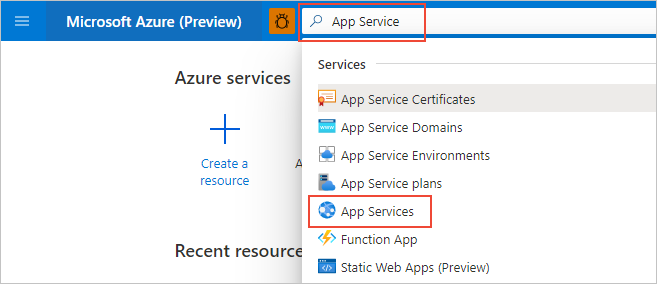

1. На странице **Службы приложений** выберите " **+Добавить**:

    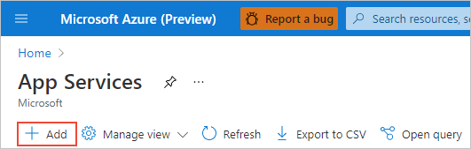

1. На странице **Создание пространства имен** выполните следующие действия.
    
    | Поле | Действие |
    | --- | --- |
    | Подписка | Выберите подписку Azure, которую нужно использовать. |
    | Группа ресурсов | Выберите **создать новый** под раскрывающимся списком. В всплывающем окне введите "AppService-PythonQuickstart" и нажмите кнопку **ОК**. |
    | Имя | Введите уникальное имя для всех Azure, как правило, используя сочетание личных или корпоративных названий, например *contoso-TestApp-123*. |
    | Публикация | Выберите **Код**. |
    | Стек среды выполнения | Выберите **Python 3.8**. |
    | Операционная система | Выберите **Linux** (Python поддерживается только в Linux). |
    | Регион | Выберите ближайшую область. |
    | План Linux | Выберите существующий план службы приложений или создайте новый, используя команду **Создать**. Мы рекомендуем использовать **базовый план B1**. |

    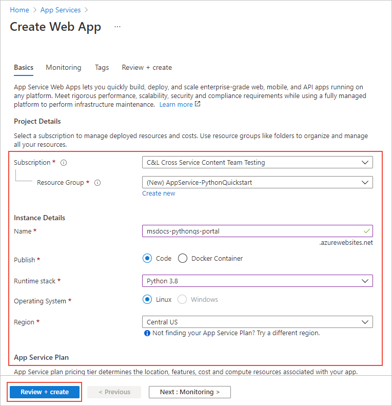

1. В нижней части страницы выберите **Просмотр и создание**, просмотрите сведения, а затем выберите **создать**.

1. После завершения подготовки выберите **Переход к ресурсу**, чтобы открыть страницу службы приложений. Веб-приложение на этом этапе содержит только страницу по умолчанию, поэтому следующий шаг развертывает пример кода.

Возникли проблемы? [Сообщите нам об этом.](https://aka.ms/FlaskPortalQuickstartHelp)

## Развертывание примера

1. На странице веб-приложение на портал Azure выберите **центр развертывания**:
    
    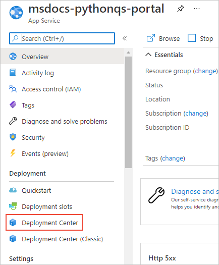

1. На странице **центр развертывания** выберите вкладку **Параметры**, если она еще не открыта:

    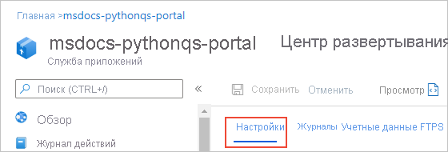

1. В разделе **источник** выберите **GitHub**, а затем на появившейся форме **GitHub** выполните следующие действия.

    | Поле | Действие |
    | --- | --- |
    | Вы вошли как | Если вы еще не вошли в GitHub, выполните вход сейчас или выберите **изменить учетную запись*, если это необходимо. |
    | План | При необходимости выберите свою организацию GitHub. |
    | Хранилище | Выберите имя ранее разветвленного репозитория: **Python-документация-Hello-World** (Flask) или **Python-документация-Hello-Django** (Django). |
    | Ветвь | Выберите **Main**. |

    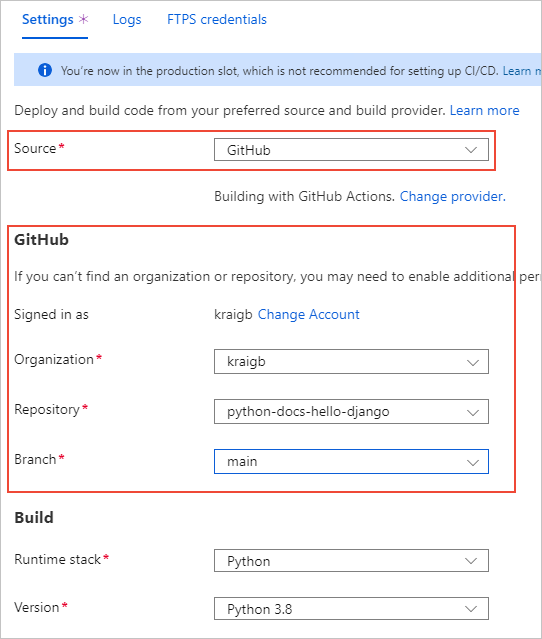

1. В верхней части страницы щелкните **сохранить** , чтобы применить параметры.

    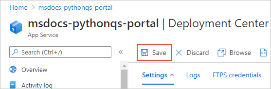

1. Щелкните значок **Уведомления**, чтобы просмотреть состояние развертывания. Создание и развертывание образца и дополнительных журналов появляются в течение нескольких минут. По завершении работы журналы должны отражать состояние **успеха (активно)** :

    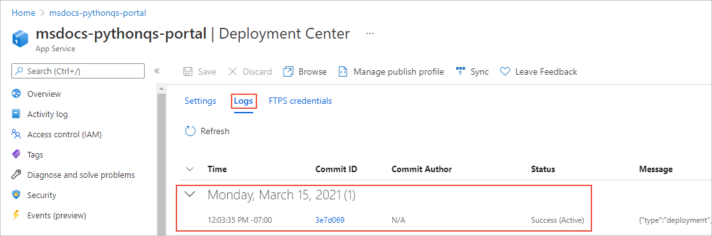

Возникли проблемы? [Сообщите нам об этом.](https://aka.ms/FlaskPortalQuickstartHelp)

## Переход в приложение

1. После завершения развертывания выберите **Обзор** в меню слева, чтобы вернуться на главную страницу веб-приложения.

1. Выберите **URL-адрес** приложения, который содержит адрес:

    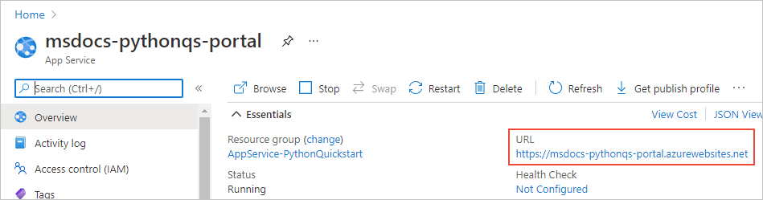

1. Убедитесь, что выходные данные приложения — "Hello, World!":

    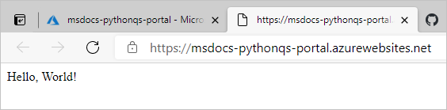

Возникли проблемы? Сначала изучите [руководство по устранению неполадок](configure-language-python.md#troubleshooting). Если проблему решить не удается, [свяжитесь с нами](https://aka.ms/FlaskPortalQuickstartHelp).

## Внесение изменений и повторное развертывание

Так как вы подключили службу приложений к репозиторию, изменения, зафиксированные в исходном репозитории, автоматически развертываются в веб-приложении.

1. Вы можете вносить изменения непосредственно в разветвленный репозиторий на GitHub или клонировать репозиторий локально, вносить и зафиксировать изменения, а затем отправлять эти изменения в GitHub. Любой из этих методов приводит к изменению репозитория, подключенного к службе приложений.

1. **В разветвленном репозитории** измените сообщение приложения с "Hello, World!" на "Hello Azure!" следующим образом:
    - Flask (пример python-docs-hello-world). Измените текстовую строку в строке 6 файла *application.py*.
    - Django (пример python-docs-hello-django). Измените текстовую строку в строке 5 файла *views.py* в папке *Hello*.

1. Зафиксируйте изменения в репозитории.

    Если вы используете локальный клон, также отправьте эти изменения в GitHub.

1. На портал Azure веб-приложения вернитесь в **центр развертывания**, перейдите на вкладку **журналы** и обратите внимание на новое действие развертывания, которое должно быть завершено.

1. Когда развертывание будет завершено, вернитесь на страницу **обзора** веб-приложения, снова откройте URL-адрес приложения и просмотрите изменения в приложении:

    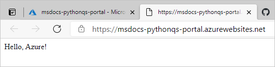

Возникли проблемы? Сначала изучите [руководство по устранению неполадок](configure-language-python.md#troubleshooting). Если проблему решить не удается, [свяжитесь с нами](https://aka.ms/FlaskCLIQuickstartHelp).

## Очистка ресурсов

На предыдущих шагах вы создали ресурсы Azure в группе ресурсов с именем "AppService-PythonQuickstart", которая показана на странице *Обзор* веб-приложения. Если веб-приложение продолжит выполняться, с вас начнет взиматься плата (см. сведения о [ценах на Службу приложений](https://azure.microsoft.com/pricing/details/app-service/linux/)).

Если вы не хотите, чтобы эти ресурсы появлялись в будущем, выберите имя группы ресурсов на странице **Обзор** веб-приложения для перехода к разделу Общие сведения о группах ресурсов. Выберите **Удалить группу ресурсов** и следуйте инструкциям.

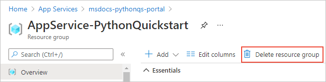

Возникли проблемы? [Сообщите нам об этом.](https://aka.ms/FlaskCLIQuickstartHelp)

## Дальнейшие действия

> [!div class="nextstepaction"]
> [Руководство. Веб-приложение Python (Django) с PostgreSQL](/azure/developer/python/tutorial-python-postgresql-app-portal)

> [!div class="nextstepaction"]
> [Настройка приложения Python](configure-language-python.md)

> [!div class="nextstepaction"]
> [Добавление возможности входа пользователя в веб-приложение Python](../active-directory/develop/quickstart-v2-python-webapp.md)

> [!div class="nextstepaction"]
> [Руководство. Запуск приложения Python в настраиваемом контейнере](tutorial-custom-container.md)
