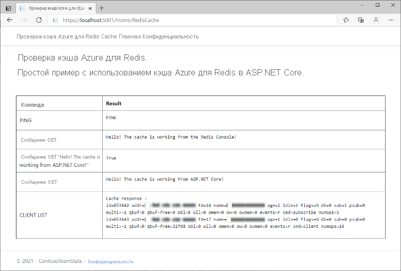

# <a name="quickstart-use-azure-cache-for-redis-with-an-aspnet-core-web-app"></a>Краткое руководство. Использование кэша Azure для Redis с веб-приложением ASP.NET Core 

Из этого краткого руководства вы узнаете, как внедрить кэш Azure для Redis в веб-приложение ASP.NET Core, которое подключается к кэшу Azure для Redis для хранения и извлечения данных из кэша.

## <a name="skip-to-the-code-on-github"></a>Переход к коду на GitHub

Если вы хотите сразу перейти к коду, см. [краткое руководство по ASP.NET Core](https://github.com/Azure-Samples/azure-cache-redis-samples/tree/main/quickstart/aspnet-core) на сайте GitHub.

## <a name="prerequisites"></a>Предварительные требования

- Подписка Azure — [создайте бесплатную учетную запись](https://azure.microsoft.com/free/).
- [Базовый пакет SDK для .NET](https://dotnet.microsoft.com/download)

## <a name="create-a-cache"></a>Создание кэша

[!INCLUDE [redis-cache-create](../../includes/redis-cache-create.md)]

[!INCLUDE [redis-cache-access-keys](../../includes/redis-cache-access-keys.md)]

Запомните или запишите **имя узла** и **первичный ключ доступа**. Эти значения вам потребуются позже для создания секрета *CacheConnection*.

## <a name="create-an-aspnet-core-web-app"></a>Создание веб-приложения ASP.NET Core

Откройте новое окно командной строки и выполните следующую команду для создания нового веб-приложения ASP.NET Core (модель — представление — контроллер):

```dotnetcli
dotnet new mvc -o ContosoTeamStats
```

В этом же окне командной строки перейдите к каталогу нового проекта *ContosoTeamStats*.

[!INCLUDE[Add Secret Manager support to an ASP.NET Core project](../../includes/azure-app-configuration-add-secret-manager.md)]

Выполните следующую команду, чтобы добавить в проект пакет *Microsoft.Extensions.Configuration.UserSecrets*:

```dotnetcli
dotnet add package Microsoft.Extensions.Configuration.UserSecrets
```

Выполните следующую команду, чтобы восстановить пакеты:

```dotnetcli
dotnet restore
```

В том же окне командной строки выполните следующую команду, чтобы сохранить новый секрет с именем *CacheConnection*. Не забудьте заменить заполнители (включая угловые скобки) именем кэша и первичным ключом доступа.

```dotnetcli
dotnet user-secrets set CacheConnection "<cache name>.redis.cache.windows.net,abortConnect=false,ssl=true,allowAdmin=true,password=<primary-access-key>"
```

## <a name="configure-the-cache-client"></a>Настройка клиента кэша

В этом разделе вы настроите в приложении использование клиента [StackExchange.Redis](https://github.com/StackExchange/StackExchange.Redis) для .NET.

В окне командной строки выполните следующую команду в каталоге проекта *ContosoTeamStats*:

```dotnetcli
dotnet add package StackExchange.Redis
```

Когда установка завершится, клиент кэша *StackExchange.Redis* станет доступным для использования в проекте.

## <a name="update-the-homecontroller-and-layout"></a>Обновление HomeController и макета

Добавьте следующие операторы `using` в файл *Controllers\HomeController.cs*:

```csharp
using System.Net.Sockets;
using System.Text;
using System.Threading;

using Microsoft.Extensions.Configuration;

using StackExchange.Redis;
```

Замените

```csharp
private readonly ILogger<HomeController> _logger;

public HomeController(ILogger<HomeController> logger)
{
    _logger = logger;
}
```

на:

```csharp
private readonly ILogger<HomeController> _logger;
private static IConfiguration Configuration { get; set; }

public HomeController(ILogger<HomeController> logger, IConfiguration configuration)
{
    _logger = logger;
    if (Configuration == null)
        Configuration = configuration;
}
```

Добавьте следующие элементы в класс `HomeController`, чтобы включить поддержку нового действия `RedisCache`, которое выполняет некоторые команды для нового кэша.

```csharp
public ActionResult RedisCache()
{
    ViewBag.Message = "A simple example with Azure Cache for Redis on ASP.NET Core.";

    IDatabase cache = GetDatabase();

    // Perform cache operations using the cache object...

    // Simple PING command
    ViewBag.command1 = "PING";
    ViewBag.command1Result = cache.Execute(ViewBag.command1).ToString();

    // Simple get and put of integral data types into the cache
    ViewBag.command2 = "GET Message";
    ViewBag.command2Result = cache.StringGet("Message").ToString();

    ViewBag.command3 = "SET Message \"Hello! The cache is working from ASP.NET Core!\"";
    ViewBag.command3Result = cache.StringSet("Message", "Hello! The cache is working from ASP.NET Core!").ToString();

    // Demonstrate "SET Message" executed as expected...
    ViewBag.command4 = "GET Message";
    ViewBag.command4Result = cache.StringGet("Message").ToString();

    // Get the client list, useful to see if connection list is growing...
    // Note that this requires allowAdmin=true in the connection string
    ViewBag.command5 = "CLIENT LIST";
    StringBuilder sb = new StringBuilder();
    var endpoint = (System.Net.DnsEndPoint)GetEndPoints()[0];
    IServer server = GetServer(endpoint.Host, endpoint.Port);
    ClientInfo[] clients = server.ClientList();

    sb.AppendLine("Cache response :");
    foreach (ClientInfo client in clients)
    {
        sb.AppendLine(client.Raw);
    }

    ViewBag.command5Result = sb.ToString();

    return View();
}

private const string SecretName = "CacheConnection";

private static long lastReconnectTicks = DateTimeOffset.MinValue.UtcTicks;
private static DateTimeOffset firstErrorTime = DateTimeOffset.MinValue;
private static DateTimeOffset previousErrorTime = DateTimeOffset.MinValue;

private static readonly object reconnectLock = new object();

// In general, let StackExchange.Redis handle most reconnects,
// so limit the frequency of how often ForceReconnect() will
// actually reconnect.
public static TimeSpan ReconnectMinFrequency => TimeSpan.FromSeconds(60);

// If errors continue for longer than the below threshold, then the
// multiplexer seems to not be reconnecting, so ForceReconnect() will
// re-create the multiplexer.
public static TimeSpan ReconnectErrorThreshold => TimeSpan.FromSeconds(30);

public static int RetryMaxAttempts => 5;

private static Lazy<ConnectionMultiplexer> lazyConnection = CreateConnection();

public static ConnectionMultiplexer Connection
{
    get
    {
        return lazyConnection.Value;
    }
}

private static Lazy<ConnectionMultiplexer> CreateConnection()
{
    return new Lazy<ConnectionMultiplexer>(() =>
    {
        string cacheConnection = Configuration[SecretName];
        return ConnectionMultiplexer.Connect(cacheConnection);
    });
}

private static void CloseConnection(Lazy<ConnectionMultiplexer> oldConnection)
{
    if (oldConnection == null)
        return;

    try
    {
        oldConnection.Value.Close();
    }
    catch (Exception)
    {
        // Example error condition: if accessing oldConnection.Value causes a connection attempt and that fails.
    }
}

/// <summary>
/// Force a new ConnectionMultiplexer to be created.
/// NOTES:
///     1. Users of the ConnectionMultiplexer MUST handle ObjectDisposedExceptions, which can now happen as a result of calling ForceReconnect().
///     2. Don't call ForceReconnect for Timeouts, just for RedisConnectionExceptions or SocketExceptions.
///     3. Call this method every time you see a connection exception. The code will:
///         a. wait to reconnect for at least the "ReconnectErrorThreshold" time of repeated errors before actually reconnecting
///         b. not reconnect more frequently than configured in "ReconnectMinFrequency"
/// </summary>
public static void ForceReconnect()
{
    var utcNow = DateTimeOffset.UtcNow;
    long previousTicks = Interlocked.Read(ref lastReconnectTicks);
    var previousReconnectTime = new DateTimeOffset(previousTicks, TimeSpan.Zero);
    TimeSpan elapsedSinceLastReconnect = utcNow - previousReconnectTime;

    // If multiple threads call ForceReconnect at the same time, we only want to honor one of them.
    if (elapsedSinceLastReconnect < ReconnectMinFrequency)
        return;

    lock (reconnectLock)
    {
        utcNow = DateTimeOffset.UtcNow;
        elapsedSinceLastReconnect = utcNow - previousReconnectTime;

        if (firstErrorTime == DateTimeOffset.MinValue)
        {
            // We haven't seen an error since last reconnect, so set initial values.
            firstErrorTime = utcNow;
            previousErrorTime = utcNow;
            return;
        }

        if (elapsedSinceLastReconnect < ReconnectMinFrequency)
            return; // Some other thread made it through the check and the lock, so nothing to do.

        TimeSpan elapsedSinceFirstError = utcNow - firstErrorTime;
        TimeSpan elapsedSinceMostRecentError = utcNow - previousErrorTime;

        bool shouldReconnect =
            elapsedSinceFirstError >= ReconnectErrorThreshold // Make sure we gave the multiplexer enough time to reconnect on its own if it could.
            && elapsedSinceMostRecentError <= ReconnectErrorThreshold; // Make sure we aren't working on stale data (e.g. if there was a gap in errors, don't reconnect yet).

        // Update the previousErrorTime timestamp to be now (e.g. this reconnect request).
        previousErrorTime = utcNow;

        if (!shouldReconnect)
            return;

        firstErrorTime = DateTimeOffset.MinValue;
        previousErrorTime = DateTimeOffset.MinValue;

        Lazy<ConnectionMultiplexer> oldConnection = lazyConnection;
        CloseConnection(oldConnection);
        lazyConnection = CreateConnection();
        Interlocked.Exchange(ref lastReconnectTicks, utcNow.UtcTicks);
    }
}

// In real applications, consider using a framework such as
// Polly to make it easier to customize the retry approach.
private static T BasicRetry<T>(Func<T> func)
{
    int reconnectRetry = 0;
    int disposedRetry = 0;

    while (true)
    {
        try
        {
            return func();
        }
        catch (Exception ex) when (ex is RedisConnectionException || ex is SocketException)
        {
            reconnectRetry++;
            if (reconnectRetry > RetryMaxAttempts)
                throw;
            ForceReconnect();
        }
        catch (ObjectDisposedException)
        {
            disposedRetry++;
            if (disposedRetry > RetryMaxAttempts)
                throw;
        }
    }
}

public static IDatabase GetDatabase()
{
    return BasicRetry(() => Connection.GetDatabase());
}

public static System.Net.EndPoint[] GetEndPoints()
{
    return BasicRetry(() => Connection.GetEndPoints());
}

public static IServer GetServer(string host, int port)
{
    return BasicRetry(() => Connection.GetServer(host, port));
}
```

Откройте файл *Views\Shared\\_Layout.cshtml*.

Замените

```cshtml
<a class="navbar-brand" asp-area="" asp-controller="Home" asp-action="Index">ContosoTeamStats</a>
```

на:

```cshtml
<a class="navbar-brand" asp-area="" asp-controller="Home" asp-action="RedisCache">Azure Cache for Redis Test</a>
```

## <a name="add-a-new-rediscache-view-and-update-the-styles"></a>Добавление нового представления RedisCache и обновление стилей

Создайте новый файл *Views\Home\RedisCache.cshtml* со следующим содержимым:

```cshtml
@{
    ViewBag.Title = "Azure Cache for Redis Test";
}

<h2>@ViewBag.Title.</h2>
<h3>@ViewBag.Message</h3>
<br /><br />
<table border="1" cellpadding="10" class="redis-results">
    <tr>
        <th>Command</th>
        <th>Result</th>
    </tr>
    <tr>
        <td>@ViewBag.command1</td>
        <td><pre>@ViewBag.command1Result</pre></td>
    </tr>
    <tr>
        <td>@ViewBag.command2</td>
        <td><pre>@ViewBag.command2Result</pre></td>
    </tr>
    <tr>
        <td>@ViewBag.command3</td>
        <td><pre>@ViewBag.command3Result</pre></td>
    </tr>
    <tr>
        <td>@ViewBag.command4</td>
        <td><pre>@ViewBag.command4Result</pre></td>
    </tr>
    <tr>
        <td>@ViewBag.command5</td>
        <td><pre>@ViewBag.command5Result</pre></td>
    </tr>
</table>
```

Добавьте следующие строки в файл *wwwroot\css\site.css*:

```css
.redis-results pre {
  white-space: pre-wrap;
}
```

## <a name="run-the-app-locally"></a>Локальный запуск приложения

В окне командной строки выполните следующую команду, чтобы запустить сборку приложения:

```dotnetcli
dotnet build
```

Теперь запустите это приложение с помощью следующей команды.

```dotnetcli
dotnet run
```

Перейдите на сайт `https://localhost:5001` в веб-браузере.

На панели навигации на веб-странице щелкните **Проверка кэша Azure для Redis**, чтобы проверить доступ к кэшу.

В приведенном ниже примере видно, что ключ `Message` ранее содержал кэшированное значение, установленное через консоль Redis на портале Azure. Приложение обновило кэшированное значение. Кроме того, оно выполнило команды `PING` и `CLIENT LIST`.



## <a name="clean-up-resources"></a>Очистка ресурсов

При переходе к следующему руководству в нем можно использовать ресурсы, созданные в рамках этого руководства.

В противном случае, если вы закончите работу с примером приложения из краткого руководства, вы можете удалить ресурсы Azure, созданные в рамках этого руководства, чтобы избежать ненужных расходов.

> [!IMPORTANT]
> Удаление группы ресурсов — процесс необратимый. Группа ресурсов и все содержащиеся в ней ресурсы удаляются без возможности восстановления. Будьте внимательны, чтобы случайно не удалить не ту группу ресурсов или не те ресурсы. Если ресурсы для размещения этого примера созданы в имеющейся группе ресурсов, содержащей ресурсы, которые следует сохранить, можно удалить каждый ресурс отдельно в соответствующих колонках вместо удаления группы ресурсов.

### <a name="to-delete-a-resource-group"></a>Удаление группы ресурсов

1. Войдите на [портал Azure](https://portal.azure.com) и щелкните **Группы ресурсов**.

2. Введите имя группы ресурсов в поле **Фильтровать по имени...** В инструкциях в этой статье использовалась группа ресурсов с именем *TestResources*. В своей группе ресурсов в списке результатов щелкните **...**, а затем выберите **Удалить группу ресурсов**.

    

Подтвердите операцию удаления группы ресурсов. Введите имя группы ресурсов, которую необходимо удалить, и щелкните **Удалить**.

Через некоторое время группа ресурсов и все ее ресурсы будут удалены.

## <a name="next-steps"></a>Дальнейшие действия

Подробнее о развертывании в Azure см. здесь:

> [!div class="nextstepaction"]
> [Руководство. Создание приложения ASP.NET Core и Базы данных SQL в Службе приложений Azure](/azure/app-service/tutorial-dotnetcore-sqldb-app)

Сведения о хранении секрета подключения кэша в Azure Key Vault см. в следующих статьях:

> [!div class="nextstepaction"]
> [Поставщик конфигурации Azure Key Vault в ASP.NET Core](/aspnet/core/security/key-vault-configuration)

Хотите масштабировать кэш с более низкого уровня до более высокого уровня?

> [!div class="nextstepaction"]
> [Масштабирование кэша Azure для Redis](./cache-how-to-scale.md)

Хотите оптимизировать и сократить ваши расходы на облако?

> [!div class="nextstepaction"]
> [Начните анализировать затраты с помощью службы "Управление затратами"](../cost-management-billing/costs/quick-acm-cost-analysis.md?WT.mc_id=costmanagementcontent_docsacmhorizontal_-inproduct-learn)
