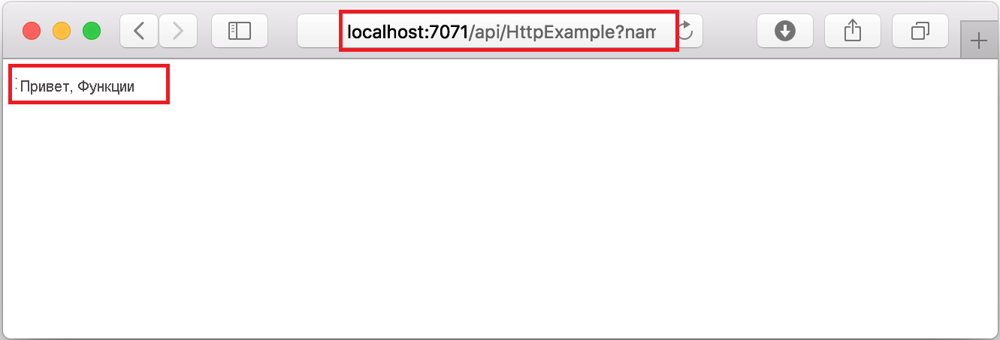
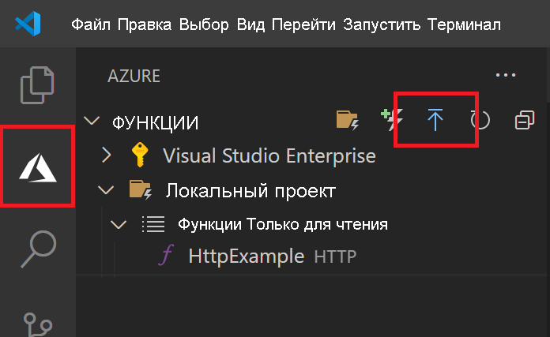
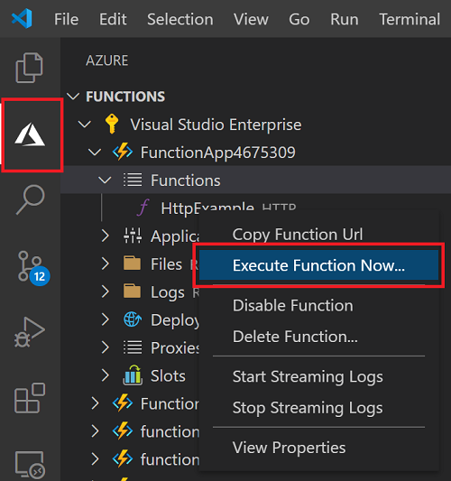

# Краткое руководство. Создание функции JavaScript в Azure с помощью Visual Studio Code

> [!div class="op_single_selector" title1="Выберите язык функции: "]
> - [JavaScript](create-first-function-vs-code-node.md)
> - [C#](create-first-function-vs-code-csharp.md)
> - [Java](create-first-function-vs-code-java.md)
> - [PowerShell](create-first-function-vs-code-powershell.md)
> - [Python](create-first-function-vs-code-python.md)
> - [TypeScript](create-first-function-vs-code-typescript.md)
> - [Другое (Go/Rust)](create-first-function-vs-code-other.md)

С помощью Visual Studio Code создайте функцию JavaScript, которая отвечает на HTTP-запросы. Протестируйте код в локальной среде, а затем разверните его в бессерверном окружении Функций Azure.

Выполнение этого краткого руководства предполагает небольшую дополнительную плату в несколько центов США, которая будет взиматься с вашей <abbr title="Учетная запись Azure — это глобальная уникальная сущность, которая предоставляет доступ к службам и подпискам Azure.">учетной записи Azure</abbr>.

## 1. Подготовка среды

Перед началом работы убедитесь, что выполнены следующие предварительные требования.

+ Учетная записи Azure с <abbr title="Подписка Azure — это логический контейнер, используемый для подготовки ресурсов в Azure. Она содержит сведения обо всех ресурсах, таких как виртуальные машины, базы данных и т. д.">активной подпиской</abbr>. [Создайте учетную запись](https://azure.microsoft.com/free/?ref=microsoft.com&utm_source=microsoft.com&utm_medium=docs&utm_campaign=visualstudio) бесплатно.

+ [Node.js версии 10.14.1 или выше](https://nodejs.org/)

+ [Visual Studio Code](https://code.visualstudio.com/)

+ [Расширение службы "Функции Azure"](https://marketplace.visualstudio.com/items?itemName=ms-azuretools.vscode-azurefunctions) для Visual Studio Code.

+ [Основные инструменты службы "Функции Azure"](functions-run-local.md?tabs=linux%2Ccsharp%2Cbash#install-the-azure-functions-core-tools)

 

## 2. Создание локального проекта службы "Функции Azure"

1. Щелкните значок Azure на <abbr title="">панели действий</abbr>затем в области **Azure: Функции** щелкните значок **Создание проекта...**

    

1. **Выберите расположение каталога** для рабочей области проекта и щелкните **Выбрать**. 

1. Введите следующие сведения по соответствующим запросам:

    + **Выберите язык для проекта приложения-функции**: Выберите `JavaScript`.

    + **Выберите шаблон для первой функции вашего проекта**. Выберите `HTTP trigger`.

    + **Укажите имя функции**. Введите `HttpExample`.

    + **Уровень авторизации**: выберите `Anonymous`, что позволит любому пользователю вызывать конечную точку функции.

    + **Выберите, как вы хотели бы открыть свой проект**. Выберите `Add to workspace`.

 

<strong>Не можете создать проект функции?</strong>

Наиболее часто встречающимися проблемами, которые необходимо решать при создании проекта локальных функций, являются:
* У вас не установлено расширение Функций Azure. 

 

## 3. Локальное выполнение функции

1. Нажмите клавишу <kbd>F5</kbd>, чтобы запустить проект приложения-функции. 

1. В окне **Терминал** вы увидите URL-адрес конечной точки вашей функции, которая работает локально.

    

1. Скопируйте следующий URL-адрес и вставьте его в адресную строку веб-браузера, а затем нажмите клавишу "ВВОД".

    `http://localhost:7071/api/HttpExample?name=Functions`

1. Изучите полученный ответ.

    

1. Просмотрите сведения о запросе на панели **Терминал**.

    

1. Нажмите клавиши <kbd>CTRL+C</kbd>, чтобы остановить Core Tools и отключить отладчик.

 

<strong>Не можете запустить функцию локально?</strong>

Наиболее часто встречающимися проблемами, которые необходимо решать при выполнении проекта локальных функций, являются:
* Основные инструменты не установлены. 
*  При возникновении проблем с запуском в Windows убедитесь, что в качестве оболочки терминала по умолчанию для Visual Studio Code не настроена оболочка WSL Bash. 

 

## 4. Вход в Azure

Чтобы опубликовать приложение, выполните вход в Azure. Если вы уже выполнили вход, перейдите к следующему разделу.

1. Щелкните значок Azure на панели действий, а затем в области **Azure: Функции** выберите кнопку **Войти в Azure...**

    

1. При появлении запроса в браузере **выберите учетную запись Azure** и **войдите** в нее с помощью учетных данных Azure.

1. После успешного входа в систему закройте новое окно браузера и вернитесь к Visual Studio Code. 

 

## 5. Публикация проекта в Azure

Ваше первое развертывание кода включает в себя создание ресурса Функций в вашей подписке Azure. 

1. Щелкните значок Azure на панели действий, а затем в области **Azure: Функции** выберите кнопку **Deploy to function app...** (Развертывание в приложение-функцию).

    

1. Введите следующие сведения по соответствующим запросам:

    + **Select folder** (Выберите папку). Выберите папку, в которой находится ваше приложение-функция. 

    + **Выбрать подписку**. Выберите подписку, которую нужно использовать. Если у вас только одна подписка, вы не увидите этот параметр.

    + **Select Function App in Azure** (Выбор приложения-функции в Azure). Выберите `+ Create new Function App`.

    + **Enter a globally unique name for the function app** (Ввод глобально уникального имени для приложения-функции). В качестве пути для URL-адреса введите глобально уникальное в Azure имя. Введенное здесь имя проверяется, чтобы обеспечить глобальную уникальность.

    + **Select a runtime** (Выбор среды выполнения). Выберите версию Node.js, которая запускалась локально. Вы можете использовать команду `node --version`, чтобы проверить установленную версию.

    + **Select a location for new resources** (Выбор расположения для новых ресурсов).  Для повышения производительности выберите [регион](https://azure.microsoft.com/regions/) рядом с вами. 

1. После создания приложения-функции и применения пакета развертывания отобразится уведомление. Выберите **View Output** (Просмотр выходных данных), чтобы просмотреть результаты создания и развертывания. 
    
    

 

<strong>Не удается опубликовать функцию?</strong>

Из этого раздела вы узнали, как создать ресурсы Azure и развернуть локальный код в виде приложения-функции. Если не удалось:

* Проверьте выходные данные на наличие сведений об ошибке. Выходные данные также можно просмотреть, щелкнув значок колокольчика в правом нижнем углу. 
* Публикация выполнялась в существующем приложении-функции? Это действие перезаписывает содержимое этого приложения в Azure.

 

<strong>Какие ресурсы созданы?</strong>

После завершения в вашей подписке создаются следующие ресурсы Azure с именами, производными от имени приложения-функции: 
* **Группа ресурсов**. Группа ресурсов — это логический контейнер для связанных ресурсов в одном регионе.
* **Учетная запись хранения Azure.** Ресурс службы хранилища Azure хранит данные о состоянии и другую информацию о вашем проекте.
* **План потребления**. План потребления, который определяет базовый узел для бессерверного приложения-функции.
* **Приложение-функция**. Приложение-функция предоставляет окружение для выполнения кода функции и группирования функций в качестве логической единицы.
* **Application Insights**. Application Insights отслеживает использование бессерверных функций.

 

## 6. Запуск функции в Azure
1. Снова перейдите к боковой панели **Azure: Функции** и разверните новое приложение-функцию. 
1. Разверните элемент **Функции**, щелкните правой кнопкой мыши функцию **HttpExample** и выберите команду **Execute Function Now...** (Выполнить функцию...).

    

1. Нажмите клавишу **ВВОД**, чтобы отправить в функцию стандартное сообщение запроса. 

1. Когда завершится выполнение функции, в Visual Studio Code создается уведомление.

 

<strong>Не удается выполнить облачное приложение-функцию?</strong>

* Возможно, вы забыли добавить строку запроса в конец URL-адреса?

 

## 7. Очистка ресурсов

Чтобы избежать дополнительных расходов, удалите приложение-функцию и его ресурсы.

1. В Visual Studio Code выберите на панели действий значок Azure и щелкните область "Функции" на боковой панели. 
1. Выберите приложение-функцию, щелкните его правой кнопкой мыши и выберите действие **Delete Function app...** (Удалить приложение-функцию...).

 

## Дальнейшие действия

Расширьте эту функцию, добавив <abbr title="Привязка к функции позволяет декларативно подключить к ней другой ресурс.">выходную привязку</abbr>. Эта привязка записывает строку из HTTP-запроса в сообщение очереди Хранилища очередей Azure. 

> [!div class="nextstepaction"]
> [Подключение Функций Azure к службе хранилища Azure с помощью средств командной строки](functions-add-output-binding-storage-queue-vs-code.md?pivots=programming-language-javascript)

[Azure Functions Core Tools]: functions-run-local.md
[Azure Functions extension for Visual Studio Code]: https://marketplace.visualstudio.com/items?itemName=ms-azuretools.vscode-azurefunctions
