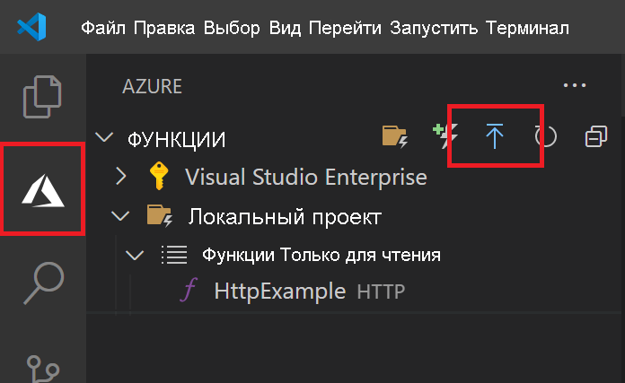

# Краткое руководство. Создание функции Python в Azure с помощью Visual Studio Code

> [!div class="op_single_selector" title1="Выберите язык функции: "]
> - [Python](create-first-function-vs-code-python.md)
> - [C#](create-first-function-vs-code-csharp.md)
> - [Java](create-first-function-vs-code-java.md)
> - [JavaScript](create-first-function-vs-code-node.md)
> - [PowerShell](create-first-function-vs-code-powershell.md)
> - [TypeScript](create-first-function-vs-code-typescript.md)
> - [Другое (Go/Rust)](create-first-function-vs-code-other.md)

Из этой статьи вы узнаете, как создать функцию Python, которая отвечает на HTTP-запросы, используя Visual Studio Code. После локального тестирования кода его необходимо развернуть в <abbr title="Вычислительное окружение среды выполнения, в котором все сведения о сервере прозрачны для разработчиков приложений, что упрощает процесс развертывания и управления кодом.">независимая от сервера.</abbr> окружении <abbr title="Служба Azure, которая предоставляет недорогое окружение бессерверных вычислений для приложений.">Функции Azure</abbr>.

Выполнение этого краткого руководства предполагает небольшую дополнительную плату в несколько центов США в учетной записи Azure.

Существует также версия этой статьи для [интерфейса командной строки](create-first-function-cli-python.md).

## 1. Подготовка среды

Перед началом работы убедитесь, что выполнены следующие предварительные требования.

+ . <abbr title="Профиль, который поддерживает данные для выставления счетов за использование Azure.">account</abbr> Azure с активной <abbr title="Базовая организационная структура, в которой можно управлять ресурсами в Azure, обычно связанными с частным лицом или отделом в пределах организации.">Подписка</abbr>. [Создайте учетную запись](https://azure.microsoft.com/free/?ref=microsoft.com&utm_source=microsoft.com&utm_medium=docs&utm_campaign=visualstudio) бесплатно.

+ [Azure Functions Core Tools](functions-run-local.md#install-the-azure-functions-core-tools) версии 3.x.

+ Функции Azure (x64) поддерживают версии [Python 3.8](https://www.python.org/downloads/release/python-381/), [Python 3.7](https://www.python.org/downloads/release/python-375/) и [Python 3.6](https://www.python.org/downloads/release/python-368/).

+ [Visual Studio Code](https://code.visualstudio.com/) на одной из [поддерживаемых платформ](https://code.visualstudio.com/docs/supporting/requirements#_platforms).

+ [Расширение Python](https://marketplace.visualstudio.com/items?itemName=ms-python.python) для Visual Studio Code.  

+ [Расширение "Функции Azure"](https://marketplace.visualstudio.com/items?itemName=ms-azuretools.vscode-azurefunctions) для Visual Studio Code.

 

## 2. Создание локального проекта

1. Щелкните значок Azure на <abbr title="Вертикальная группа иконок в левой части окна Visual Studio Code.">Панель действий</abbr>затем в области **Azure: Функции** щелкните значок **Создание проекта...**

    

1. Выберите расположение для рабочей области проекта и нажмите кнопку **Выбрать**.

    > [!NOTE]
    > Рассматриваемые в этой статье шаги выполняются вне рабочей области. В этом случае не нужно указывать папку проекта, которая является частью рабочей области.

1. Введите следующие сведения по соответствующим запросам:

    + **Выберите язык для проекта приложения-функции**: Выберите `Python`.

    + **Выберите псевдоним Python для создания виртуальной среды**. Выберите расположение интерпретатора Python. Если расположение не отображается, введите полный путь к двоичному файлу Python.  

    + **Выберите шаблон для первой функции вашего проекта**. Выберите `HTTP trigger`.

    + **Укажите имя функции**. Введите `HttpExample`.

    + **Уровень авторизации**: выберите `Anonymous`, что позволит любому пользователю вызывать конечную точку функции. Дополнительные сведения об уровнях авторизации см. в разделе [Ключи авторизации](functions-bindings-http-webhook-trigger.md#authorization-keys).

    + **Выберите, как вы хотели бы открыть свой проект**. Выберите `Add to workspace`.

 

<strong>Не можете создать проект функции?</strong>

Наиболее часто встречающимися проблемами, которые необходимо решать при создании проекта локальных функций, являются:
* У вас не установлено расширение Функций Azure. 

 

## Локальное выполнение функции

1. Нажмите клавишу <kbd>F5</kbd>, чтобы запустить проект приложения-функции.

1. На панели **Терминал** взгляните на конечную точку URL вашей функции, работающей локально.

    

1. При запущенных Core Tools перейдите в область **Azure: Функции**. В разделе **Функции** разверните **Локальный проект** > **Функции**. Щелкните правой кнопкой мыши (в Windows) или используйте <kbd>Ctrl-</kbd>щелчок (в macOS) на функции `HttpExample` и выберите **Выполнить функцию...** .

    :::image type="content" source="../../includes/media/functions-run-function-test-local-vs-code/execute-function-now.png" alt-text="Вариант &quot;Выполнить функцию&quot; из Visual Studio Code":::

1. В поле **Ввести текст запроса** вы увидите значение текста запроса `{ "name": "Azure" }`. Нажмите клавишу ВВОД, чтобы отправить это сообщение запроса в свою функцию.  

1. При выполнении функции локально и возврате ответа в Visual Studio Code отобразится уведомление. Сведения о выполнении функции отображаются на панели **Терминал**.

1. Нажмите клавиши <kbd>CTRL+C</kbd>, чтобы остановить Core Tools и отключить отладчик.

 

<strong>Не можете запустить функцию локально?</strong>

Наиболее часто встречающимися проблемами, которые необходимо решать при выполнении проекта локальных функций, являются:
* Основные инструменты не установлены. 
*  При возникновении проблем с запуском в Windows убедитесь, что в качестве оболочки терминала по умолчанию для Visual Studio Code не используется **оболочка WSL Bash**. 

 

## 4. Вход в Azure

Чтобы опубликовать приложение, выполните вход в Azure. Если вы уже выполнили вход, перейдите к следующему разделу.

1. Щелкните значок Azure на панели действий, а затем в области **Azure: Функции** выберите кнопку **Войти в Azure...**

    

1. При появлении запроса в браузере **выберите учетную запись Azure** и **войдите** в нее с помощью учетных данных Azure.

1. После успешного входа в систему закройте новое окно браузера и вернитесь к Visual Studio Code. 

 

## 5. Публикация проекта в Azure

Ваше первое развертывание кода включает в себя создание ресурса Функций в вашей подписке Azure.

1. Щелкните значок Azure на панели действий, а затем в области **Azure: Функции** выберите кнопку **Deploy to function app...** (Развертывание в приложение-функцию).

    

1. Введите следующие сведения по соответствующим запросам:

    + **Select folder** (Выберите папку). Выберите папку, в которой находится ваше приложение-функция.

    + **Выбрать подписку**. Выберите подписку, которую нужно использовать. Если у вас только одна подписка, вы не увидите этот параметр.

    + **Select Function App in Azure** (Выбор приложения-функции в Azure). Выберите `+ Create new Function App`.

    + **Enter a globally unique name for the function app** (Ввод глобально уникального имени для приложения-функции). Введите имя, допустимое в пути URL-адреса. Имя, которое вы вводите, проверяется, чтобы убедиться, что оно <abbr title="Уникальное имя, которое не должно встречаться ни у одного клиента Azure глобально. Например, можно использовать сочетание собственного имени или названия организации с именем приложения и числовым идентификатором, например contoso-bizapp-func-20.">является уникальным в пределах Azure</abbr>. 

    + **Select a runtime** (Выбор среды выполнения). Выберите версию Python, которая запускалась локально. Вы можете использовать команду `python --version`, чтобы проверить установленную версию.

    + **Select a location for new resources** (Выбор расположения для новых ресурсов). Для повышения производительности выберите [регион](https://azure.microsoft.com/regions/) рядом с вами.

    Расширение показывает в области уведомлений состояние отдельных ресурсов по мере их создания в Azure.

    :::image type="content" source="../../includes/media/functions-publish-project-vscode/resource-notification.png" alt-text="Уведомление о создании ресурса Azure":::

1. После создания приложения-функции и применения пакета развертывания отобразится уведомление. Выберите **View Output** (Просмотр выходных данных), чтобы просмотреть результаты создания и развертывания. 

    

 

<strong>Не удается опубликовать функцию?</strong>

Из этого раздела вы узнали, как создать ресурсы Azure и развернуть локальный код в виде приложения-функции. Если не удалось:

* Проверьте выходные данные на наличие сведений об ошибке. Выходные данные также можно просмотреть, щелкнув значок колокольчика в правом нижнем углу. 
* Публикация выполнялась в существующем приложении-функции? Это действие перезаписывает содержимое этого приложения в Azure.

 

<strong>Какие ресурсы созданы?</strong>

После завершения в вашей подписке создаются следующие ресурсы Azure с именами, производными от имени приложения-функции: 
* **Группа ресурсов**. Группа ресурсов — это логический контейнер для связанных ресурсов в одном регионе.
* **Учетная запись хранения Azure.** Ресурс службы хранилища Azure хранит данные о состоянии и другую информацию о вашем проекте.
* **План потребления**. План потребления, который определяет базовый узел для бессерверного приложения-функции.
* **Приложение-функция**. Приложение-функция предоставляет окружение для выполнения кода функции и группирования функций в качестве логической единицы.
* **Application Insights**. Application Insights отслеживает использование бессерверных функций.

 

## 6. Запуск функции в Azure

1. Снова перейдите к боковой панели **Azure: Функции** и разверните новое приложение-функцию.
1. Разверните **Функции**, затем щелкните правой кнопкой мыши (Windows) или кнопку <kbd>Ctrl -</kbd> (macOS) на функции `HttpExample` и выберите **Выполнить функцию...**

    :::image type="content" source="../../includes/media/functions-vs-code-run-remote/execute-function-now.png" alt-text="Вариант &quot;Выполнить функцию&quot; в Azure из Visual Studio Code":::

1. В поле **Ввести текст запроса** вы увидите значение текста запроса `{ "name": "Azure" }`.

    Нажмите клавишу ВВОД, чтобы отправить это сообщение запроса в свою функцию.  

1. При выполнении функции в Azure и возврате ответа в Visual Studio Code отобразится уведомление.

## 7. Очистка ресурсов

Если вы планируете перейти к [следующему шагу](#next-steps) и добавить <abbr title="Средство для связывания функции с очередью хранилища, с помощью которого можно будет создавать сообщения в очереди."> Выходная привязка очереди службы хранилища Azure</abbr> к вашей функции, вам нужно будет сохранить все ресурсы, чтобы выполнить сборку на основе уже созданных ресурсов.

В противном случае выполните следующие действия, чтобы удалить приложение-функцию и связанные с ним ресурсы и избежать дополнительных расходов.

[!INCLUDE [functions-cleanup-resources-vs-code-inner.md](../../includes/functions-cleanup-resources-vs-code-inner.md)]

Дополнительные сведения о затратах на использование Функций см. в статье [Estimating Consumption plan costs](functions-consumption-costs.md) (Оценка затрат на план потребления).

## Дальнейшие действия

Разверните эту функцию, добавив выходную <abbr title="Декларативное соединение между функцией и другими ресурсами. Входная привязка предоставляет данные для функции, а выходная привязка предоставляет данные из функции для других ресурсов.">binding</abbr>. Эта привязка записывает строку из HTTP-запроса в сообщение очереди Хранилища очередей Azure. 

> [!div class="nextstepaction"]
> [Подключение Функций Azure к службе хранилища Azure с помощью средств командной строки](functions-add-output-binding-storage-queue-vs-code.md?pivots=programming-language-python)

[Возникли проблемы? Сообщите нам!](https://aka.ms/python-functions-qs-survey)

[Azure Functions Core Tools]: functions-run-local.md
[Azure Functions extension for Visual Studio Code]: https://marketplace.visualstudio.com/items?itemName=ms-azuretools.vscode-azurefunctions
