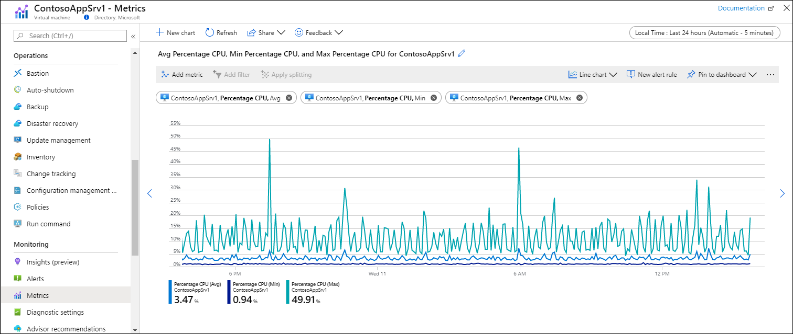

# Краткое руководство. Мониторинг ресурса Azure с помощью Azure Monitor
[Azure Monitor](../overview.md) начнет сбор данных из ресурсов Azure с момента их создания. В этом кратком руководстве приводится краткое пошаговое руководство с описанием данных, которые автоматически собираются для каждого ресурса, и процедуры просмотра данных для определенного ресурса на портале Azure. Вы можете позднее настроить сбор дополнительных данных и (или) через меню Azure Monitor применить те же средства для просмотра данных для всех ресурсов в подписке.

Более подробное описание данных мониторинга, собираемых из ресурсов Azure, см. в статье [о мониторинге ресурсов Azure с помощью Azure Monitor](../essentials/monitor-azure-resource.md).

## Вход на портал Azure

Войдите на портал Azure по адресу [https://portal.azure.com](https://portal.azure.com). 

## Страница "Обзор"
Многие службы отображают данные мониторинга на странице **Обзор**, что позволяет быстро оценить их работу. Как правило, этот механизм основан на подмножестве метрик платформы, хранящихся в службе метрик Azure Monitor.

1. Найдите ресурс Azure в подписке.
2. Перейдите на страницу **Обзор** и проверьте, отображаются ли здесь данные о производительности. Если есть, то эти данные предоставляются Azure Monitor. В приведенном ниже примере страница **Обзор** для учетной записи хранения Azure отображает несколько метрик.

    

3. Можно щелкнуть любую диаграмму, чтобы открыть данные в обозревателе метрик, как описано ниже.

## Просмотр журнала действий
Журнал действий предоставляет полезные сведения об операциях с каждым ресурсом Azure в подписке. Сюда входят такие сведения, как время создания или изменения ресурса, время запуска задания или выполнения определенной операции.

1. В верхней части меню для ресурса выберите **Журнал действий**.
2. Фильтр настраивается так, чтобы отображать события, связанные с этим ресурсом. Если вы не видите никаких событий, попробуйте изменить значение **Timespan**, чтобы увеличить диапазон времени.

    

4. Если вы хотите просмотреть события из других ресурсов в той же подписке, измените критерии в фильтре или совсем удалите свойства фильтра.

    

## Просмотр метрик
Метрики представляют собой числовые значения с характеристиками некоторого аспекта ресурса на определенный момент времени. Azure Monitor автоматически каждую минуту собирает метрики платформы по всем ресурсам Azure. Эти метрики можно просмотреть в обозревателе метрик.

1. В меню параметров ресурса в разделе **Мониторинг** щелкните **Метрики**. Откроется обозреватель метрик, где ресурс выбран в качестве области действия.
2. Щелкните **Добавить метрику**, чтобы добавить метрику на эту диаграмму.
   
   
   
4. Выберите метрику из раскрывающегося списка **Метрика**, а затем выберите **Агрегат**. Это значение определяет, как обрабатываются собранные значения за каждый интервал времени.

    

5. Щелкните **добавить метрику**, чтобы добавить на диаграмму дополнительные сочетания метрик и агрегатов.

    

## Дальнейшие действия
В этом кратком руководстве вы просмотрели для ресурса Azure журнал действий и метрики, которые автоматически собираются службой Azure Monitor. Перейдите к следующему краткому руководству, в котором показано, как выполнять сбор журналов в рабочей области Log Analytics, где их можно проанализировать с помощью [запросов журнала](../logs/log-query-overview.md).

> [!div class="nextstepaction"]
> [Отправка журнала действий Azure в рабочую область Log Analytics](./quick-collect-activity-log-portal.md)