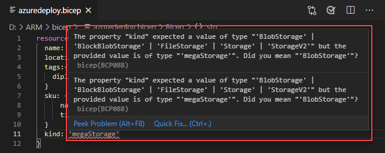
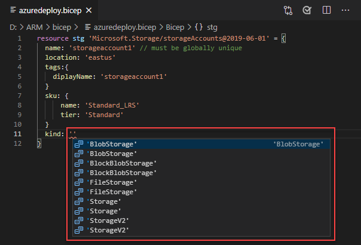
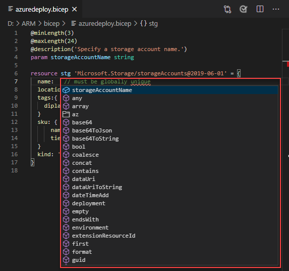

# <a name="quickstart-create-bicep-files-with-visual-studio-code"></a>Краткое руководство. Создание BICEP-файлов с помощью Visual Studio Code

Расширение Bicep для Visual Studio Code обеспечивает поддержку языка и автозавершение ресурсов. Эти инструменты помогают создавать и проверять [BICEP](./bicep-overview.md)-файлы. В этом кратком руководстве показано, как с помощью расширения создать BICEP-файл с нуля. Это позволит вам опробовать возможности этого расширения, включая проверку и завершение.

[!INCLUDE [Bicep preview](../../../includes/resource-manager-bicep-preview.md)]

Для работы с этим кратким руководством вам необходимо установить [Visual Studio Code](https://code.visualstudio.com/) с [расширением Bicep](https://marketplace.visualstudio.com/items?itemName=ms-azuretools.vscode-bicep). Вам также потребуется установить и аутентифицировать последнюю версию [Azure CLI](/cli/azure/) или [модуля Azure PowerShell](/powershell/azure/new-azureps-module-az).

Если у вас еще нет подписки Azure, [создайте бесплатную учетную запись Azure](https://azure.microsoft.com/free/), прежде чем начинать работу.

## <a name="create-a-bicep-file"></a>Создание BICEP-файла

Создайте и откройте файл *azuredeploy.bicep* в Visual Studio Code.

## <a name="add-an-azure-resource"></a>Добавление ресурса Azure

Добавьте базовый ресурс учетной записи хранения в BICEP-файл.

```bicep
resource stg 'Microsoft.Storage/storageAccounts@2019-06-01' = {
  name: 'storageaccount1' // must be globally unique
  location: 'eastus'
  tags:{
    diplayName: 'storageaccount1'
  }
  sku: {
      name: 'Standard_LRS'
      tier: 'Standard'
  }
  kind: 'Storage'
}
```

Объявление ресурса состоит из четырех компонентов:

- **resource**: ключевое слово.
- **Символьное имя** (stg): идентификатор для ссылки на ресурс в BICEP-файле. Это не имя ресурса после развертывания. Имя ресурса определяет свойство **name**.  Ознакомьтесь с четвертым компонентом в списке.
- **Тип ресурса** (Microsoft.Storage/storageAccounts@2019-06-01): состоит из поставщика ресурсов (Microsoft.Storage), типа ресурса (StorageAccounts) и версии API (2019-06-01). Каждый поставщик ресурсов опубликовал собственные версии API, поэтому это значение зависит от типа. Дополнительные типы и версии API для различных ресурсов Azure можно найти в [справочнике по шаблонам ARM](/azure/templates/).
- **Свойства** (все, что указано в = {…}): укажите свойства для типа ресурса. У каждого ресурса есть свойство `name`. Большинство ресурсов также имеют свойство `location`, которое задает регион, где развернут ресурс. Другие свойства зависят от типа ресурса и версии API.

## <a name="completion-and-validation"></a>Завершение и проверка

Одной из наиболее мощных возможностей расширения является интеграция со схемами Azure. Схемы Azure предоставляют расширения с возможностями проверки и завершения ресурсов. Давайте изменим учетную запись хранения, чтобы увидеть возможности проверки и завершения в действии.

Сначала задайте для типа учетной записи хранения недопустимое значение, например `megaStorage`. Обратите внимание, что в результате этого действия появится предупреждение, уведомляющее, что `megaStorage` не является допустимым значением.



Чтобы использовать возможности завершения, удалите `megaStorage`, поместите курсор внутри одиночных кавычек и нажмите клавиши `ctrl` + `space`. Отобразится список завершения допустимых значений.



## <a name="add-parameters"></a>Добавление параметров

Теперь создайте параметр и воспользуйтесь им, чтобы указать имя учетной записи хранения.

Добавьте приведенный ниже код в начало файла.

```bicep
@minLength(3)
@maxLength(24)
@description('Specify a storage account name.')
param storageAccountName string
```

Минимальная длина имен учетных записей хранения Azure — 3 символа, а максимальная — 24. Используйте `minLength` и `maxLength`, чтобы указать соответствующие значения.

Теперь обновите свойство Name в ресурсе хранилища, чтобы использовать параметр. Для этого удалите текущее имя ресурса хранилища, включая одиночные кавычки. Нажмите клавиши `ctrl` + `space`. Выберите параметр **storageAccountName** из списка. Обратите внимание на то, что на параметры можно ссылаться напрямую, используя их имена в Bicep. Для шаблонов JSON требуется функция parameter().



## <a name="deploy-the-bicep-file"></a>Развертывание BICEP-файла

Откройте интегрированный терминал Visual Studio Code, используя сочетание клавиш `ctrl` + ```` ` ````, перейдите из текущего каталога в место расположения BICEP-файла, а затем используйте модуль Azure CLI или Azure PowerShell для развертывания этого BICEP-файла.

# <a name="cli"></a>[CLI](#tab/CLI)

```azurecli
az group create --name arm-vscode --location eastus

az deployment group create --resource-group arm-vscode --template-file azuredeploy.bicep --parameters storageAccountName={your-unique-name}
```

# <a name="powershell"></a>[PowerShell](#tab/PowerShell)

```azurepowershell
New-AzResourceGroup -Name arm-vscode -Location eastus

New-AzResourceGroupDeployment -ResourceGroupName arm-vscode -TemplateFile ./azuredeploy.bicep -storageAccountName "{your-unique-name}"
```

---

## <a name="clean-up-resources"></a>Очистка ресурсов

Если ресурсы Azure больше не нужны, используйте Azure CLI или модуль Azure PowerShell, чтобы удалить группу ресурсов, созданную для краткого руководства.

# <a name="cli"></a>[CLI](#tab/CLI)

```azurecli
az group delete --name arm-vscode
```

# <a name="powershell"></a>[PowerShell](#tab/PowerShell)

```azurepowershell
Remove-AzResourceGroup -Name arm-vscode
```

---

## <a name="next-steps"></a>Дальнейшие действия

> [!div class="nextstepaction"]
> [Учебники по Bicep для начинающих](./bicep-tutorial-create-first-bicep.md)
