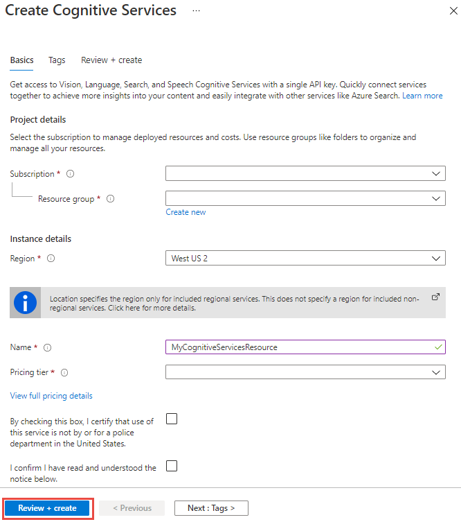
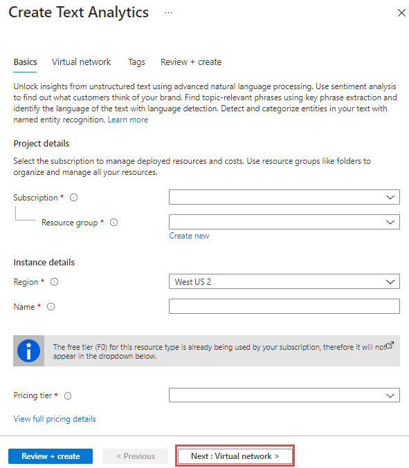

# Краткое руководство. Создание ресурса Cognitive Services с помощью портала Azure

Используйте это краткое руководство, чтобы начать работу с Azure Cognitive Services. После создания ресурса Cognitive Services на портале Azure вы получите конечную точку и ключ для проверки подлинности приложений.

Azure Cognitive Services — это облачные службы с REST API и пакетами SDK клиентских библиотек, которые помогают разработчикам без опыта работы со средствами искусственного интеллекта (ИИ) и обработки и анализа данных создавать когнитивные интеллектуальные приложения. С помощью Azure Cognitive Services разработчики могут без усилий добавлять в свои приложения когнитивные функции, создавая когнитивные решения, которые могут видеть, слышать, говорить, понимать и даже в некоторой степени размышлять.

[!INCLUDE [cognitive-services-subscription-types](../../includes/cognitive-services-subscription-types.md)]

## Предварительные требования

* Действующая подписка Azure ([создайте бесплатную учетную запись](https://azure.microsoft.com/free/cognitive-services/)).

## Создание ресурса Azure Cognitive Services

1. Создание ресурса.

### [Ресурс для нескольких служб](#tab/multiservice)

Ресурс для нескольких служб на портале называется **Cognitive Services**. [Создайте ресурс Cognitive Services.](https://ms.portal.azure.com/#create/Microsoft.CognitiveServicesAllInOne)

В настоящее время ресурс для нескольких служб предоставляет доступ к следующим службам Cognitive Services:

* Компьютерное зрение
* Content Moderator
* Распознавание лиц
* Распознавание речи (LUIS)
* Анализ текста
* API перевода

### [Ресурс для одной службы](#tab/singleservice)

Используйте следующие ссылки, чтобы создать ресурс для доступных служб Cognitive Services:

| Зрение                      | Речь                  | Язык                          | Решение             |
|-----------------------------|-------------------------|-----------------------------------|----------------------|
| [Компьютерное зрение](https://ms.portal.azure.com/#create/Microsoft.CognitiveServicesComputerVision)         | [Службы "Речь"](https://ms.portal.azure.com/#create/Microsoft.CognitiveServicesSpeechServices)     | [Иммерсивное средство чтения](https://ms.portal.azure.com/#create/Microsoft.CognitiveServicesImmersiveReader)              | [Детектор аномалий](https://ms.portal.azure.com/#create/Microsoft.CognitiveServicesAnomalyDetector) | 
| [Пользовательское визуальное распознавание](https://ms.portal.azure.com/#create/Microsoft.CognitiveServicesCustomVision) | [Распознавание говорящего](https://ms.portal.azure.com/#create/Microsoft.CognitiveServicesSpeakerRecognition) | [Распознавание речи (LUIS)](https://ms.portal.azure.com/#create/Microsoft.CognitiveServicesLUISAllInOne) | [Content Moderator](https://ms.portal.azure.com/#create/Microsoft.CognitiveServicesContentModerator) | 
| [Распознавание лиц](https://ms.portal.azure.com/#create/Microsoft.CognitiveServicesFace)                    |                         | [QnA Maker](https://ms.portal.azure.com/#create/Microsoft.CognitiveServicesQnAMaker)                     | [Персонализатор](https://ms.portal.azure.com/#create/Microsoft.CognitiveServicesPersonalizer)     |
| [Распознаватель рукописного текста](https://ms.portal.azure.com/#create/Microsoft.CognitiveServicesInkRecognizer)        |                         | [Анализ текста](https://ms.portal.azure.com/#create/Microsoft.CognitiveServicesTextAnalytics)                |  [Помощник по метрикам](https://go.microsoft.com/fwlink/?linkid=2142156)                    |

---

2. На странице **Создание** введите приведенные ниже сведения.
<!-- markdownlint-disable MD024 -->

### [Ресурс для нескольких служб](#tab/multiservice)

|сведения о проекте;| Описание   |
|--|--|
| **Подписка** | Выберите одну из доступных подписок Azure. |
| **Группа ресурсов** | Группа ресурсов Azure, которая будет содержать ресурс Cognitive Services. Вы можете создать новую группу или добавить к имеющейся группе. |
| **Регион** | Расположение экземпляра Cognitive Service. Разные расположения могут увеличивать задержку, но не влияют на доступность среды выполнения ресурса. |
| **Имя** | Описательное имя для ресурса Cognitive Services. Например, *MyCognitiveServicesResource*. |
| **Ценовая категория** | Затраты на учетную запись Cognitive Services зависят от выбранных параметров и использования. Дополнительные сведения см. на [странице с ценами](https://azure.microsoft.com/pricing/details/cognitive-services/) API-интерфейсов.

Нажмите кнопку **создания**.

### [Ресурс для одной службы](#tab/singleservice)

|сведения о проекте;| Описание   |
|--|--|
| **Подписка** | Выберите одну из доступных подписок Azure. |
| **Группа ресурсов** | Группа ресурсов Azure, которая будет содержать ресурс Cognitive Services. Вы можете создать новую группу или добавить к имеющейся группе. |
| **Регион** | Расположение экземпляра Cognitive Service. Разные расположения могут увеличивать задержку, но не влияют на доступность среды выполнения ресурса. |
| **Имя** | Описательное имя для ресурса Cognitive Services. Например, *MyCognitiveServicesResource*. |
| **Ценовая категория** | Затраты на учетную запись Cognitive Services зависят от выбранных параметров и использования. Дополнительные сведения см. на [странице с ценами](https://azure.microsoft.com/pricing/details/cognitive-services/) API-интерфейсов.

Нажмите кнопку **создания**.

---

[!INCLUDE [Register Azure resource for subscription](./includes/register-resource-subscription.md)]

## Получение ключей для ресурса

1. После успешного развертывания ресурса щелкните **Перейти к ресурсу** в разделе **Дальнейшие действия**.

    

2. Откроется область быстрого запуска, где вы можете получить ключ и конечную точку.

    

[!INCLUDE [cognitive-services-environment-variables](../../includes/cognitive-services-environment-variables.md)]

## Очистка ресурсов

Если вы хотите очистить и удалить подписку Cognitive Services, вы можете удалить ресурс или группу ресурсов. При удалении группы ресурсов удаляются также все другие ресурсы, содержащиеся в этой группе.

1. На портале Azure разверните меню слева, чтобы открыть меню служб, и выберите **Resource Groups** (Группы ресурсов), чтобы просмотреть список групп ресурсов.
2. Найдите группу ресурсов, содержащую ресурс, который необходимо удалить.
3. Щелкните правой кнопкой мыши список групп ресурсов. Выберите **Удалить группу ресурсов** и подтвердите выбор.

## См. также раздел

* [Проверка подлинности запросов к Azure Cognitive Services](authentication.md)
* [Общие сведения об Azure Cognitive Services](./what-are-cognitive-services.md)
* [Краткое руководство. Создание ресурса Cognitive Services с помощью клиентской библиотеки управления Azure](.\cognitive-services-apis-create-account-client-library.md)
* [Поддержка естественного языка в Azure Cognitive Services](language-support.md)
* [Поддержка контейнеров в Azure Cognitive Services](cognitive-services-container-support.md)
