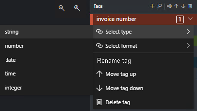

<!-- markdownlint-disable MD001 -->
<!-- markdownlint-disable MD024 -->
<!-- markdownlint-disable MD033 -->
<!-- markdownlint-disable MD034 -->
# <a name="train-a-custom-model-using-the-sample-labeling-tool"></a>Обучение пользовательской модели с использованием примера средства создания меток

В этом кратком руководстве описано, как с помощью REST API Распознавателя документов и средства маркировки данных обучить настраиваемую модель обработки документов с использованием данных с метками, присвоенными вручную. Дополнительные сведения о контролируемом обучении с помощью Распознавателя документов см. в разделе [Обучение с использованием меток](../overview.md#train-with-labels).

> [!VIDEO https://channel9.msdn.com/Shows/Docs-Azure/Azure-Form-Recognizer/player]

## <a name="prerequisites"></a>Предварительные требования

Для работы с этим кратким руководством требуется следующее:

* Подписка Azure — [создайте бесплатную учетную запись](https://azure.microsoft.com/free/cognitive-services).
* Получив подписку Azure, перейдите к <a href="https://ms.portal.azure.com/#create/Microsoft.CognitiveServicesFormRecognizer"  title="Создание ресурса Распознавателя документов"  target="_blank">созданию ресурса Распознавателя документов </a> на портале Azure, чтобы получить ключ и конечную точку. После развертывания ресурса выберите элемент **Перейти к ресурсу**.
  * Для подключения приложения к API Распознавателя документов потребуется ключ и конечная точка из созданного ресурса. Ключ и конечная точка будут вставлены в приведенный ниже код в кратком руководстве.
  * Используйте бесплатную ценовую категорию (`F0`), чтобы опробовать службу, а затем выполните обновление до платного уровня для рабочей среды.
* Минимум шесть документов одного типа. Вы будете использовать эти данные для обучения модели и тестирования формы. Для выполнения инструкций из этого краткого руководства можно использовать [образец набора данных](https://go.microsoft.com/fwlink/?linkid=2090451) (скачайте и разархивируйте файл *sample_data.zip*). Передайте файлы для обучения в корневой каталог контейнера хранилища BLOB-объектов в учетной записи хранения Azure со стандартным уровнем производительности.

## <a name="create-a-form-recognizer-resource"></a>Создание ресурса Распознавателя документов

[!INCLUDE [create resource](../includes/create-resource.md)]

## <a name="try-it-out"></a>Попробуйте сейчас

Чтобы протестировать веб-средство маркировки данных Распознавателя документов, перейдите на веб-сайт [FOTT](https://fott-preview.azurewebsites.net/).

### <a name="v21-preview"></a>[Предварительная версия 2.1](#tab/v2-1)

> [!div class="nextstepaction"]
> [Ознакомление с предварительно созданными моделями](https://fott-preview.azurewebsites.net/)

### <a name="v20"></a>[Версия 2.0](#tab/v2-0)

> [!div class="nextstepaction"]
> [Ознакомление с предварительно созданными моделями](https://fott.azurewebsites.net/)

---

Чтобы опробовать Распознаватель документов, вам потребуется подписка Azure ([создайте ее бесплатно](https://azure.microsoft.com/free/cognitive-services)) и конечная точка или ключ [ресурса Распознавателя документов](https://ms.portal.azure.com/#create/Microsoft.CognitiveServicesFormRecognizer).

## <a name="set-up-the-sample-labeling-tool"></a>Настройка средства маркировки данных

Для запуска средства маркировки данных используется модуль Docker. Чтобы настроить контейнер Docker, сделайте следующее. Ознакомьтесь с [общими сведениями о Docker и контейнерах](https://docs.docker.com/engine/docker-overview/).

> [!TIP]
> Средство маркировки документов OCR также доступно в виде проекта с открытым исходным кодом на сайте GitHub. Это средство представляет собой веб-приложение TypeScript, созданное с помощью React + Redux. Чтобы узнать больше или внести свой вклад, см. репозиторий [средства маркировки документов OCR](https://github.com/microsoft/OCR-Form-Tools/blob/master/README.md#run-as-web-application). Чтобы испытать средство в Интернете, перейдите на [веб-сайт FOTT](https://fott.azurewebsites.net/).

1. Для начала установите Docker на главный компьютер. В этом руководстве показано, как использовать локальный компьютер в качестве узла. Если вы хотите использовать службу размещения Docker в Azure, ознакомьтесь с руководством [Развертывание примера средства создания меток](../deploy-label-tool.md).

   Главный компьютер должен отвечать следующим требованиям к аппаратному обеспечению.

    | Контейнер | Минимальные | Рекомендуемая|
    |:--|:--|:--|
    |Средство маркировки данных|2 ядра, 4 ГБ памяти|4 ядра, 8 ГБ памяти|

   Установите Docker на компьютере, выполнив соответствующие инструкции для вашей операционной системы:

   * [Windows](https://docs.docker.com/docker-for-windows/)
   * [macOS](https://docs.docker.com/docker-for-mac/)
   * [Linux](https://docs.docker.com/install/)

1. Получите контейнер средства маркировки данных с помощью команды `docker pull`.

### <a name="v21-preview"></a>[Предварительная версия 2.1](#tab/v2-1)

```console
 docker pull mcr.microsoft.com/azure-cognitive-services/custom-form/labeltool:latest-preview
```

### <a name="v20"></a>[Версия 2.0](#tab/v2-0)

```console
docker pull mcr.microsoft.com/azure-cognitive-services/custom-form/labeltool
```

---
</br>
  3. Теперь все готово к тому, чтобы запустить контейнер с помощью команды `docker run`.

### <a name="v21-preview"></a>[Предварительная версия 2.1](#tab/v2-1)

```console
 docker run -it -p 3000:80 mcr.microsoft.com/azure-cognitive-services/custom-form/labeltool:latest-preview eula=accept
```

### <a name="v20"></a>[Версия 2.0](#tab/v2-0)

```console
docker run -it -p 3000:80 mcr.microsoft.com/azure-cognitive-services/custom-form/labeltool eula=accept
```

---

   Так средство маркировки данных станет доступным в веб-браузере. Перейдите к `http://localhost:3000`.

> [!NOTE]
> Вы также можете присваивать документам метки и обучать модели с помощью REST API Распознавателя документов. См. сведения о том, как [выполнять обучение на основе меток и анализ с использованием REST API и Python](https://github.com/Azure-Samples/cognitive-services-quickstart-code/blob/master/python/FormRecognizer/rest/python-labeled-data.md).

## <a name="set-up-input-data"></a>Настройка входных данных

Для начала убедитесь, что все обучающие документы имеют одинаковый формат. Если у вас есть формы в разных форматах, рассортируйте их по вложенным папкам соответствующим образом. При обучении вам нужно будет обращаться к вложенным папкам с помощью API.

### <a name="configure-cross-domain-resource-sharing-cors"></a>Настройка общего доступа к ресурсам независимо от источника (CORS)

Включите CORS для учетной записи хранения. Перейдите к учетной записи хранения на портале Azure и выберите вкладку **CORS** на панели слева. В нижней строке укажите следующие значения. Щелкните **Сохранить** в верхней части страницы.

* Разрешенные источники = *
* Допустимые методы = \[выберите все\]
* Допустимые заголовки = *
* Предоставляемые заголовки = *
* Максимальный возраст = 200

> [!div class="mx-imgBorder"]
> 

## <a name="connect-to-the-sample-labeling-tool"></a>Подключение к средству маркировки данных

 Средство маркировки данных подключается к исходному хранилищу (где размещены отправленные вами документы) и к целевому хранилищу (где будет размещать созданные метки и выходные данные).

Подключения можно настраивать и совместно использовать для нескольких проектов. При этом используется расширяемая модель поставщика, что позволяет легко добавлять новых поставщиков источника и назначения.

Чтобы создать новое подключение, щелкните значок **Новые подключения** (электрическая вилка) на панели навигации слева.

Заполните поля следующими значениями.

* **Отображаемое имя** — имя подключения.
* **Описание** — описание проекта.
* **Подписанный URL-адрес** — указывает на контейнер хранилища BLOB-объектов Azure. [!INCLUDE [get SAS URL](../includes/sas-instructions.md)]

   :::image type="content" source="../media/quickstarts/get-sas-url.png" alt-text="Получение подписанного URL-адреса":::

:::image type="content" source="../media/label-tool/connections.png" alt-text="Настройка подключения для средства маркировки данных.":::

## <a name="create-a-new-project"></a>Создание нового проекта

В этом средстве маркировки данных конфигурации и параметры хранятся в проектах. Создайте новый проект и заполните поля следующими значениями.

* **Отображаемое имя** — имя проекта.
* **Маркер безопасности** — нужен для хранения конфиденциальных параметров проекта, таких как ключи API или другие общие секреты. Каждый проект создает маркер безопасности, который можно использовать для шифрования и расшифровки конфиденциальных параметров. Маркеры безопасности можно найти в разделе параметров приложения, который открывается щелчком по значку шестеренки в нижней части панели навигации слева.
* **Подключение к источнику** — в нашем примере это подключение к хранилищу BLOB-объектов Azure, которое вы создали на предыдущем шаге и хотите использовать для этого проекта.
* **Путь к папке** (необязательно) — нужен, если исходные формы находятся во вложенной папке контейнера больших двоичных объектов.
* **URI службы Распознавателя документов** — указывает на конечную точку Распознавателя документов.
* **Ключ API** — ключ подписки Распознавателя документов.
* **Описание** — описание проекта (необязательно).

:::image type="content" source="../media/label-tool/new-project.png" alt-text="Страница создания проекта в средстве маркировки данных.":::

## <a name="label-your-forms"></a>Создание меток для форм

При создании или открытии проекта открывается главное окно редактора тегов. Редактор тегов разделен на три сегмента.

* Область просмотра с возможностью изменения размера содержит прокручиваемый список форм из подключенного источника.
* Главная панель редактора позволяет применять теги.
* Панель редактора тегов позволяет пользователям изменять, блокировать, переупорядочивать и удалять теги.

### <a name="identify-text-and-tables"></a>Выявление текста и таблиц 

Щелкните **Выполнить распознавание текста для всех файлов** на панели слева, чтобы получить сведения о тексте и таблицах для каждого документа. Средство маркировки данных отобразит ограничивающие прямоугольники вокруг каждого текстового элемента.

Также средство маркировки данных покажет, какие таблицы извлечены автоматически. Щелкните значок таблицы или сетки в левой части документа, чтобы увидеть извлеченную таблицу. Поскольку в этом кратком руководстве содержимое таблицы извлекается автоматически, мы будем не помечать содержимое таблицы, а полагаться на автоматическое извлечение.

:::image type="content" source="../media/label-tool/table-extraction.png" alt-text="Визуализация таблицы в примере средства маркировки данных.":::

В версии 2.1, если в учебном документе нет введенного значения, вы можете прямоугольником обозначить зону, где должно находиться это значение. Используйте элемент **Область рисования** в левом верхнем углу окна, чтобы обозначить регион для присвоения меток.

### <a name="apply-labels-to-text"></a>Применение меток к тексту

Теперь вам предстоит создать теги (метки) и применить их к текстовым элементам, которые должна анализировать модель.

### <a name="v20"></a>[Версия 2.0](#tab/v2-1)  

1. Во-первых, с помощью панели редактора тегов создайте теги (метки), которые вы хотите определить.
   1. Щелкните **+** , чтобы создать новый тег.
   1. Введите имя тега.
   1. Нажмите клавишу ВВОД, чтобы сохранить тег.
1. В основном редакторе выберите слова из выделенных текстовых элементов или обозначенного вами региона.
1. Щелкните тег, который вы хотите применить, или нажмите соответствующую клавишу на клавиатуре. Клавиши с цифрами позволяют быстро присвоить любой из первых десяти тегов. Чтобы изменить порядок тегов, используйте значки со стрелками вверх и вниз на панели редактора тегов.
    > [!Tip]
    > При создании меток для форм воспользуйтесь следующими советами:
    >
    > * К каждому выбранному текстовому элементу можно применить только один тег.
    > * Каждый тег может применяться только один раз на каждую страницу. Если значение встречается несколько раз в одной и той же форме, создайте разные теги для каждого экземпляра. Например: "счет# 1", "счет# 2" и т. д.
    > * Теги не могут охватывать несколько страниц.
    > * Помечайте значения, отображаемые в форме; не пытайтесь разделить значение на две части двумя разными тегами. Например, поле адреса должно быть помечено одним тегом, даже если оно охватывает несколько строк.
    > * Не включайте в поля с тегами ключи &mdash; только значения.
    > * Данные таблицы должны обнаруживаться автоматически и будут доступны в окончательном выходном JSON-файле. Однако если модели не удается обнаружить все данные таблицы, вы можете также пометить эти поля вручную. Пометьте каждую ячейку в таблице другой меткой. Если в формах есть таблицы с разным количеством строк, обязательно пометьте по крайней мере одну форму с максимально возможной таблицей.
    > * Чтобы искать, переименовывать, упорядочивать и удалять теги, используйте кнопки справа от значка **+** .
    > * Чтобы снять примененный тег, не удаляя его, выберите прямоугольник с тегом в представлении документа и нажмите клавишу Delete.
    >

### <a name="v20"></a>[Версия 2.0](#tab/v2-0)

1. Во-первых, с помощью панели редактора тегов создайте теги (метки), которые вы хотите определить.
   1. Щелкните **+** , чтобы создать новый тег.
   1. Введите имя тега.
   1. Нажмите клавишу ВВОД, чтобы сохранить тег.
1. В основном редакторе выберите слова из выделенных текстовых элементов.
1. Щелкните тег, который вы хотите применить, или нажмите соответствующую клавишу на клавиатуре. Клавиши с цифрами позволяют быстро присвоить любой из первых десяти тегов. Чтобы изменить порядок тегов, используйте значки со стрелками вверх и вниз на панели редактора тегов.
    > [!Tip]
    > При создании меток для форм воспользуйтесь следующими советами:
    >
    > * К каждому выбранному текстовому элементу можно применить только один тег.
    > * Каждый тег может применяться только один раз на каждую страницу. Если значение встречается несколько раз в одной и той же форме, создайте разные теги для каждого экземпляра. Например: "счет# 1", "счет# 2" и т. д.
    > * Теги не могут охватывать несколько страниц.
    > * Помечайте значения, отображаемые в форме; не пытайтесь разделить значение на две части двумя разными тегами. Например, поле адреса должно быть помечено одним тегом, даже если оно охватывает несколько строк.
    > * Не включайте в поля с тегами ключи &mdash; только значения.
    > * Данные таблицы должны обнаруживаться автоматически и будут доступны в окончательном выходном JSON-файле. Однако если модели не удается обнаружить все данные таблицы, вы можете также пометить эти поля вручную. Пометьте каждую ячейку в таблице другой меткой. Если в формах есть таблицы с разным количеством строк, обязательно пометьте по крайней мере одну форму с максимально возможной таблицей.
    > * Чтобы искать, переименовывать, упорядочивать и удалять теги, используйте кнопки справа от значка **+** .
    > * Чтобы снять примененный тег, не удаляя его, выберите прямоугольник с тегом в представлении документа и нажмите клавишу Delete.
>

---
---

:::image type="content" source="../media/label-tool/main-editor-2-1.png" alt-text="Окно основного редактора в средстве маркировки данных.":::

Выполните описанные выше действия, чтобы пометить как минимум пять форм.

### <a name="specify-tag-value-types"></a>Определение типов значений тегов

Вы можете задать ожидаемый тип данных для каждого тега. Откройте контекстное меню справа от тега и выберите тип. Эта возможность позволяет алгоритму обнаружения делать некоторые предположения, которые улучшат точность обнаружения текста. Так обнаруженные значения гарантированно будут возвращены в стандартизованном формате в окончательных выходных данных JSON. Сведения о типе значения сохраняются в файле **fields.json** по тому же пути, что и файлы меток.

> [!div class="mx-imgBorder"]
> 

Сейчас поддерживаются следующие типы и разновидности значений:

* `string`
  * `no-whitespaces`, `alphanumeric` (по умолчанию);

* `number`
  * `currency` (по умолчанию);

* `date`
  * `dmy`, `mdy`, `ymd` (по умолчанию).

* `time`
* `integer`
* `selectionMark` — _новое в предварительной версии 1 для версии 2.1!_

> [!NOTE]
> См. следующие правила форматирования даты:
>
> Чтобы форматирование даты работало, необходимо указать формат (`dmy`, `mdy`, `ymd`).
>
> В качестве разделителей даты можно использовать следующие символы: `, - / . \`. Пробелы нельзя использовать в качестве разделителя. Пример:
>
> * 01,01,2020
> * 01-01-2020
> * 01.01.2020
>
> День и месяц можно написать одной или двумя цифрами, а год — двумя или четырьмя:
>
> * 1-1-2020
> * 1-01-20
>
> Если строка даты содержит восемь цифр, разделитель является необязательным:
>
> * 01012020
> * 01.01.2020
>
> Месяц также можно записать, используя полное название или сокращение. Если используется имя, символы-разделители необязательны. Но такой формат может распознаваться менее точно, чем другие.
>
> * 01 января 2020 г.
> * 01января2020 г.
> * 01 января 2020 г.

### <a name="label-tables-v21-only"></a>Таблицы меток (только в версии 2.1)

Иногда лучше обозначить блок данных как таблицу, а не отдельные пары "ключ — значение". В этом случае вы можете создать тег для таблицы, щелкнув "Add a new table tag" (Добавить тег таблицы), указать, будет ли число строк в этой таблице постоянным или разным для каждого документа, а также определить схему.

:::image type="content" source="../media/label-tool/table-tag.png" alt-text="Настройка тега для таблицы.":::

Определив тег для таблицы, переходите к присвоению тегов значениям в ячейках.

:::image type="content" source="../media/table-labeling.png" alt-text="Маркировка таблицы.":::

## <a name="train-a-custom-model"></a>Обучение пользовательской модели

Щелкните значок обучения на панели слева, чтобы открыть страницу "Обучение". Затем нажмите кнопку **Обучение**, чтобы начать обучение модели. Когда процесс обучения завершится, вы увидите следующие сведения.

* **Идентификатор модели**, которую вы создали и обучили. Каждый вызов обучения создает новую модель с уникальным идентификатором. Скопируйте эту строку в безопасное расположение — она вам понадобится для вызовов прогнозирования через [REST API](./client-library.md?pivots=programming-language-rest-api) или [клиентскую библиотеку](./client-library.md).
* **Средняя точность**, как характеристика точности модели. Точность модели можно улучшить, присвоив метки большему числу форм и повторно выполнив обучение, чтобы создать новую модель. Мы рекомендуем для начала создать метки для пяти форм и добавлять новые формы по мере необходимости.
* Список тегов и оценка точности для каждого из них.


:::image type="content" source="../media/label-tool/train-screen.png" alt-text="Представление обучения.":::

Когда обучение завершится, оцените значение **средней точности**. Если оно слишком низкое, следует добавить дополнительные документы и повторить описанные выше шаги. Маркированные документы останутся в индексе проекта.

> [!TIP]
> Вы также можете выполнить процесс обучения, используя вызов REST API. Узнать, как это сделать, можно в разделе [Обучение с помощью меток и Python](https://github.com/Azure-Samples/cognitive-services-quickstart-code/blob/master/python/FormRecognizer/rest/python-labeled-data.md).

## <a name="compose-trained-models"></a>Создание обученных моделей

### <a name="v21-preview"></a>[Предварительная версия 2.1](#tab/v2-1)

С помощью пункта Model Compose (Составление модели) можно составлять до 100 моделей с одним идентификатором модели. Если вы вызовете функцию "Анализ" со значением `modelID` для составленной модели, Распознаватель документов сначала классифицирует отправленную форму, затем выберет для него наилучшую модель и возвратит результаты по выбранной модели. Это очень удобная операция, если входящие документы могут относиться к одному из нескольких шаблонов.

Чтобы составить модели в средстве маркировки данных, щелкните значок составления модели (стрелку объединения) слева. Выберите в левой части модели, которые необходимо объединить. Модели со значком со стрелками уже являются составными моделями.
Нажмите кнопку **Создать**. Во всплывающем окне присвойте имя новой составленной модели и щелкните **Составить**. После завершения операции новая модель появится в списке.

:::image type="content" source="../media/label-tool/model-compose.png" alt-text="Представление взаимодействия с пользователем при составлении модели.":::

### <a name="v20"></a>[Версия 2.0](#tab/v2-0)

Эта функция в настоящее время доступна в предварительной версии 2.1.

---

## <a name="analyze-a-form"></a>Анализ формы

Щелкните значок прогнозирования (лампочка) слева, чтобы протестировать модель. Отправьте документ формы, который вы не использовали в процессе обучения. Затем нажмите кнопку **Прогноз** справа, чтобы получить прогнозы в формате "ключ — значение" для этой формы. Средство применит теги к ограничивающим прямоугольникам и сообщит о достоверности каждого тега.

> [!TIP]
> Вы также можете обратиться к API анализа, используя вызов REST. Узнать, как это сделать, можно в разделе [Обучение с помощью меток и Python](https://github.com/Azure-Samples/cognitive-services-quickstart-code/blob/master/python/FormRecognizer/rest/python-labeled-data.md).

## <a name="improve-results"></a>Улучшение результатов

В зависимости от оценки точности может потребоваться дополнительное обучение для улучшения модели. Завершив прогнозирование, проверьте значения достоверности для каждого из примененных тегов. Если среднее значение точности при обучении было велико, но оценки достоверности низкие или результаты неточные, следует добавить в учебный набор выбранный для прогнозирования файл, присвоить ему метки и выполнить обучение еще раз.

Показатели средней точности, оценки достоверности и фактической точности могут быть нестабильными, если анализируемые документы отличаются от тех, которые использовались для обучения. Не забывайте, что некоторые документы выглядят одинаковыми для людей, но при этом отличаются для моделей ИИ. Например, если ваша форма имеет два варианта оформления и в наборе для обучения использовалось 20 % варианта А и 80 % варианта Б, на этапе прогнозирования оценки достоверности для документов варианта А будут, скорее всего, ниже.

## <a name="save-a-project-and-resume-later"></a>Сохранение и возобновление проекта

Чтобы возобновить проект в другое время или в другом браузере, вам нужно сохранить маркер безопасности этого проекта и повторно ввести его позже.

### <a name="get-project-credentials"></a>Получение учетных данных проекта

Перейдите на страницу параметров проекта (значок ползунка) и запишите имя маркера безопасности. Теперь перейдите к параметрам приложения (значок шестеренки), где отображаются все маркеры безопасности в текущем экземпляре браузера. Найдите маркер безопасности нужного проекта, а затем скопируйте и сохраните его имя и значение ключа в безопасном расположении.

### <a name="restore-project-credentials"></a>Восстановление учетных данных проекта

Если вы хотите возобновить проект, создайте подключение к тому же контейнеру хранилища BLOB-объектов. Для этого повторите описанные выше действия. Затем перейдите на страницу параметров приложения (значок шестеренки) и проверьте, есть ли там маркер безопасности нужного проекта. Если его нет, добавьте новый маркер безопасности и скопируйте в него имя и ключ из предыдущего шага. Щелкните **Сохранить**, чтобы применить эти параметры позднее.

### <a name="resume-a-project"></a>Возобновление проекта

Наконец, перейдите на главную страницу (значок дома) и щелкните **Открыть облачный проект**. Теперь выберите подключение к хранилищу BLOB-объектов и **FOTT**-файл нужного проекта. Приложение загрузит все прежние параметры, так как у него есть маркер безопасности.

## <a name="next-steps"></a>Дальнейшие действия

В этом кратком руководстве описано, как с помощью Распознавателя документов и средства маркировки данных обучить модель с использованием данных с метками, присвоенными вручную. Если вы хотите создать собственную служебную программу для присвоения меток, воспользуйтесь REST API, предназначенными для обучения с использованием данных с метками.

> [!div class="nextstepaction"]
> [Обучение с использованием меток и Python](https://github.com/Azure-Samples/cognitive-services-quickstart-code/blob/master/python/FormRecognizer/rest/python-labeled-data.md)

* [Что такое Распознаватель документов?](../overview.md)
* [Краткое руководство по Распознавателю документов](client-library.md)
