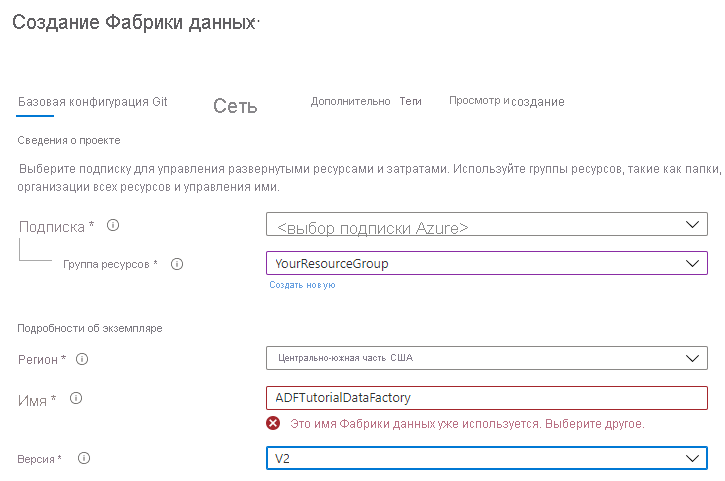
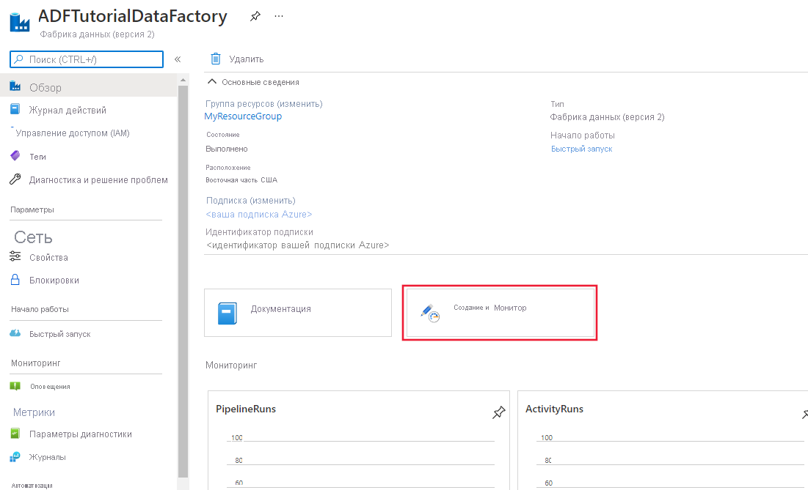

# Добавочное копирование новых файлов на основе временного секционированного файла с помощью средства Копирование данных

[!INCLUDE[appliesto-adf-asa-md](includes/appliesto-adf-asa-md.md)]

В этом руководстве вы создадите фабрику данных с помощью портала Azure. Затем вы используете средство Копирование данных для создания конвейера, который постепенно копирует новые файлы на основе временного секционированного имени из хранилища BLOB-объектов Azure в хранилище BLOB-объектов Azure.

> [!NOTE]
> Если вы еще не работали с фабрикой данных Azure, ознакомьтесь со статьей [Введение в фабрику данных Azure](introduction.md).

Вот какие шаги выполняются в этом учебнике:

> [!div class="checklist"]
> * Создали фабрику данных.
> * Создание конвейера с помощью средства копирования данных.
> * Мониторинг конвейера и выполнения действий.

## Предварительные требования

* **Подписка Azure**: Если у вас еще нет подписки Azure, [создайте бесплатную учетную запись](https://azure.microsoft.com/free/), прежде чем начинать работу.
* **Учетная запись хранения Azure**. Используйте хранилище BLOB-объектов в качестве _источника_  и _приемника_ хранилища данных. Если у вас нет учетной записи хранения Azure, см. инструкции по [ее созданию](../storage/common/storage-account-create.md).

### Создание двух контейнеров в хранилище BLOB-объектов

Подготовьте хранилище BLOB-объектов для учебника, выполнив следующие действия.

1. Создайте контейнер с именем **Source**.  Создайте путь к папке в контейнере как **2020/03/17/03** . Создайте пустой текстовый файл и присвойте ему имя **file1.txt**. Отправьте file1.txt в папку с **исходным путем/2020/03/17/03** в учетной записи хранения.  Это можно сделать при помощи таких средств, как [обозреватель службы хранилища Azure](https://storageexplorer.com/).

    

    > [!NOTE]
    > Измените имя папки, указав время в формате UTC.  Например, если текущее время в формате UTC — 3:38 AM 17 марта 2020, можно создать путь к папке в формате **Source/2020/03/17/03/** согласно правилу **Source/{year}/{month}/{day}/{Hour}/**.

2. Создайте контейнер с именем **Destination**. Это можно сделать при помощи таких средств, как [обозреватель службы хранилища Azure](https://storageexplorer.com/).

## Создание фабрики данных

1. В меню слева выберите **Создать ресурс** > **Интеграция** > **Фабрика данных**:

   

2. На странице **Новая фабрика данных** в поле **Имя** введите **ADFTutorialDataFactory**.

    Имя фабрики данных должно быть _глобально уникальным_. Вы можете получить следующее сообщение об ошибке.

   

   Если вы увидите следующую ошибку касательно значения имени, введите другое имя фабрики данных. Например,**_ваше_имя_** **ADFTutorialDataFactory**. Правила именования артефактов службы "Фабрика данных" см. в [этой](naming-rules.md) статье.
3. Выберите **подписку** Azure, в которой нужно создать фабрику данных.
4. Для **группы ресурсов** выполните одно из следующих действий:

    а. Выберите **Использовать существующую** и укажите существующую группу ресурсов в раскрывающемся списке.

    b. Выберите **Создать новую** и укажите имя группы ресурсов. 
         
    Сведения о группах ресурсов см. в статье [Общие сведения об Azure Resource Manager](../azure-resource-manager/management/overview.md).

5. В качестве **версии** выберите **V2**.
6. В качестве **расположения** выберите расположение фабрики данных. В раскрывающемся списке отображаются только поддерживаемые расположения. Хранилища данных (например, служба хранилища Azure и база данных SQL) и вычислительные ресурсы (например, Azure HDInsight), используемые фабрикой данных, могут располагаться в других регионах или расположениях.
7. Нажмите кнопку **создания**.
8. Когда создание завершится, откроется домашняя страница **Фабрика данных**.
9. Щелкните плитку **Author & Monitor** (Создание и мониторинг), чтобы запустить на отдельной вкладке пользовательский интерфейс фабрики данных Azure.

    

## Создание конвейера с помощью средства копирования данных

1. На странице Приступая к **работе** выберите заголовок **копирование данных** , чтобы запустить средство копирование данных.

   

2. На странице **Свойства** выполните следующие действия.

    а. В разделе **имя задачи** введите **делтакопифромблобпипелине**.

    b. В разделе " **ритмичность задач" или "Расписание задач**" выберите **регулярное выполнение по расписанию**.

    c. В разделе **тип триггера** выберите **окно "переворачивающегося"**.

    d. В разделе **повторение** введите **1 час**.

    д) Выберите **Далее**.

    Пользовательский интерфейс фабрики данных создаст конвейер с указанным именем задачи.

    
3. На странице **Исходное хранилище данных** сделайте следующее:

    а. Щелкните **+Создать подключение**, чтобы добавить подключение.
    
    b. В коллекции выберите Хранилище BLOB-объектов Azure и щелкните Продолжить.
    
    c. На странице **Новая связанная служба (хранилище BLOB-объектов Azure)** введите имя связанной службы. Выберите подписку Azure и выберите учетную запись хранения из списка **имя учетной записи хранения** . Проверьте подключение и выберите **Создать**.

    

    d. Выберите созданную связанную службу на странице **исходное хранилище данных** и нажмите кнопку **Далее**.

4. На странице **Choose the output file or folder** (Выбор файла или папки входных данных) выполните следующие действия.

    а. Найдите и выберите **Исходный** контейнер, а затем нажмите **кнопку Выбрать**.

    

    b. В разделе **поведение при загрузке файлов** выберите **добавочная загрузка: временная секционированная папка или имена файлов**.

    c. Запишите путь динамической папки в формате " **источник/{год}/{месяц}/{день}/{час}/**" и измените формат, как показано на следующем снимке экрана. Проверьте **двоичное копирование** и нажмите кнопку **Далее**.

         

5. На странице **целевое хранилище данных** выберите **AzureBlobStorage**, которая является той же учетной записью хранения, что и хранилище источников данных, и нажмите кнопку **Далее**.

    
6. На странице **Выбор выходного файла или папки** выполните следующие действия.

    а. Найдите и выберите папку **назначения** , а затем нажмите кнопку **выбрать**.

    b. Запишите путь к динамическим папкам в качестве **места назначения/{year}/{month}/{день}/{Hour}/** и измените формат следующим образом:

    

    в. Нажмите кнопку **Далее**.

    
7. На странице **Параметры** выберите **Далее**.

8. Просмотрите параметры на странице **Сводка**, а затем нажмите кнопку **Далее**.

    

9. На **странице развертывания** выберите **Мониторинг**, чтобы отслеживать созданный конвейер (задачу).
    

10. Обратите внимание, что слева автоматически выбирается вкладка **Мониторинг**.  Необходимо дождаться выполнения конвейера при автоматическом запуске (примерно через один час). При запуске щелкните ссылку имя конвейера **делтакопифромблобпипелине** , чтобы просмотреть сведения о выполнении действия или перезапустить конвейер. Щелкните **Обновить**, чтобы обновить список.

    
11. В этом конвейере определено только одно действие (действие копирования), поэтому вы увидите только одну запись. Настройка ширины столбца **исходных** и **целевых** столбцов (при необходимости) для просмотра дополнительных сведений можно увидеть исходный файл (file1.txt), скопированный из  *Source/2020/03/17/03/* to *Destination/2020/03/17/03/* с тем же именем файла. 

    

    Вы также можете проверить это же с помощью Обозреватель службы хранилища Azure ( https://storageexplorer.com/) для сканирования файлов.

    

12. Создайте другой пустой текстовый файл с новым именем в виде **file2.txt**. Передайте файл file2.txt в папку с **исходным путем/2020/03/17/04** в учетной записи хранения. Это можно сделать при помощи таких средств, как [обозреватель службы хранилища Azure](https://storageexplorer.com/).

    > [!NOTE]
    > Возможно, вы знаете, что требуется создать новый путь к папке. Измените имя папки, указав время в формате UTC.  Например, если текущее время UTC равно 4:20 AM. 17, 2020, можно создать путь к папке в виде **Source/2020/03/17/04/** в соответствии с правилом **{year}/{Монс}/{дай}/{Хаур}/**.

13. Чтобы вернуться к представлению **запусков конвейеров** , выберите **все конвейеры** и дождитесь автоматического запуска одного и того же конвейера через час.  

    

14. Выберите ссылку New **делтакопифромблобпипелине** (создать) для второго запуска конвейера, когда он поступает, и сделайте то же самое для просмотра подробностей. Вы увидите, что исходный файл (file2.txt) скопирован из  **Source/2020/03/17/04/**  to **Destination/2020/03/17/04/** с тем же именем файла. Это также можно проверить с помощью Обозреватель службы хранилища Azure ( https://storageexplorer.com/) для сканирования файлов в **целевом** контейнере.

## Дальнейшие действия
Перейдите к следующему руководству, чтобы узнать о преобразовании данных с помощью кластера Spark в Azure:

> [!div class="nextstepaction"]
>[Transform data in the cloud by using Spark activity in Azure Data Factory](tutorial-transform-data-spark-portal.md) (Преобразование данных в облаке с помощью действий Spark в фабрике данных Azure)
