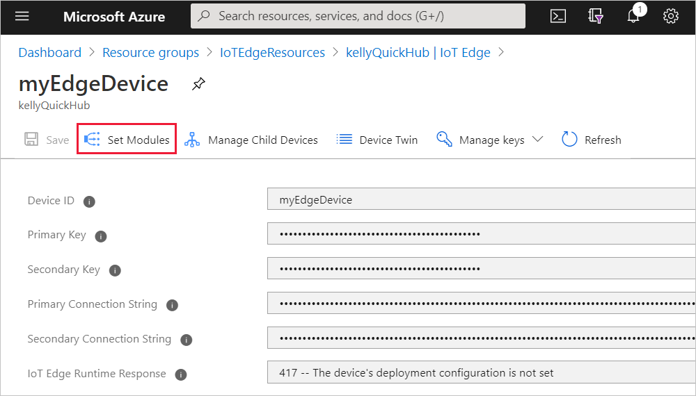
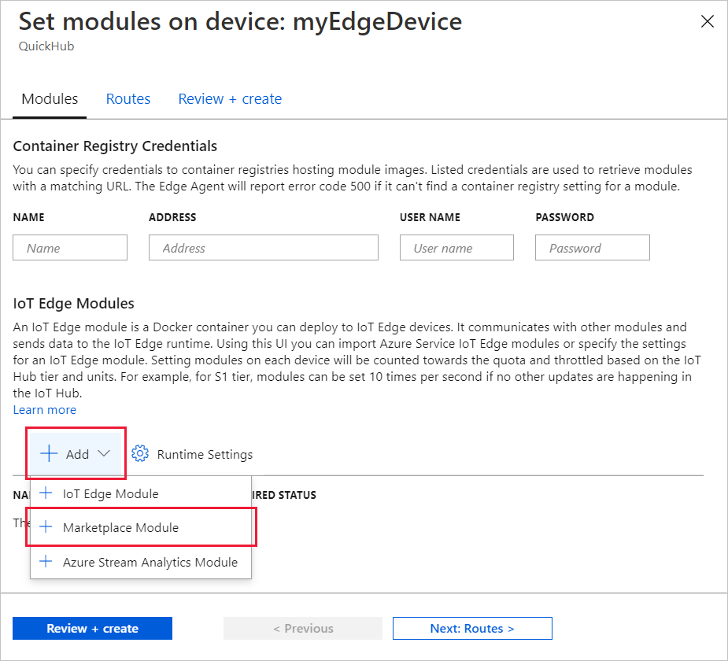
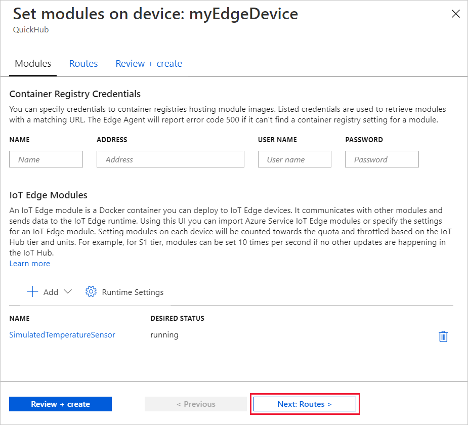
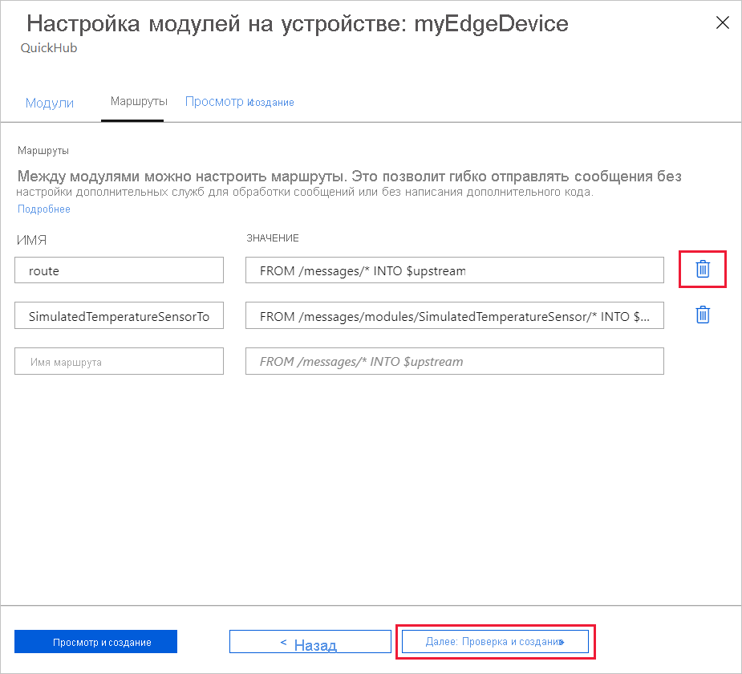
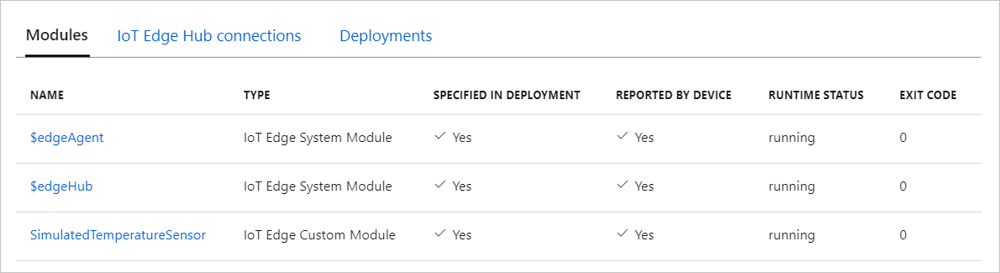

# <a name="quickstart-deploy-your-first-iot-edge-module-to-a-windows-device-preview"></a>Краткое руководство. Развертывание первого модуля IoT Edge на устройстве Windows (предварительная версия)

[!INCLUDE [iot-edge-version-201806](../../includes/iot-edge-version-201806.md)]

Опробуйте Azure IoT Edge с помощью этого краткого руководства, развернув контейнерный код в Linux на устройстве IoT Edge с Windows. IoT Edge позволяет удаленно управлять кодом на устройствах, чтобы вы могли передавать больше рабочих нагрузок на пограничные устройства. Для работы с этим кратким руководством мы рекомендуем использовать собственное устройство. Вы увидите, насколько просто использовать Azure IoT Edge для Linux в Windows.

В этом кратком руководстве описано следующее:

* Создайте Центр Интернета вещей.
* Регистрация устройства IoT Edge в Центре Интернета вещей.
* Установка и запуск среды выполнения IoT Edge для Linux в Windows на устройстве.
* Удаленное развертывание модуля на устройстве IoT Edge и отправка телеметрии.


В этом кратком руководстве объясняется, как настроить Azure IoT Edge для Linux на устройстве Windows. Затем на портале Azure вы развернете модуль для устройства. Модуль, который вы будете использовать, — это имитированный датчик, генерирующий данные температуры, влажности и давления. В других руководствах по Azure IoT Edge используются наработки из этой статьи: развернутые модули, которые анализируют смоделированные данные для бизнес-аналитики.

Если у вас нет активной подписки Azure, перед началом работы создайте [бесплатную учетную запись](https://azure.microsoft.com/free).

>[!NOTE]
>IoT Edge для Linux в Windows предоставляется в [общедоступной предварительной версии](https://azure.microsoft.com/support/legal/preview-supplemental-terms/).

## <a name="prerequisites"></a>Предварительные требования

Подготовьте среду к работе с Azure CLI.

[!INCLUDE [azure-cli-prepare-your-environment-no-header.md](../../includes/azure-cli-prepare-your-environment-no-header.md)]

Создайте облачную группу ресурсов для управления всеми ресурсами, которые вы используете в этом кратком руководстве.

   ```azurecli-interactive
   az group create --name IoTEdgeResources --location westus2
   ```

Убедитесь, что устройство IoT Edge соответствует следующим требованиям:

* Выпуски
  * Windows 10 версии 1809 или более поздней; сборка 17763 или более поздняя
    * Профессиональная, Корпоративная, IoT Корпоративная
  * Windows Server 2019; сборка 17763 или более поздняя

* Требования к оборудованию
  * Минимальный объем свободной памяти: 2 ГБ
  * Минимальный объем свободного места на диске: 10 ГБ

>[!NOTE]
>В этом кратком руководстве для создания развертывания IoT Edge для Linux в Windows используется Windows Admin Center. Вы также можете использовать PowerShell. Если вы хотите использовать PowerShell для создания развертывания, выполните действия, описанные в руководстве по [установке и подготовке Azure IoT Edge для Linux на устройстве Windows](how-to-install-iot-edge-on-windows.md).

## <a name="create-an-iot-hub"></a>Создание Центра Интернета вещей

Начните с создания центра Интернета вещей с помощью Azure CLI.


Для целей этого руководства можно использовать бесплатный уровень Центра Интернета вещей Azure. Если у вас уже есть центр Интернета вещей, который вы использовали ранее, вы можете продолжить работу с ним.

При помощи следующего кода создается бесплатный центр **F1** в группе ресурсов `IoTEdgeResources`. Замените `{hub_name}` уникальным именем центра Интернета вещей. Создание Центра Интернета вещей может занять несколько минут.

```azurecli-interactive
az iot hub create --resource-group IoTEdgeResources --name {hub_name} --sku F1 --partition-count 2
```

Если отобразится сообщение об ошибке с уведомлением о том, что в вашей подписке уже имеется один бесплатный центр, измените номер SKU на `S1`. Если отобразится сообщение об ошибке с уведомлением о том, что имя центра недоступно, кто-то уже создал центр Интернета вещей с таким именем. Выберите другое имя.

## <a name="register-an-iot-edge-device"></a>Регистрация устройства IoT Edge

Зарегистрируйте устройство IoT Edge в только что созданном Центре Интернета вещей.


Создайте удостоверение для своего имитированного устройства, чтобы оно могло обмениваться данными с Центром Интернета вещей. Удостоверение устройства находится в облаке. Чтобы связать физическое устройство с удостоверением, нужно использовать уникальную строку подключения к устройству.

Устройства IoT Edge работают и могут управляться иначе, чем обычные устройства Интернета вещей. Используйте флаг `--edge-enabled`, чтобы объявить это удостоверение как удостоверение для устройства IoT Edge.

1. Чтобы создать устройство с именем **myEdgeDevice** в своем центре, введите следующую команду в Azure Cloud Shell.

     ```azurecli-interactive
     az iot hub device-identity create --device-id myEdgeDevice --edge-enabled --hub-name {hub_name}
     ```

     Если отобразится сообщение об ошибке при использовании ключей политики `iothubowner`, убедитесь, что в Cloud Shell установлена последняя версия расширения Интернета вещей Azure.

1. Просмотрите строку подключения для устройства, которая связывает физическое устройство с его удостоверением в Центре Интернета вещей. Она содержит имя центра Интернета вещей и имя устройства, а также общий ключ, который используется для аутентификации подключений между ними.

     ```azurecli-interactive
     az iot hub device-identity connection-string show --device-id myEdgeDevice --hub-name {hub_name}
     ```

1. Скопируйте значение ключа `connectionString` из выходных данных JSON и сохраните его. Это значение — строка подключения устройства. Это значение потребуется для настройки среды выполнения IoT Edge в следующем разделе.

     

## <a name="install-and-start-the-iot-edge-runtime"></a>Установка и запуск среды выполнения IoT Edge

Установите IoT Edge для Linux в Windows на своем устройстве и настройте эту службу, используя строку подключения устройства.


1. [Скачайте Windows Admin Center.](https://aka.ms/wacdownload)

1. Следуйте указаниям мастера установки, чтобы настроить Windows Admin Center на устройстве.

1. Откройте Windows Admin Center.

1. Щелкните значок **шестеренки "Параметры"** в правом верхнем углу экрана и выберите **Расширения**.

1. На вкладке **Веб-каналы** выберите **Добавить**.

1. Введите `https://aka.ms/wac-insiders-feed` в текстовое поле и щелкните **Добавить**.

1. После добавления веб-канала перейдите на вкладку **Доступные расширения** и дождитесь обновления списка расширений.

1. В списке **Доступные расширения** выберите **Azure IoT Edge**.

1. Установите расширение.

1. После установки расширения выберите **Windows Admin Center** в левом верхнем углу, чтобы открыть главную страницу панели мониторинга.

     Подключение **localhost** представляет компьютер, на котором выполняется Windows Admin Center.

     :::image type="content" source="media/quickstart/windows-admin-center-start-page.png" alt-text="Снимок экрана: страница Windows Admin Center.":::

1. Выберите **Добавить**.

     :::image type="content" source="media/quickstart/windows-admin-center-start-page-add.png" alt-text="Снимок экрана: нажатие кнопки &quot;Добавить&quot; в Windows Admin Center.":::

1. На плитке Azure IoT Edge выберите **Создать**, чтобы запустить мастер установки.

     :::image type="content" source="media/quickstart/select-tile-screen.png" alt-text="Снимок экрана: создание развертывания на плитке Azure IoT Edge.":::

1. Продолжите работу с мастером установки, примите условия лицензии на программное обеспечение Майкрософт и нажмите кнопку **Далее**.

     :::image type="content" source="media/quickstart/wizard-welcome-screen.png" alt-text="Снимок экрана: нажатие кнопки &quot;Далее&quot; для продолжения работы с мастером установки.":::

1. Выберите **Необязательные диагностические данные** и нажмите кнопку **Далее: Развертывание**. Это позволит вам получить расширенные диагностические данные, которые помогают Майкрософт отслеживать и поддерживать качество обслуживания.

     :::image type="content" source="media/quickstart/diagnostic-data-screen.png" alt-text="Снимок экрана: параметры диагностических данных.":::

1. На экране **Выбор целевого устройства** выберите нужное целевое устройство, чтобы проверить его соответствие минимальным требованиям. В рамках этого краткого руководства мы установим IoT Edge на локальном устройстве, поэтому выберите подключение **localhost**. Если целевое устройство соответствует требованиям, нажмите кнопку **Далее**, чтобы продолжить.

     :::image type="content" source="media/quickstart/wizard-select-target-device-screen.png" alt-text="Снимок экрана: список &quot;Целевое устройство&quot;.":::

1. Нажмите кнопку **Далее**, чтобы принять параметры по умолчанию. На экране развертывания можно отслеживать процесс скачивания и установки пакета, настройки узла и окончательной настройки виртуальной машины Linux. Успешное развертывание выглядит следующим образом:

     :::image type="content" source="media/quickstart/wizard-deploy-success-screen.png" alt-text="Снимок экрана: успешное развертывание.":::

1. По завершении выберите **Next: подключиться**, чтобы перейти к последнему шагу по подготовке устройства Azure IoT Edge с использованием идентификатора устройства, полученного в вашем экземпляре центра Интернета вещей.

1. Вставьте строку подключения, скопированную [ранее при работе с этим кратким руководством](#register-an-iot-edge-device), в поле **Device connection string** (Строка подключения устройства). Затем выберите **Provisioning with the selected method** (Подготовить с помощью выбранного метода).

     :::image type="content" source="media/quickstart/wizard-provision.png" alt-text="Снимок экрана: строка подключения устройства в соответствующем поле.":::

1. После завершения подготовки выберите **Готово**, чтобы завершить работу и вернуться на начальный экран Windows Admin Center. Теперь устройство должно отображаться в списке как устройство IoT Edge.

     :::image type="content" source="media/quickstart/windows-admin-center-device-screen.png" alt-text="Снимок экрана: все подключения в Windows Admin Center.":::

1. Выберите свое устройство Azure IoT Edge, чтобы просмотреть его панель мониторинга. Вы должны увидеть, что рабочие нагрузки с устройства двойника в Центре Интернета вещей Azure уже развернуты. В **списке модулей IoT Edge** должен отображаться один запущенный модуль (**edgeAgent**), а в строке **Состояние IoT Edge** должно отображаться значение **Активно (работает)** .

Теперь устройство IoT Edge настроено. Оно готово для запуска модулей, развернутых в облаке.

## <a name="deploy-a-module"></a>Развертывание модуля

Управляя устройством Azure IoT Edge из облака, разверните модуль, который будет передавать данные телеметрии в Центр Интернета вещей.


<!--
[!INCLUDE [iot-edge-deploy-module](../../includes/iot-edge-deploy-module.md)]

Include content included below to support versioned steps in Linux quickstart. Can update include file once Windows quickstart supports v1.2
-->

Одной из ключевых возможностей Azure IoT Edge является развертывание кода на устройствах IoT Edge из облака. *Модули IoT Edge* — это выполняемые пакеты, которые реализованы в виде контейнеров. В этом разделе показано, как развернуть предварительно созданный модуль, полученный из раздела ["Модули IoT Edge" в Azure Marketplace](https://azuremarketplace.microsoft.com/marketplace/apps/category/internet-of-things?page=1&subcategories=iot-edge-modules), непосредственно из Центра Интернета вещей Azure.

Модуль, который будет развернут в этом разделе, имитирует поведение датчика и отправляет сгенерированные данные. Данный модуль является требуемой частью кода для начала работы с IoT Edge, так как сгенерированные данные вы можете использовать для разработки и тестирования. Если требуется увидеть полный функционал модуля, см. имитированный исходный код датчика температуры [здесь](https://github.com/Azure/iotedge/blob/027a509549a248647ed41ca7fe1dc508771c8123/edge-modules/SimulatedTemperatureSensor/src/Program.cs).

Выполните эти шаги, чтобы развернуть первый модуль из Azure Marketplace:

1. Войдите на [портал Azure](https://portal.azure.com) и перейдите к своему центру Интернета вещей.

1. В меню слева в разделе **Автоматическое управление устройствами** выберите **IoT Edge**.

1. Выберите код целевого устройства в списке устройств.

1. На верхней панели выберите **Задание модулей**.

   

1. В разделе **Модули IoT Edge** откройте раскрывающееся меню **Добавить** и выберите **Модуль в Marketplace**.

   

1. В окне **Модуль IoT Edge в Marketplace** найдите и выберите модуль `Simulated Temperature Sensor`.

   Модуль добавится в раздел "Модули IoT Edge" с требуемым состоянием **Выполняется**.

1. По завершении выберите **Next: Routes** (Далее: маршруты), чтобы перейти к следующему шагу в мастере.

   

1. На вкладке **Маршруты** удалите маршрут по умолчанию **route** и выберите элемент **Next: Review + create** (Далее: просмотр и создание), чтобы перейти к следующему шагу мастера.

   >[!Note]
   >Маршруты создаются с использованием пар "имя — значение". На этой странице должны отображаться два маршрута. Маршрут по умолчанию **route** поддерживает отправку всех сообщений в Центр Интернета вещей (с именем `$upstream`). Второй маршрут **SimulatedTemperatureSensorToIoTHub** был создан автоматически при добавлении модуля из Azure Marketplace. По этому маршруту в Центр Интернета вещей отправляются все сообщения из имитированного модуля температурного датчика. Вы можете удалить маршрут по умолчанию, так как он не нужен в этом случае.

   

1. Просмотрите файл JSON, а затем щелкните **Создать**. В файле JSON определены все модули, развертываемые на устройстве IoT Edge. В нем вы увидите модуль **SimulatedTemperatureSensor** и два модуля среды выполнения: **edgeAgent** и **edgeHub**.

   >[!Note]
   >После отправки нового развертывания на устройство IoT Edge на ваше устройство ничего оправляться не будет. Вместо этого устройство регулярно выполняет запрос к Центру Интернета вещей для получения новых сведений. Если устройство обнаруживает обновленный манифест развертывания, оно использует информацию о новом развертывании для получения образов модуля с облака с последующим локальным запуском модулей. Это может занять несколько минут.

1. Когда вы укажете сведения о развертывании модуля, мастер вернет вас на страницу с подробными сведениями об устройстве. Проверьте состояние развертывания на вкладке **Модули**.

   На ней должны быть указаны три модуля: **$edgeAgent**, **$edgeHub** и **SimulatedTemperatureSensor**. Если для одного или нескольких модулей указано значение **Да** в столбце **Указано в развертывании**, но не в столбце **Данные, полученные от устройства**, то ваше устройство IoT Edge все еще запускает эти модули. Подождите несколько минут и обновите страницу.

   

## <a name="view-the-generated-data"></a>Просмотр созданных данных

В этом руководстве мы создали новое устройство IoT Edge и установили на нем среду выполнения IoT Edge. Затем с помощью портала Azure мы развернули модуль IoT Edge на устройстве, обеспечив возможность запуска без необходимости менять настройки на устройстве.

Отправленный модуль создает примеры данных среды, которые можно использовать для последующего тестирования. Имитируемый датчик выполняет мониторинг оборудования и окружающей среды. Например, этот датчик может быть в серверной комнате, производственном цехе или ветроэлектрической установке. Он отправляет сообщения, которые содержат данные о температуре и влажности окружающей среды, температуре и давлении оборудования, а также метки времени. При работе с руководствами по IoT Edge используйте данные, созданные этим модулем, как тестовые данные для аналитики.

Перейдите в командную оболочку в Windows Admin Center и убедитесь, что модуль, развернутый из облака, выполняется на устройстве IoT Edge.

1. Подключитесь к созданному устройству IoT Edge.

     :::image type="content" source="media/quickstart/connect-edge-screen.png" alt-text="Снимок экрана: нажатие кнопки &quot;Подключить&quot; в Windows Admin Center.":::

     На странице **Общие сведения** вы увидите **список модулей IoT Edge** и **сведения о состоянии IoT Edge**. Вы можете просмотреть развернутые модули и данные о состоянии устройства.  

1. В разделе **Сервис** выберите **Командная оболочка**. Командная оболочка — это терминал PowerShell, который автоматически использует SSH (Secure Shell) для подключения к виртуальной машине Linux устройства Azure IoT Edge на компьютере с Windows.

     :::image type="content" source="media/quickstart/command-shell-screen.png" alt-text="Снимок экрана: открытие командной оболочки.":::

1. Чтобы проверить три модуля на устройстве, выполните следующую команду Bash:

     ```bash
     sudo iotedge list
     ```

    :::image type="content" source="media/quickstart/iotedge-list-screen.png" alt-text="Снимок экрана: выходные данные со списком устройств IoT Edge в командной оболочке.":::

1. Убедитесь, что сообщения отправляются с модуля датчика температуры в облако.

     ```bash
     iotedge logs SimulatedTemperatureSensor -f
     ```

    >[!Important]
    >В командах IoT Edge при использовании имен модулей учитывается регистр.

    :::image type="content" source="media/quickstart/temperature-sensor-screen.png" alt-text="Снимок экрана: список сообщений, отправленных из модуля в облако.":::

Вы также можете просматривать сообщения, которые поступают в центр Интернета вещей, используя [расширение Центра Интернета вещей Azure для Visual Studio Code](https://marketplace.visualstudio.com/items?itemName=vsciot-vscode.azure-iot-toolkit).

## <a name="clean-up-resources"></a>Очистка ресурсов

Если вы хотите продолжить работу с руководствами по IoT Edge, пропустите этот шаг. Вы можете использовать устройство, зарегистрированное и настроенное при работе с этим кратким руководством. Если нет, вы можете удалить созданные ресурсы Azure, чтобы избежать расходов.

Если вы создали виртуальную машину и Центр Интернета вещей в новой группе ресурсов, можно удалить эту группу и все связанные с ней ресурсы. Если вы не хотите удалять всю группу, можно удалить отдельные ресурсы.

> [!IMPORTANT]
> Проверьте содержимое группы ресурсов. В ней не должно быть важных ресурсов. Удаление группы ресурсов — процесс необратимый.

Используйте следующую команду, чтобы удалить группу **IoTEdgeResources**. Это действие может выполняться несколько минут.

```azurecli-interactive
az group delete --name IoTEdgeResources
```

Чтобы проверить, удалена ли группа ресурсов, просмотрите список групп ресурсов с помощью этой команды:

```azurecli-interactive
az group list
```

### <a name="remove-azure-iot-edge-for-linux-on-windows"></a>Удаление IoT Edge для Linux в Windows

Вы можете удалить Azure IoT Edge для Linux в Windows с помощью расширения панели мониторинга в Windows Admin Center.

1. Подключитесь к устройству IoT Edge в Windows Admin Center. Загрузится расширение средств панели мониторинга Azure.

1. Выберите **Удалить**. После удаления Azure IoT Edge с **начальной страницы** Windows Admin Center будет удалена запись подключения устройства Azure IoT Edge.

>[!Note]
>Чтобы воспользоваться другим способом удаления Azure IoT Edge из системы Windows, выберите **Пуск** > **Параметры** > **Приложения** > **Azure IoT Edge** > **Удалить** на своем устройстве IoT Edge. Это приведет к удалению Azure IoT Edge с устройства IoT Edge, но подключение при этом будет сохранено в Windows Admin Center. Чтобы полностью удалить все компоненты, также удалите Windows Admin Center из меню **Параметры**.

## <a name="next-steps"></a>Дальнейшие действия

При работе с этим кратким руководством вы создали устройство IoT Edge и с помощью облачного интерфейса Azure IoT Edge развернули код на устройстве. В итоге вы получили устройство для тестирования, генерирующее необработанные данные о среде.

Далее вы можете настроить локальную среду разработки, чтобы приступить к созданию модулей IoT Edge, которые выполняют бизнес-логику.

> [!div class="nextstepaction"]
> [Разработка модулей IoT Edge](tutorial-develop-for-linux.md)
