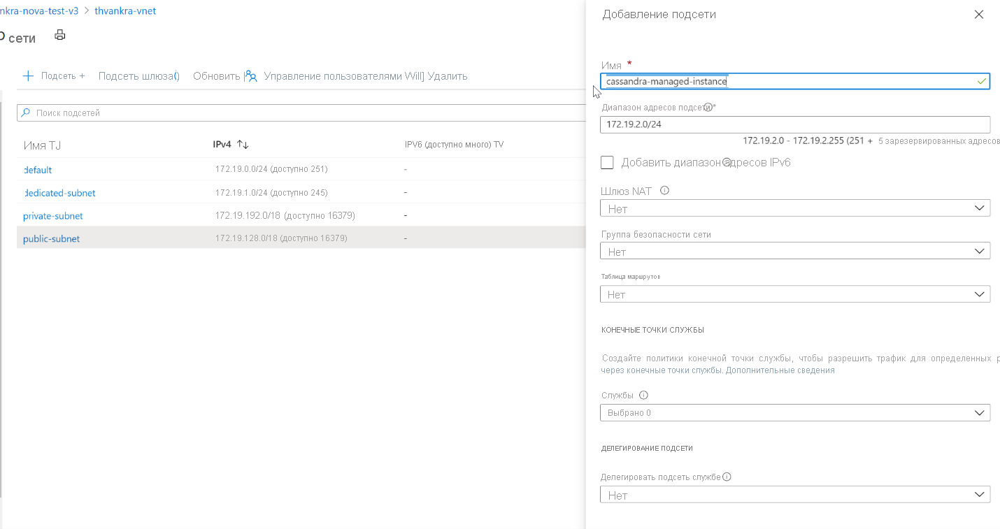
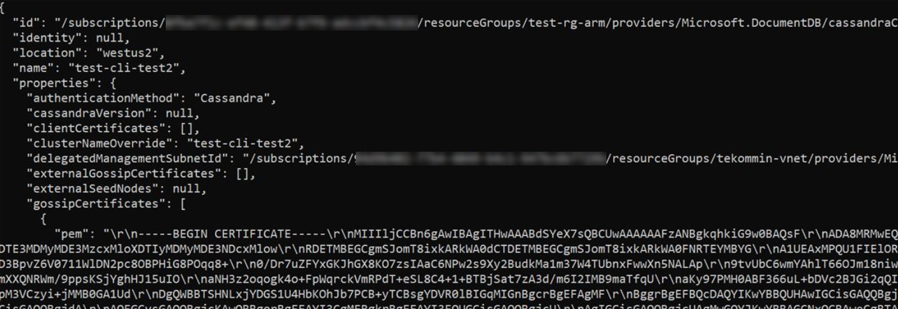
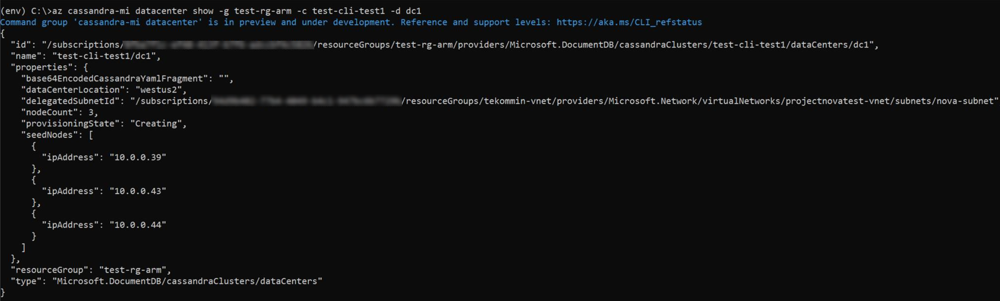

# <a name="quickstart-configure-a-hybrid-cluster-with-azure-managed-instance-for-apache-cassandra-preview"></a>Краткое руководство. Настройка гибридного кластера с помощью службы "Управляемый экземпляр Azure для Apache Cassandra" (предварительная версия)

Служба "Управляемый экземпляр Azure для Apache Cassandra" позволяет автоматизировать операции развертывания и масштабирования для управляемых решений Apache Cassandra с открытым кодом для центров обработки данных. Эта служба помогает ускорить гибридные сценарии и сократить текущее обслуживание.

> [!IMPORTANT]
> Служба "Управляемый экземпляр Azure для Apache Cassandra" сейчас предоставляется в общедоступной предварительной версии.
> Эта предварительная версия предоставляется без соглашения об уровне обслуживания и не рекомендована для использования рабочей среде. Некоторые функции могут не поддерживаться или их возможности могут быть ограничены.
> Дополнительные сведения см. в статье [Дополнительные условия использования предварительных выпусков Microsoft Azure](https://azure.microsoft.com/support/legal/preview-supplemental-terms/).

В этом кратком руководстве показано, как с помощью команд Azure CLI настроить гибридный кластер. Если у вас есть центры обработки данных в локальной или собственной среде, с помощью службы "Управляемый экземпляр Azure для Apache Cassandra" вы можете добавить в кластер другие центры обработки данных и поддерживать их.

[!INCLUDE [azure-cli-prepare-your-environment.md](../../includes/azure-cli-prepare-your-environment.md)]

* Для работы с этой статьей потребуется Azure CLI 2.12.1 или более поздней версии. Если вы используете Azure Cloud Shell, последняя версия уже установлена.

* [Виртуальная сеть Azure](../virtual-network/virtual-networks-overview.md) с подключением к собственной или локальной среде. Дополнительные сведения о подключении локальных сред к Azure см. в статье [Подключение локальной сети к Azure](https://docs.microsoft.com/azure/architecture/reference-architectures/hybrid-networking/).

## <a name="configure-a-hybrid-cluster"></a><a id="create-account"></a>Настройка гибридного кластера

1. Войдите на [портал Azure](https://portal.azure.com/) и найдите нужный ресурс виртуальной сети.

1. Откройте вкладку **Подсети** и создайте новую подсеть. Дополнительные сведения о полях в форме **Добавление подсети** можно найти в статье [о виртуальной сети](../virtual-network/virtual-network-manage-subnet.md#add-a-subnet).

   :::image type="content" source="./media/configure-hybrid-cluster/subnet.png" alt-text="Создание подсети в виртуальной сети." lightbox="./media/configure-hybrid-cluster/subnet.png" border="true":::
    <!--  -->

1. Теперь мы с помощью Azure CLI применим к виртуальной сети и подсетям специальные разрешения, которые требует Управляемый экземпляр Cassandra. Для начала нам нужно найти `Resource ID` для существующей виртуальной сети. Скопируйте значение из выходных данных этой команды, оно будет использоваться как `Resource ID`.

   ```azurecli-interactive
    # discover the vnet id
    az network vnet show -n <your VNet name> -g <Resource Group Name> --query "id" --output tsv
   ```

1. Теперь мы применим специальные разрешения, передав выходные данные предыдущей команды в качестве параметра области:

   ```azurecli-interactive
    az role assignment create --assignee e5007d2c-4b13-4a74-9b6a-605d99f03501 --role 4d97b98b-1d4f-4787-a291-c67834d212e7 --scope <Resource ID>
   ```
    > [!NOTE]
    > Указанные выше значения `assignee` и `role` являются фиксированными идентификаторами субъекта-службы и роли соответственно. 

1. Теперь нам предстоит настроить ресурсы для гибридного кластера. Так как кластер у вас уже есть, имя кластера здесь является логическим ресурсом, который позволяет указать имя существующего кластера. Обязательно указывайте имя существующего кластера при определении переменных `clusterName` и `clusterNameOverride` в следующем скрипте.

   Кроме того, нужно указать начальные узлы, общедоступные сертификаты клиентов (если вы настроили открытый и закрытый ключ для конечной точки Cassandra) и сертификаты протоколов gossip для существующего кластера. Также потребуется указать идентификатор ресурса, который вы скопировали выше, для определения переменной `delegatedManagementSubnetId`.

   ```azurecli-interactive
   resourceGroupName='MyResourceGroup'
   clusterName='cassandra-hybrid-cluster-legal-name'
   clusterNameOverride='cassandra-hybrid-cluster-illegal-name'
   location='eastus2'
   delegatedManagementSubnetId='<Resource ID>'
    
   # You can override the cluster name if the original name is not legal for an Azure resource:
   # overrideClusterName='ClusterNameIllegalForAzureResource'
   # the default cassandra version will be v3.11
    
   az managed-cassandra cluster create \
      --cluster-name $clusterName \
      --resource-group $resourceGroupName \
      --location $location \
      --delegated-management-subnet-id $delegatedManagementSubnetId \
      --external-seed-nodes 10.52.221.2,10.52.221.3,10.52.221.4
      --client-certificates 'BEGIN CERTIFICATE-----\n...PEM format..\n-----END CERTIFICATE-----','BEGIN CERTIFICATE-----\n...PEM format...\n-----END CERTIFICATE-----' \
      --external-gossip-certificates 'BEGIN CERTIFICATE-----\n...PEM format 1...\n-----END CERTIFICATE-----','BEGIN CERTIFICATE-----\n...PEM format 2...\n-----END CERTIFICATE-----'
   ```

    > [!NOTE]
    > Вам нужна информация о том, где хранятся существующие общедоступные сертификаты и (или) сертификаты gossip. Если вам это неизвестно, можно выполнить `keytool -list -keystore <keystore-path> -rfc -storepass <password>` для вывода сертификатов. 

1. После создания ресурса кластера выполните следующую команду, чтобы получить сведения о настройке кластера:

   ```azurecli-interactive
   resourceGroupName='MyResourceGroup'
   clusterName='cassandra-hybrid-cluster'
    
   az managed-cassandra cluster show \
       --cluster-name $clusterName \
       --resource-group $resourceGroupName \
   ```

1. Приведенная выше команда возвращает сведения о среде для управляемого экземпляра. Вам понадобятся сертификаты gossip, чтобы их можно было установить на узлах в существующем центре обработки данных. На следующем снимке экрана представлены выходные данные приведенной выше команды и формат сертификатов.

   :::image type="content" source="./media/configure-hybrid-cluster/show-cluster.png" alt-text="Получение сведений о сертификате из кластера." lightbox="./media/configure-hybrid-cluster/show-cluster.png" border="true":::
    <!--  -->

1. Теперь создайте центр обработки данных в гибридном кластере. Обязательно замените значения переменных данными для реального кластера:

   ```azurecli-interactive
   resourceGroupName='MyResourceGroup'
   clusterName='cassandra-hybrid-cluster'
   dataCenterName='dc1'
   dataCenterLocation='eastus2'
   delegatedSubnetId= '<Resource ID>'
    
   az managed-cassandra datacenter create \
       --resource-group $resourceGroupName \
       --cluster-name $clusterName \
       --data-center-name $dataCenterName \
       --data-center-location $dataCenterLocation \
       --delegated-subnet-id $delegatedSubnetId \
       --node-count 9 
   ```

1. Итак, новый центр обработки данных создан. Теперь выполните команду show datacenter, чтобы просмотреть сведения о нем.

   ```azurecli-interactive
   resourceGroupName='MyResourceGroup'
   clusterName='cassandra-hybrid-cluster'
   dataCenterName='dc1'
    
   az managed-cassandra datacenter show \
       --resource-group $resourceGroupName \
       --cluster-name $clusterName \
       --data-center-name $dataCenterName 
   ```

1. Приведенная выше команда выводит список начальных узлов нового центра обработки данных. Добавьте начальные узлы нового центра обработки данных в конфигурацию существующего центра обработки данных в файле *cassandra.yaml*. И установите для управляемого экземпляра сертификаты gossip, собранные ранее:

   :::image type="content" source="./media/configure-hybrid-cluster/show-datacenter.png" alt-text="Получение сведений о центре обработки данных." lightbox="./media/configure-hybrid-cluster/show-datacenter.png" border="true":::
    <!--  -->

    > [!NOTE]
    > Если вы хотите добавить еще центры обработки данных, можно повторить описанные выше шаги, но в этом случае вам будут нужны только начальные узлы. 

1. Наконец, выполните следующий запрос CQL, чтобы включить в стратегию репликации в каждом пространстве ключей все центры обработки данных кластера:

   ```bash
   ALTER KEYSPACE "ks" WITH REPLICATION = {'class': 'NetworkTopologyStrategy', ‘on-premise-dc': 3, ‘managed-instance-dc': 3};
   ```
   Также необходимо обновить таблицы паролей:

   ```bash
    ALTER KEYSPACE "system_auth" WITH REPLICATION = {'class': 'NetworkTopologyStrategy', ‘on-premise-dc': 3, ‘managed-instance-dc': 3}
   ```

## <a name="clean-up-resources"></a>Очистка ресурсов

Если вы не планируете в дальнейшем использовать кластер с управляемым экземпляром, удалите его, выполнив следующие действия:

1. В меню слева на портале Azure выберите **Группы ресурсов**.
1. Выберите из списка группу ресурсов, созданную для этого краткого руководства.
1. На панели **Обзор** на странице группы ресурсов выберите **Удалить группу ресурсов**.
3. В следующем окне введите имя группы ресурсов, которую требуется удалить, и щелкните **Удалить**.

## <a name="next-steps"></a>Дальнейшие действия

Из этого краткого руководства вы узнали, как создать гибридный кластер с использованием Azure CLI и службы "Управляемый экземпляр Azure для Apache Cassandra". Теперь можно приступить к работе с кластером.

> [!div class="nextstepaction"]
> [Управление ресурсами службы "Управляемый экземпляр Azure для ресурсов Apache Cassandra" с помощью Azure CLI](manage-resources-cli.md)