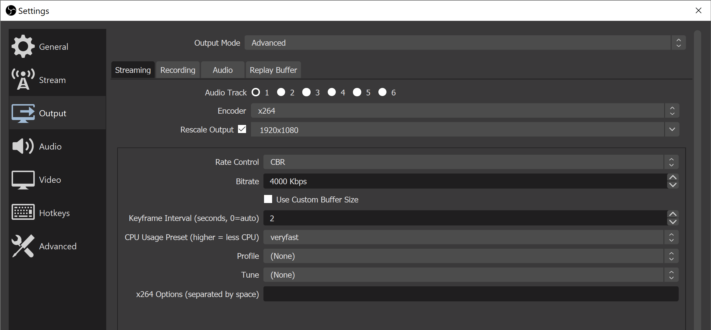
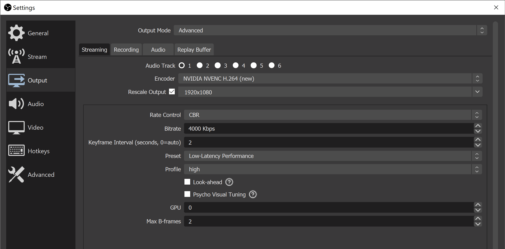
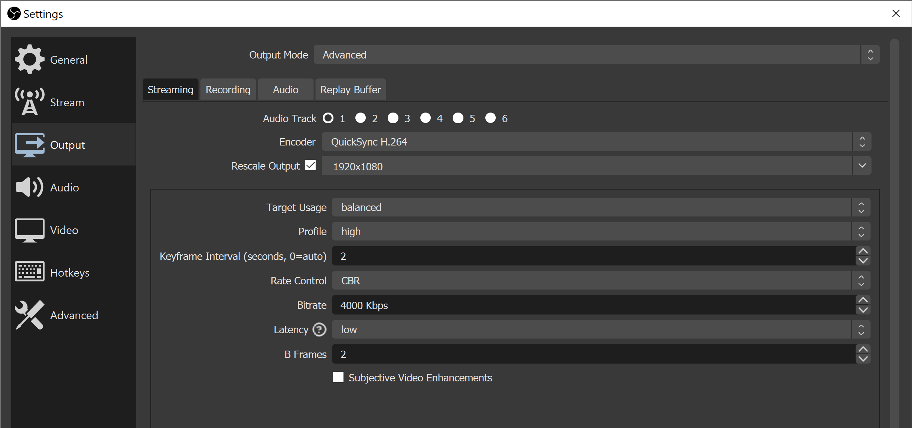
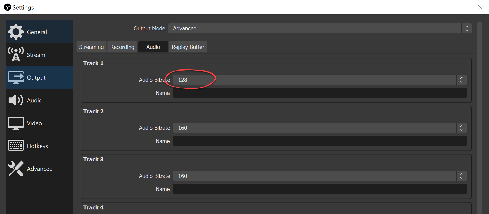
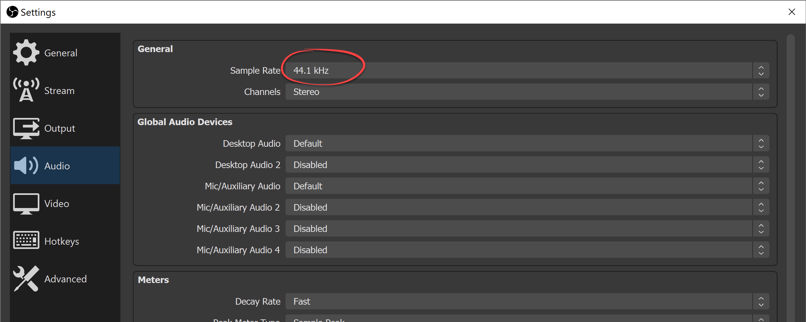

# Создание прямой трансляции в Службах мультимедиа Azure с помощью OBS

[!INCLUDE [media services api v3 logo](./includes/v3-hr.md)]

Из этого краткого руководства вы узнаете, как создать трансляцию в Службах мультимедиа с помощью портала Azure и Open Broadcasting Studio (OBS). Далее предполагается, что у вас есть подписка Azure и создана учетная запись Служб мультимедиа Azure.

В этом кратком руководстве мы рассмотрим следующие процессы:

- настройка локального кодировщика с помощью OBS;
- настройка прямой трансляции;
- настройка выходных потоков прямой трансляции;
- активация конечной точки прямой передачи по умолчанию;
- применение Проигрывателя мультимедиа Azure для просмотра прямой трансляции и вывода по запросу.

## Предварительные требования

Если у вас еще нет подписки Azure, [создайте бесплатную учетную запись](https://azure.microsoft.com/free/), прежде чем начинать работу.

## Вход на портал Azure

Откройте веб-браузер и перейдите на [портал Microsoft Azure](https://portal.azure.com/). Введите свои учетные данные для входа на портал. Панель мониторинга службы является представлением по умолчанию.

## Настройка локального кодировщика с помощью OBS

1. Скачайте с [веб-сайта Open Broadcaster Software (OBS)](https://obsproject.com/) и установите версию OBS для используемой операционной системы.
1. Запустите приложение и не закрывайте его.

## Активация стандартной конечной точки потоковой передачи

1. В Службах мультимедиа выберите **Конечные точки потоковой передачи** в списке.

   
1. Если стандартная конечная точка потоковой передачи находится в состоянии "Остановлена", выберите ее. После этого откроется страница конечной точки.
1. Щелкните **Запуск**.

   

## Настройка прямой трансляции в Службах мультимедиа Azure

1. Перейдите к учетной записи Служб мультимедиа Azure на портале и выберите **Потоковая трансляция** из списка **Службы мультимедиа**.

   
1. Выберите **Добавить трансляцию**, чтобы создать событие потоковой трансляции.

   
1. Введите имя нового события, например *TestLiveEvent*, в поле **Имя трансляции**.

   
1. Введите необязательное описание события в поле **Описание**.
1. Выберите вариант **Сквозной режим — без кодирования в облаке**.

   
1. Выберите вариант **RTMP**.
1. Чтобы избежать оплаты за трансляцию до того, как она будет готова, установите значение **Нет** для параметра **Начать прямую трансляцию**. (Начисление оплаты начнется после запуска трансляции.)

   
1. Нажмите кнопку **Просмотр и создание**, чтобы проверить параметры.
1. Нажмите кнопку **Создать**, чтобы создать трансляцию. Вы вернетесь к представлению списка трансляций.
1. Щелкните ссылку на созданную трансляцию. Обратите внимание, что событие остановлено.
1. Не закрывайте эту страницу в браузере. Мы вернемся к нему позже.

## Настройка прямой трансляции с помощью OBS Studio

OBS начинает работу со сцены по умолчанию, для которой не выбраны никакие входные данные.

   

### Добавление источника видео

1. На панели **Sources** (Источники) щелкните значок **add** (Добавить), чтобы выбрать новое исходное устройство. Откроется меню **Источники**.

1. Выберите **устройство видеозахвата** из меню исходных устройств. Откроется меню **создания и выбора источников**.

   

1. Выберите переключатель **Add Existing** (Добавить существующий) и щелкните **ОК**. Откроется меню **свойств для видеоустройства**.

   

1. В раскрывающемся списке **Устройство** выберите источник видео, который хотите использовать для трансляции. Остальные параметры пока не изменяйте, а просто щелкните **ОК**. Источник входных данных будет добавлен на панель **Источники**, а в области **Предварительный просмотр** появится представление входных видеоданных.

   

### Добавление источника звука

1. На панели **Sources** (Источники) щелкните значок **add** (Добавить), чтобы выбрать новое исходное устройство. Откроется меню "Исходное устройство".

1. Выберите **Захват звукового входа** из меню исходных устройств. Откроется меню **создания и выбора источников**.

   

1. Выберите переключатель **Add Existing** (Добавить существующий) и щелкните **ОК**. Откроется меню **свойств для захвата звукового входа**.

   

1. В раскрывающемся списке **Устройство** выберите устройство захвата звука, которое вы хотите использовать для трансляции. Остальные параметры пока не изменяйте, а просто щелкните ОК. Устройство захвата звука будет добавлено на панель микшера.

   

### Настройка потоковой передачи и дополнительных параметров кодирования в OBS

В следующей процедуре вы вернетесь к Службам мультимедиа Azure в браузере, чтобы скопировать входной URL-адрес и вставить его в раздел параметров вывода.

1. На странице Служб мультимедиа Azure на портале щелкните **Запуск**, чтобы запустить прямую трансляцию. (С этого момента начинается тарификация.)

   
1. Установите переключатель **RTMP** в положение **RTMPS**.
1. В поле **URL-адрес ввода** скопируйте URL-адрес в буфер обмена.

   

1. Переключитесь на приложение OBS.

1. Нажмите кнопку **Settings** (Параметры) на панели **Controls** (Элементы управления). Откроется страница "Параметры".

   

1. Выберите элемент **Поток** в меню **Параметры**.

1. В раскрывающемся списке **Служба** выберите элемент "Показать все", а затем — элемент **Настраиваемый...**

1. В поле **Сервер** вставьте URL-адрес RTMPS, который вы ранее скопировали в буфер обмена.

1. Введите что-нибудь в поле **Ключ потока**.  Это значение является обязательным, но может быть любым.

    

1. Выберите **Вывод** в меню **Параметры**.

1. Щелкните раскрывающийся список **Output Mode** (Режим вывода) в верхней части страницы и выберите **Advanced** (Дополнительно), чтобы открыть полный список параметров кодировщика.

1. Перейдите на вкладку **Streaming** (Потоковая передача), чтобы настроить кодировщик.

1. Выберите подходящий кодировщик с учетом используемой системы.  Если оборудование поддерживает ускорение с использованием GPU, выберите вариант Nvidia **NVENC** H.264 или Intel **QuickSync** H.264. Если в системе нет поддерживаемого GPU, выберите программный кодировщик **X264**.

#### Параметры кодировщика X264

1. Если выбран кодировщик **X264**, установите флажок **Rescale Output** (Изменить выходное разрешение). Выберите вариант 1920х1080, если вы используете в Службах мультимедиа формат трансляции "Премиум", или 1280х720, — если формат трансляции "Стандартный" (720P).  Если вы используете трансляцию со сквозной передачей, можно выбрать любое доступное разрешение.

1. Установите для параметра **Bitrate** (Скорость) любое значение в диапазоне от 1500 кбит/с до 4000 кбит/с. Мы рекомендуем выбрать скорость 2500 кбит/с, если используется формат трансляции "Стандартный" (720P). Если вы используете формат трансляции "Премиум" (1080P), лучше выбрать значение 4000 кбит/с. Вы можете изменять эту скорость в зависимости от доступных ресурсов ЦП и пропускной способности сети, чтобы получить требуемое качество.

1. Введите *2* в поле **Keyframe interval** (Интервал опорного кадра). Это значение устанавливает интервал опорного кадра (2 секунды), который управляет окончательным размером фрагментов, доставляемых из Служб мультимедиа по технологии HLS или DASH. Никогда не используйте интервал опорного кадра более 4 секунд.  Если вы наблюдаете высокую задержку во время вещания, обязательно проверьте это значение или сообщите пользователям приложения, что это значение должно быть равным 2 секундам. Если вам нужно снизить задержку трансляции, можно попробовать уменьшить это значение до 1 секунды.

1. (Необязательно.) Установите для параметра CPU Usage Preset (Предустановка использования ЦП) значение **veryfast** (Очень быстро) и проверьте, что ресурсов ЦП локального компьютера с запасом хватает для обработки высокой скорости и предустановки. Не используйте такие параметры, которые увеличивают среднюю загрузку ЦП выше 80 %, чтобы избежать проблем во время потоковой трансляции. Чтобы повысить качество, попробуйте варианты предустановки **faster** (Быстрее) и **fast** (Быстро), пока вы не достигнете ограничений ЦП.

   

1. Остальные параметры пока не изменяйте, а просто щелкните **ОК**.

#### Параметры кодировщика NVIDIA NVENC

1. Если вы выбрали кодировщик **NVENC** с использованием GPU, установите флажок **Rescale Output** (Изменить выходное разрешение) и выберите вариант 1920х1080, если вы используете в Службах мультимедиа формат трансляции "Премиум", или 1280×720, —если формат трансляции "Стандартный" (720P). Если вы используете трансляцию со сквозной передачей, можно выбрать любое доступное разрешение.

1. Для параметра **Rate Control** (Управление скоростью) установите значение CBR, чтобы управлять постоянной скоростью.

1. Установите для параметра **Bitrate** (Скорость) любое значение в диапазоне от 1500 кбит/с до 4000 кбит/с. Мы рекомендуем выбрать скорость 2500 кбит/с, если используется формат трансляции "Стандартный" (720P). Если вы используете формат трансляции "Премиум" (1080P), лучше выбрать значение 4000 кбит/с. Вы можете выбирать значение скорости с учетом доступных ресурсов ЦП и пропускной способности сети, чтобы получить требуемое качество.

1. Для параметра **Keyframe Interval** (Интервал опорного кадра) установите значение 2 секунды, как описано выше в разделе о параметрах для X264. Не задавайте значение более 4 секунд, так как это может увеличить задержку во время вещания.

1. Задайте для параметра **Preset** (Предустановка) значение Low-Latency (Низкая задержка), Low-Latency Performance (Низкая задержка, производительность) или Low-Latency Quality (Низкая задержка, качество) в зависимости от скорости ЦП на локальном компьютере. Поэкспериментируйте с этими параметрами, чтобы добиться оптимального баланса между качеством и загрузкой ЦП на используемом оборудовании.

1. Если вы используете более мощную конфигурацию оборудования, задайте для параметра **Profile** (Профиль) значение main (Основной) или high (Высокий).

1. Не устанавливайте флажок **Look-ahead** (Просмотр вперед). Если у вас очень мощный компьютер, вы можете установить этот флажок.

1. Не устанавливайте флажок **Psycho Visual Tuning** (Психологическая визуальная настройка). Если у вас очень мощный компьютер, вы можете установить этот флажок.

1. Установите для параметра **GPU** значение 0, чтобы автоматически выбирать выделяемые GPU. При желании вы можете ограничить использование GPU.

1. Установите для параметра **Max B-frames** (Максимальное число B-кадров) значение 2.

   

#### Параметры кодировщика Intel QuickSync

1. Если вы выбрали кодировщик Intel **QuickSync** с использованием GPU, установите флажок **Rescale Output** (Изменить выходное разрешение) и выберите вариант 1920х1080, если вы используете в Службах мультимедиа формат трансляции "Премиум", или 1280×720, — если формат трансляции "Стандартный" (720P). Если вы используете трансляцию со сквозной передачей, можно выбрать любое доступное разрешение.

1. Задайте для параметра **Target Usage** (Целевое использование) значение balanced (Сбалансировано) или настройте его с учетом общей загрузки ЦП и GPU. Внесите необходимые изменения и добейтесь максимальной средней загрузки ЦП на уровне 80 %. Так вы получите наивысшее качество, обеспечиваемое используемым оборудованием. Если производительность оборудования невысокая, попробуйте варианты fast или very fast, особенно если при воспроизведении возникают проблемы.

1. Если вы используете более мощную конфигурацию оборудования, задайте для параметра **Profile** (Профиль) значение main (Основной) или high (Высокий).

1. Для параметра **Keyframe Interval** (Интервал опорного кадра) установите значение 2 секунды, как описано выше в разделе о параметрах для X264. Не задавайте значение более 4 секунд, так как это может увеличить задержку во время вещания.

1. Для параметра **Rate Control** (Управление скоростью) установите значение CBR, чтобы управлять постоянной скоростью.

1. Установите для параметра **Bitrate** (Скорость) любое значение в диапазоне от 1500 до 4000 кбит/с.  Мы рекомендуем выбрать скорость 2500 кбит/с, если используется формат трансляции "Стандартный" (720P). Если вы используете формат трансляции "Премиум" (1080P), лучше выбрать значение 4000 кбит/с. Вы можете выбирать значение скорости с учетом доступных ресурсов ЦП и пропускной способности сети, чтобы получить требуемое качество.

1. Для параметра **Latency** (Задержка) установите значение low (Низкая).

1. Для параметра **B frames** (B-кадры) задайте значение 2.

1. Не устанавливайте флажок **Subjective Video Enhancements** (Субъективные улучшения видео).

   

### Настройка параметров звука

Следующая процедура позволяет настроить параметры кодирования звука.

1. Выберите вкладку Output->Audio (Выход — Аудио) в разделе Settings (Параметры).

1. Для дорожки Track 1 присвойте параметру **Audio Bitrate** (Скорость звука) значение 128 кбит/с.

   

1. Выберите вкладку Audio (Аудио) в разделе Settings (Параметры).

1. Для параметра **Sample Rate** (Частота дискретизации) задайте значение 44,1 кГц.

   

### Запуск потоковой передачи

1. На панели **Элементы управления** щелкните **Запуск потоковой передачи**.

    

2. Перейдите в браузере на экран трансляции событий в реальном времени в Службах мультимедиа Azure и щелкните ссылку **Перезагрузить проигрыватель**. Вы увидите свой поток в проигрывателе предварительного просмотра.

## Настройка выходных потоков

В этой части рассказывается о том, как настроить выводы и обеспечить возможность сохранения записи прямой трансляции.  

> [!NOTE]
> Для выполнения потоковой передачи этих выходных потоков должна быть активна конечная точка потоковой передачи. Подробные сведения см. далее в разделе [Активация конечной точки потоковой передачи по умолчанию](#run-the-default-streaming-endpoint).

1. Щелкните ссылку **Create Outputs** (Создать выходной поток) под средством просмотра видео **Outputs** (Выходные потоки).
1. При необходимости измените имя выходного потока в поле **имени** на понятное пользователю, чтобы его можно было легко найти позже.

   
1. Остальные поля пока оставьте без изменений.
1. Затем щелкните **Next** (Далее), чтобы добавить указатель потоковой передачи.
1. При желании вы можете присвоить этому указателю более понятное имя.

   
1. Все остальное на этом экране оставьте пока без изменений.
1. Нажмите кнопку **создания**.

## Воспроизведение транслируемых выходных потоков с помощью Проигрывателя мультимедиа Azure

1. Скопируйте URL-адрес потоковой передачи в разделе **Output** (Вывод) для видеопроигрывателя.
1. В веб-браузере откройте [демонстрационную страницу Проигрывателя мультимедиа Azure](https://ampdemo.azureedge.net/azuremediaplayer.html).
1. Вставьте URL-адрес потоковой передачи в поле **URL-адрес** Проигрывателя мультимедиа Azure.
1. Нажмите кнопку **Update Player** (Обновить проигрыватель).
1. Щелкните значок **воспроизведения** на видео, чтобы открыть прямую трансляцию.

## Остановка трансляции

Завершив трансляцию нужного содержимого, остановите ее.

1. На портале щелкните **Остановить**.

1. В OBS нажмите кнопку **Остановить потоковую передачу** на панели **Элементы управления**. Это действие прекращает трансляцию из OBS.

## Воспроизведение выходного потока по запросу с помощью Проигрывателя мультимедиа Azure

Созданные ранее выходные данные теперь будут доступны для потокового воспроизведения по запросу, пока активна соответствующая конечная точка потоковой передачи.

1. Перейдите к списку Служб мультимедиа и выберите **Assets** (Файлы).
1. Найдите созданные ранее выходные данные события и щелкните ссылку на файл. Откроется страница вывода файла.
1. Скопируйте URL-адрес потоковой передачи под видеопроигрывателем для файла.
1. Снова откройте Проигрыватель мультимедиа Azure в браузере и вставьте URL-адрес потоковой передачи в соответствующее поле.
1. Выберите **Update Player** (Обновить проигрыватель).
1. Щелкните значок **воспроизведения** на видео, чтобы просмотреть файл по запросу.

## Очистка ресурсов

> [!IMPORTANT]
> Остановите службы! Выполнив шаги, описанные в этом кратком руководстве, обязательно остановите трансляцию и конечную точку потоковой передачи, чтобы не пришлось оплачивать бесполезное время их работы. Сведения о том, как остановить трансляцию, см. в разделе [Остановка трансляции](#stop-the-broadcast) (шаги 2 и 3).

Чтобы остановить конечную точку потоковой передачи, сделайте следующее:

1. В списке служб мультимедиа выберите **Streaming endpoints** (Конечные точки потоковой передачи).
2. Щелкните активированную ранее стандартную конечную точку потоковой передачи. Откроется страница этой конечной точки.
3. Выберите **Остановить**.

> [!TIP]
> Если вы не хотите хранить файлы этой трансляции, не забудьте их удалить, чтобы не оплачивать занятое ими место в хранилище.

## Дальнейшие действия

> [!div class="nextstepaction"]
> [События и выходные данные прямой трансляции в Службах мультимедиа](./live-event-outputs-concept.md)
