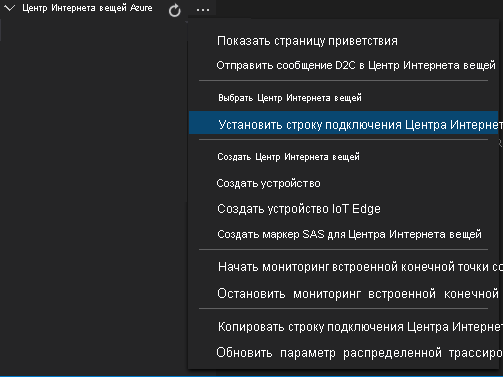

# <a name="tutorial-analyze-live-video-by-using-intel-openvino-dl-streamer--edge-ai-extension"></a>Учебник. Анализ прямой видеотрансляции с помощью модуля Edge DL Streamer в Intel OpenVINO™ (расширение ИИ для Edge). 

В этом учебнике показано, как применить модуль Edge DL Streamer в Intel OpenVINO™ (расширение ИИ для Edge) для анализа данных прямой видеотрансляции с (имитированной) IP-камеры. Вы увидите, как этот сервер вывода предоставляет доступ к разным моделям для обнаружения объектов (людей, автомобилей и велосипедов), классификации объектов (транспортных средств) и отслеживания объектов (людей, автомобилей и велосипедов). Интеграция с модулем gRPC позволяет передавать видеокадры на сервер вывода с поддержкой ИИ. Полученные результаты затем отправляются в Центр IoT Edge. Если эта служба вывода выполняется на том же вычислительном узле, что и Аналитика видеотрансляций, вы сможете воспользоваться преимуществами отправки видеоданных через общую память. Это позволяет выполнять вывод аналитики с той же частотой, которая используется для потока видеотрансляции (например, 30 кадров/с). 

В этом учебнике используется имитация видеотрансляции, а в качестве устройства IoT Edge — виртуальная машина Azure. Оно основывается на образце кода, написанном на C# для краткого руководства [Создание событий при обнаружении движения](detect-motion-emit-events-quickstart.md).

> [!NOTE]
> При работе с руководством требуется использование компьютера x86-64 в качестве пограничного устройства.

## <a name="prerequisites"></a>Предварительные требования

* Учетная запись Azure с активной подпиской. Если у вас еще нет учетной записи, [ создайте ее бесплатно](https://azure.microsoft.com/free/?WT.mc_id=A261C142F).
  > [!NOTE]
  > Вам потребуется подписка Azure с разрешениями на создание субъектов-служб (такие разрешения предоставляет роль **Владелец**). Если у вас нет нужных разрешений, обратитесь к администратору учетной записи с просьбой предоставить вам нужные разрешения. 
* [Visual Studio Code](https://code.visualstudio.com/) со следующими расширениями:
    * [Средства Интернета вещей Azure](https://marketplace.visualstudio.com/items?itemName=vsciot-vscode.azure-iot-tools)
    * [C#](https://marketplace.visualstudio.com/items?itemName=ms-dotnettools.csharp)
* [Пакет SDK для .NET Core 3.1](https://dotnet.microsoft.com/download/dotnet-core/3.1).
* Если вы еще не изучали краткое руководство [Создание событий при обнаружении движения](detect-motion-emit-events-quickstart.md), обязательно [настройте ресурсы Azure](detect-motion-emit-events-quickstart.md#set-up-azure-resources), выполнив указанные в нем шаги.

> [!TIP]
> Во время установки расширения Azure IoT Tools может появиться запрос на установку Docker. На него можно не обращать внимания.

## <a name="review-the-sample-video"></a>Просмотр примера видео

При настройке ресурсов Azure на виртуальную машину Linux в Azure, используемую в качестве устройства IoT Edge, копируется короткое видео с изображением автостоянки. В этом кратком руководстве для имитации потока в реальном времени используется видеофайл.

Откройте приложение, например [проигрыватель мультимедиа VLC](https://www.videolan.org/vlc/). Нажмите сочетание клавиш CTRL+N, а затем вставьте ссылку на [видео](https://lvamedia.blob.core.windows.net/public/lots_015.mkv), чтобы начать воспроизведение. Вы увидите видеоматериал с автомобилями на автостоянке, большинство из которых припарковано, а один движется.

> [!VIDEO https://www.microsoft.com/videoplayer/embed/RE4LUbN]

В этом кратком руководстве вы примените службу "Аналитика видеотрансляций" на базе IoT Edge в сочетании с модулем Edge DL Streamer в Intel OpenVINO™ (расширение ИИ для Edge) для обнаружения объектов (на примере транспортных средств), классификации обнаруженных транспортных средств и отслеживания транспортных средств, людей и велосипедов. Полученные события вывода будут опубликованы в центре IoT Edge.

## <a name="overview"></a>Обзор

> [!div class="mx-imgBorder"]
> :::image type="content" source="./media/use-intel-openvino-tutorial/grpc-vas-extension-with-vino.svg" alt-text="Обзор LVA MediaGraph":::

На схеме показан порядок передачи сигналов в этом кратком руководстве. [Модуль Edge](https://github.com/Azure/live-video-analytics/tree/master/utilities/rtspsim-live555) имитирует IP-камеру, на которой размещен RTSP-сервер. Узел [источника RTSP](media-graph-concept.md#rtsp-source) получает видеосигнал с этого сервера и передает видеокадры на узел [обработчика расширения gRPC](media-graph-concept.md#grpc-extension-processor). 

Узел обработчика расширения gRPC принимает декодированные видеокадры в качестве входных данных и передает эти кадры в конечную точку [gRPC](terminology.md#grpc), которую предоставляет сервер gRPC. Этот узел поддерживает передачу данных через [общую память](https://en.wikipedia.org/wiki/Shared_memory) или непосредственное внедрение содержимого в тело сообщения gRPC. Кроме того, этот узел имеет встроенный форматировщик изображений для масштабирования и кодирования видеокадров перед ретрансляцией в конечную точку gRPC. Средство масштабирования может сохранять пропорции, заполнять или растягивать исходное изображение. Кодировщик изображений поддерживает форматы JPEG, PNG и BMP. Подробнее об этом обработчике см. [здесь](media-graph-extension-concept.md#grpc-extension-processor).

Изучив данный учебник, вы научитесь:

1. развертывать граф мультимедиа;
1. Интерпретация результатов.
1. Очистка ресурсов.

## <a name="about-intel-openvino-dl-streamer--edge-ai-extension-module"></a>Общие сведения о модуле Edge DL Streamer в Intel OpenVINO™ (расширение ИИ для Edge)


Модуль Edge DL Streamer в Intel OpenVINO™ (расширение ИИ для Edge) представляет собой микрослужбу, основанную на службе Video Analytics Serving (VA Serving) компании Intel, которая обслуживает конвейеры видеоаналитики, созданные с помощью DL Streamer в OpenVINO™. Разработчики могут отправлять декодированные видеокадры в модуль расширения ИИ, который выполняет обнаружение, классификацию или отслеживание и возвращает результаты. Этот модуль расширения ИИ предоставляет API gRPC, совместимые с такими платформами анализа видео, как Аналитика видеотрансляций на базе IoT Edge корпорации Майкрософт. 

Чтобы создавать сложные высокопроизводительные решения для анализа видеотрансляций, Аналитику видеотрансляций в модуле IoT Edge следует связать с мощной подсистемой вывода, которая может использовать масштабирование в пограничной среде. В рамках этого учебника запросы на вывод отправляются в [модуль Edge DL Streamer в Intel OpenVINO™ (расширение ИИ для Edge)](), который предназначен для работы с Аналитикой видеотрансляций в IoT Edge. 

В первоначальном выпуске этого сервера вывода можно использовать указанные ниже [модели](https://github.com/intel/video-analytics-serving/tree/master/samples/lva_ai_extension#edge-ai-extension-module-options).

- object_detection for person_vehicle_bike_detection 

- object_classification for vehicle_attributes_recognition 

- object_tracking for person_vehicle_bike_tracking 

Он использует предварительно загруженные конвейеры обнаружения объектов, классификации объектов и отслеживания объектов, что позволит вам быстро приступить к работе. Кроме того, он дополняется предварительно загруженными моделями [person-vehicle-bike-detection-crossroad-0078](https://github.com/openvinotoolkit/open_model_zoo/blob/master/models/intel/person-vehicle-bike-detection-crossroad-0078/description/person-vehicle-bike-detection-crossroad-0078.md) и [vehicle-attributes-recognition-barrier-0039](https://github.com/openvinotoolkit/open_model_zoo/blob/master/models/intel/vehicle-attributes-recognition-barrier-0039/description/vehicle-attributes-recognition-barrier-0039.md).

> [!NOTE]
> Скачивая и используя модуль Edge DL Streamer в Intel OpenVINO™ (расширение ИИ для Edge) и прилагаемое программное обеспечение, вы подтверждаете согласие с условиями [лицензионного соглашения](https://www.intel.com/content/www/us/en/legal/terms-of-use.html).
> Intel обязуется уважать права человека и избегать соучастия в нарушениях этих прав. Дополнительные сведения см. на странице [Глобальные принципы прав человека в Intel](https://www.intel.com/content/www/us/en/policy/policy-human-rights.html). Продукты и программное обеспечение Intel предназначены только для приложений, использование которых не приводит к нарушению международно признанных прав человека.

Вы можете гибко применять разные конвейеры для конкретных сценариев использования, просто меняя переменные среды для этих конвейеров в шаблоне развертывания. Это позволяет быстро изменить модель конвейера, а в сочетании со службой "Аналитика видеотрансляций" на изменение конвейера мультимедиа и модели вывода потребуется всего несколько секунд.  

## <a name="create-and-deploy-the-media-graph"></a>Создание и развертывание графа мультимедиа

### <a name="examine-and-edit-the-sample-files"></a>Изучение и изменение образцов файлов

Согласно предварительным требованиям вы загрузили в папку пример кода. Выполните указания ниже, чтобы изучить и изменить файлы примеров.

1. В Visual Studio Code перейдите в папку *src/edge*. Здесь находится созданный нами *ENV*-файл и несколько файлов шаблона развертывания.

    Шаблон развертывания содержит манифест развертывания для пограничного устройства. Он содержит некоторые значения-заполнители. В *ENV*-файле указаны значения таких переменных.

1. Теперь перейдите в папку *src/cloud-to-device-console-app*. Здесь вы увидите файл *appSettings.json* и несколько других файлов:

    * ***c2d-console-app.csproj*** — файл проекта Visual Studio Code.
    * ***operations.json*** — список операций, которые должна запускать программа.
    * ***Program.cs*** — пример кода программы. Этот код выполняет следующие действия:

        * загружает параметры приложения;
        * вызывает прямые методы, которые представляются модулем Аналитики видеотрансляций в IoT Edge (с помощью модуля можно анализировать потоки видеотрансляции, вызывая его [прямые методы](direct-methods.md));
        * приостанавливает выполнение, позволяя проанализировать выходные данные программы в окне **ТЕРМИНАЛ** и проверить сгенерированные модулем события в окне **ВЫХОДНЫЕ ДАННЫЕ**;
        * вызывает прямые методы для очистки ресурсов.


1. Внесите правки в файл *operations.json*:
    * Измените ссылку на топологию графа:

        `"topologyUrl" : "https://raw.githubusercontent.com/Azure/live-video-analytics/master/MediaGraph/topologies/grpcExtensionOpenVINO/2.0/topology.json"`

    * В разделе `GraphInstanceSet` измените имя топологии графа, чтобы оно совпадало со значением в приведенной выше ссылке:

      `"topologyName" : "InferencingWithOpenVINOgRPC"`

    * В разделе `GraphTopologyDelete` измените имя:

      `"name": "InferencingWithOpenVINOgRPC"`

### <a name="generate-and-deploy-the-iot-edge-deployment-manifest"></a>Создание и развертывание манифеста развертывания IoT Edge

1. Щелкните правой кнопкой мыши файл *src/edge/deployment.openvino.grpc.cpu.template.json* и выберите **Generate IoT Edge Deployment Manifest** (Создать манифест развертывания IoT Edge).

      

    Файл манифеста *deployment.openvino.grpc.cpu.amd64.json* создается в папке *src/edge/config*.

> [!NOTE]
> Мы также добавили шаблон *deployment.openvino.grpc.gpu.template.json*, который предоставляет поддержку GPU для модуля DL Streamer в Intel OpenVINO (расширение ИИ для Edge). Эти шаблоны содержат ссылки на образ центра Docker компании Intel.

Упомянутые выше шаблоны содержат ссылки на образ центра Docker компании Intel. Если вы предпочитаете хранить копию шаблона в собственном Реестре контейнеров Azure, можно выполнить указанные ниже шаги 1 и 2:
1. Подключитесь по протоколу SSH к устройству, на котором установлены средства CLI для Docker (например, к пограничному устройству), а затем извлеките контейнер, присвойте ему тег и отправьте его, как описано ниже:
    * Извлеките образ Intel из центра Docker:

        `sudo docker pull intel/video-analytics-serving:0.4.1-dlstreamer-edge-ai-extension`
    
    * Присвойте образу Intel тег с собственным именем Реестра контейнеров Azure. Для этого замените заполнитель {YOUR ACR NAME} именем Реестра контейнеров Azure, которое можно взять из файла .env:

        `sudo docker image tag intel/video-analytics-serving:0.4.1-dlstreamer-edge-ai-extension {YOUR ACR NAME/video-analytics-serving:0.4.1-dlstreamer-edge-ai-extension}`
    
    * Передайте образ с тегом в Реестр контейнеров Azure:

        `sudo docker push {YOUR ACR NAME/video-analytics-serving:0.4.1-dlstreamer-edge-ai-extension}`
    
2. Теперь вам нужно изменить шаблоны, чтобы они ссылались на новый образ, размещенный в Реестре контейнеров Azure.
    * Щелкните правой кнопкой мыши шаблон *deployment.openvino.grpc.cpu.template.json* и найдите в нем раздел для модуля *lavExtension*, где замените следующий блок:

        `intel/video-analytics-serving:0.4.1-dlstreamer-edge-ai-extension`

        на:

        `{YOUR ACR NAME/video-analytics-serving:0.4.1-dlstreamer-edge-ai-extension}`
    * Повторите шаг 2 для файла *deployment.openvino.grpc.gpu.template.json*.


3. Если вы прошли краткое руководство [Создание событий при обнаружении движения](detect-motion-emit-events-quickstart.md), пропустите этот шаг. 

    В противном случае рядом с областью **Центр Интернета вещей Azure** в левом нижнем углу щелкните значок **Дополнительные действия**, а затем выберите **Установка строки подключения Центра Интернета вещей**. Строку можно скопировать из файла *appsettings.json*. Чтобы обеспечить правильность настройки центра Интернета вещей в Visual Studio Code, используйте команду [Выбрать центр Интернета вещей](https://github.com/Microsoft/vscode-azure-iot-toolkit/wiki/Select-IoT-Hub).
    
    

> [!NOTE]
> Возможно, вам будет предложено ввести сведения о встроенной конечной точке для Центра Интернета вещей. Чтобы получить эти сведения, на портале Azure перейдите в Центр Интернета вещей и найдите пункт **Встроенные конечные точки** в области навигации слева. Щелкните этот пункт и найдите значение **конечной точки, совместимой с центрами событий,** в разделе **Конечная точка, совместимая с концентратором событий**. В поле скопируйте текст и используйте его. Значение конечной точки будет приблизительно таким:  
    ```
    Endpoint=sb://iothub-ns-xxx.servicebus.windows.net/;SharedAccessKeyName=iothubowner;SharedAccessKey=XXX;EntityPath=<IoT Hub name>
    ```

1. Щелкните правой кнопкой мыши файл *src/edge/config/deployment.openvino.grpc.cpu.template.json* и выберите **Create Deployment for Single Device** (Создать развертывание для одного устройства). 

    

1. Когда появится запрос на выбор устройства Центра Интернета вещей, выберите **lva-sample-device**.
1. Примерно через 30 секунд обновите содержимое Центра Интернета вещей в левом нижнем углу окна. Теперь в пограничном устройстве должны отображаться следующие развернутые модули:

    * Модуль Аналитики видеотрансляций **lvaEdge**.
    * Модуль **rtspsim**, имитирующий RTSP-сервер, выступающий в качестве источника веб-канала видеотрансляции.
    * Модуль **lvaExtension**, то есть DL Streamer в Intel OpenVINO™ (расширение ИИ для Edge) 

### <a name="prepare-to-monitor-events"></a>Подготовка к мониторингу событий

Щелкните правой кнопкой мыши устройство Аналитики видеотрансляции и выберите **Запуск мониторинга встроенной конечной точки события**. Этот шаг необходим для мониторинга событий Центра Интернета вещей в окне **ВЫХОДНЫЕ ДАННЫЕ** в Visual Studio Code. 

 

### <a name="run-the-sample-program-to-detect-vehicles-persons-or-bike"></a>Запуск примера программы для распознавания транспортных средств, людей и велосипедов
Открыв [топологию графа](https://raw.githubusercontent.com/Azure/live-video-analytics/master/MediaGraph/topologies/grpcExtensionOpenVINO/2.0/topology.json) для этого учебника в браузере, вы увидите, что для `grpcExtensionAddress` установлено значение `tcp://lvaExtension:5001`. В отличие от примера *httpExtensionOpenVINO*, вам не нужно изменять URL-адрес сервера gRPC. Вместо этого используйте переменные среды, чтобы указать модулю нужный конвейер для запуска, как упоминалось ранее. В шаблоне по умолчанию мы присвоим значение "object_detection" для параметра "person_vehicle_bike_detection". Вы можете поэкспериментировать с другими поддерживаемыми конвейерами. 

1. В Visual Studio Code откройте вкладку **Расширения** (или нажмите клавиши CTRL+SHIFT+X) и найдите Центр Интернета вещей Azure.
1. Щелкните правой кнопкой мыши и выберите **Параметры расширения**.

    > [!div class="mx-imgBorder"]
    > :::image type="content" source="./media/run-program/extensions-tab.png" alt-text="Параметры расширения":::
1. Найдите и включите параметр "Show Verbose Message" (Показывать подробное сообщение).

    > [!div class="mx-imgBorder"]
    > :::image type="content" source="./media/run-program/show-verbose-message.png" alt-text="Show Verbose Message"::: (Показывать подробное сообщение)
1. Чтобы начать сеанс отладки, нажмите клавишу F5. В окне **ТЕРМИНАЛ** отображаются выводимые сообщения.
1. Код *operations.json* начинается с вызовов прямых методов `GraphTopologyList` и `GraphInstanceList`. Если вы очистили ресурсы после работы с предыдущими краткими руководствами, тогда этот процесс возвратит пустые списки, а затем приостановится. Чтобы продолжить, нажмите клавишу ВВОД.

    В окне **ТЕРМИНАЛ** показывается следующий набор вызовов прямых методов:

     * Вызов `GraphTopologySet`, который использует использованный ранее `topologyUrl`.
     * Вызов `GraphInstanceSet`, который использует такой код:

         ```
         {
           "@apiVersion": "2.0",
           "name": "Sample-Graph-1",
           "properties": {
             "topologyName": "InferencingWithOpenVINOgRPC",
             "description": "Sample graph description",
             "parameters": [
               {
                 "name": "rtspUrl",
                 "value": "rtsp://rtspsim:554/media/lots_015.mkv"
               },
               {
                 "name": "rtspUserName",
                 "value": "testuser"
               },
               {
                 "name": "rtspPassword",
                 "value": "testpassword"
               }
             ]
           }
         }
         ```

     * Вызов `GraphInstanceActivate`, который активирует экземпляр графа и поток видео.
     * Второй вызов к `GraphInstanceList`, который показывает, что экземпляр графа находится в состоянии выполнения
1. Вывод данных в окне **ТЕРМИНАЛ** приостановится с появлением предложения `Press Enter to continue`. Не нажимайте клавишу ВВОД на этом этапе. Прокрутите экран вверх, чтобы увидеть полезные данные ответов JSON на вызванные нами прямые методы.
1. Перейдите в окно **ВЫХОДНЫЕ ДАННЫЕ** в Visual Studio Code. Вы увидите сообщения, которые модуль Аналитики видеотрансляций в IoT Edge передает в центр Интернета вещей. Эти сообщения рассматриваются в следующем разделе этого краткого руководства.
1. Граф мультимедиа продолжит работать и выводить результаты. Симулятор RTSP будет продолжать циклический перебор исходного видео. Чтобы остановить граф мультимедиа, вернитесь к окну **ТЕРМИНАЛ** и нажмите клавишу ВВОД. 

    Следующая серия вызовов очищает ресурсы:
      * Вызов `GraphInstanceDeactivate` деактивирует экземпляр графа.
      * Вызов `GraphInstanceDelete` удаляет этот экземпляр.
      * Вызов `GraphTopologyDelete` удаляет топологию.
      * Окончательный вызов `GraphTopologyList` показывает, что список теперь пуст.

## <a name="interpret-results"></a>Интерпретация результатов

При запуске графа мультимедиа результаты из узла обработчика расширения HTTP отправляются через узел-преемник Центра Интернета вещей в центр Интернета вещей. Сообщения, отображаемые в окне **ВЫХОДНЫЕ ДАННЫЕ**, содержат раздел `body` и раздел `applicationProperties`. Дополнительные сведения см. в статье [Создание и чтение сообщений Центра Интернета вещей](../../iot-hub/iot-hub-devguide-messages-construct.md).

В приведенных ниже сообщениях модуль Аналитики видеотрансляций определяет свойства приложения и содержимое раздела body. 

### <a name="mediasessionestablished-event"></a>Событие MediaSessionEstablished

После создания экземпляра графа мультимедиа узел источника RTSP пытается подключиться к RTSP-серверу, работающему в контейнере rtspsim-live555. Если соединение установлено, будет выводиться указанное ниже событие. Тип этого события — **Microsoft.Media.MediaGraph.Diagnostics.MediaSessionEstablished**.

```
[IoTHubMonitor] [9:42:18 AM] Message received from [lvaedgesample/lvaEdge]:
{
  "sdp&quot;: &quot;SDP:\nv=0\r\no=- 1612432131600584 1 IN IP4 172.18.0.6\r\ns=Matroska video+audio+(optional)subtitles, streamed by the LIVE555 Media Server\r\ni=media/homes_00425.mkv\r\nt=0 0\r\na=tool:LIVE555 Streaming Media v2020.08.19\r\na=type:broadcast\r\na=control:*\r\na=range:npt=0-214.166\r\na=x-qt-text-nam:Matroska video+audio+(optional)subtitles, streamed by the LIVE555 Media Server\r\na=x-qt-text-inf:media/homes_00425.mkv\r\nm=video 0 RTP/AVP 96\r\nc=IN IP4 0.0.0.0\r\nb=AS:500\r\na=rtpmap:96 H264/90000\r\na=fmtp:96 packetization-mode=1;profile-level-id=64001F;sprop-parameter-sets=Z2QAH6zZQFAFuwFsgAAAAwCAAAAeB4wYyw==,aOvhEsiw\r\na=control:track1\r\n"
}
```

В этом сообщении обратите внимание на следующие сведения:

* Сообщение является событием диагностики. `MediaSessionEstablished` указывает, что исходный узел RTSP (параметр subject) установил подключение к симулятору RTSP и начал прием потока данных (имитируемого).
* В `applicationProperties` `subject` указывает, что сообщение было создано из узла RTSP-источника в графе мультимедиа.
* В `applicationProperties` `eventType` указывает, что это событие является событием диагностики.
* `eventTime` указывает время события.
* `body` содержит данные о событии диагностики. В этом случае данные содержат сведения [протокола SDP](https://en.wikipedia.org/wiki/Session_Description_Protocol).

### <a name="inference-event"></a>Событие вывода

Узел обработчика расширений gRPC получает результаты вывода от DL Streamer в Intel OpenVINO™ (расширение ИИ для Edge). Затем он выдает результаты через узел приемника Центра Интернета вещей в качестве событий вывода. 

В этих событиях тип имеет значение `entity`, чтобы указать, что это сущность, например легковой автомобиль или грузовик. Значение `eventTime` — время в формате UTC, когда был обнаружен объект. 

В следующем примере вы видите, что определено наличие транспортного средства, а также его тип (микроавтобус) и цвет (белый) с уровнем достоверности выше 0,9. Этому объекту назначен идентификатор сущности при использовании модели отслеживания объектов.

```
[IoTHubMonitor] [9:43:18 AM] Message received from [lva-sample-device/lvaEdge]:
{
  "timestamp": 145118912223221,
  "inferences": [
    {
      "type": "entity",
      "entity": {
        "tag": {
          "value": "vehicle",
          "confidence": 0.9605301
        },
        "attributes": [
          {
            "name": "color",
            "value": "white",
            "confidence": 0.9605301
          },
          {
            "name": "type",
            "value": "car",
            "confidence": 0.9605301
          }
        ],
        "box": {
          "l": 0.3958135,
          "t": 0.078730375,
          "w": 0.48403296,
          "h": 0.94352424
        },
        "id&quot;: &quot;1"
      }
    }
}
```

В сообщениях обратите внимание на следующие сведения:

* В `applicationProperties` `subject` — это узел в топологии графа, из которого было создано сообщение. 
* В `applicationProperties` `eventType` указывает, что это событие является событием аналитики.
* Значение `eventTime` — это время возникновения события.
* Раздел `body` содержит информацию об аналитическом событии. В этом случае событие является событием вывода, поэтому текст содержит данные `inferences`.
* Раздел `inferences` указывает, что `type` — это `entity`. Этот раздел содержит дополнительные данные о сущности.

## <a name="run-the-sample-program-to-detect-persons-or-vehicles-or-bikes"></a>Запуск примера программы для распознавания лиц или обнаружения автомобилей или велосипедов
Чтобы использовать другую модель, потребуется изменить шаблон развертывания. Чтобы переключиться между поддерживаемыми моделями, измените переменные среды в модуле lvaExtenstion. Поддерживаемые значения и сочетания для моделей см. в [этом документе на сайте GitHub](https://github.com/intel/video-analytics-serving/tree/master/samples/lva_ai_extension#edge-ai-extension-module-options).

```
"Env":[
"PIPELINE_NAME=object_classification",
"PIPELINE_VERSION=vehicle_attributes_recognition"
],
```
> [!TIP]
> Скопируйте шаблон и сохраните его под новым именем для каждого из используемых конвейеров. Так вы сможете переключаться между моделями, создавая новое развертывание на основе одного из этих шаблонов.

После изменения переменных вы можете снова развернуть шаблон на устройстве. Теперь повторите приведенные выше шаги, чтобы снова запустить пример программы с новым конвейером. Результаты вывода будут иметь очень сходные схемы, но содержать больше или меньше информации в зависимости от выбранной модели конвейера.

## <a name="clean-up-resources"></a>Очистка ресурсов

Если вы планируете изучить другие краткие руководства или учебники, сохраните созданные ресурсы. В противном случае на портале Azure перейдите к группам ресурсов, выберите группу ресурсов, с которой вы работали в этом учебнике, и удалите все ресурсы.

## <a name="next-steps"></a>Дальнейшие действия

Ознакомьтесь с дополнительными задачами для опытных пользователей.

* Вместо симулятора RTSP используйте [IP-камеру](https://en.wikipedia.org/wiki/IP_camera) с поддержкой RTSP. IP-камеры, поддерживающие протокол RTSP, можно найти на странице [продуктов, соответствующих ONVIF](https://www.onvif.org/conformant-products/). Ищите устройства, которые соответствуют профилям G, S или T.
* Используйте устройство Intel x64 на базе Linux вместо виртуальной машины Linux в Azure. Устройство должно находиться в той же сети, что и IP-камера. Вы можете выполнить инструкции из статьи [Install Azure IoT Edge runtime on Linux](../../iot-edge/how-to-install-iot-edge.md) (Установка среды выполнения Azure IoT Edge в системах Linux на основе Debian). Чтобы зарегистрировать устройство в Центре Интернета вещей Azure, следуйте инструкциям краткого руководства [Развертывание первого модуля IoT Edge на виртуальном устройстве Linux](../../iot-edge/quickstart-linux.md).