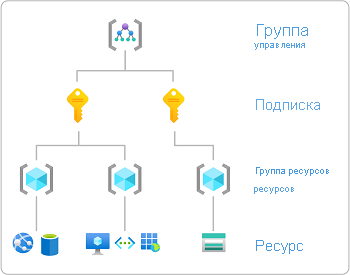

# Назначение ролей Azure с помощью портала Azure

[!INCLUDE [Azure RBAC definition grant access](../../includes/role-based-access-control/definition-grant.md)] В этой статье описывается назначение ролей с помощью портал Azure.

Если необходимо назначить роли администратора в Azure Active Directory, см. раздел [Просмотр и назначение ролей администратора в Azure Active Directory](../active-directory/roles/manage-roles-portal.md).

## Предварительные условия

[!INCLUDE [Azure role assignment prerequisites](../../includes/role-based-access-control/prerequisites-role-assignments.md)]

## Шаг 1. Определение требуемой области

[!INCLUDE [Scope for Azure RBAC introduction](../../includes/role-based-access-control/scope-intro.md)]

[!INCLUDE [Scope for Azure RBAC least privilege](../../includes/role-based-access-control/scope-least.md)] Дополнительные сведения об области действия см. в разделе [сведения о области](scope-overview.md).

1. Войдите на [портал Azure](https://portal.azure.com).

1. В поле поиска вверху найдите область, к которой требуется предоставить доступ. Например, выполните поиск **групп управления**, **подписок**, **групп ресурсов** или определенного ресурса.

    

1. Щелкните конкретный ресурс для этой области.

    Ниже показан пример группы ресурсов.

    

## Шаг 2. Открытие панели "Добавление назначения ролей"

**Управление доступом (IAM)** — это страница, которая обычно используется для назначения ролей для предоставления доступа к ресурсам Azure. Он также называется управление удостоверениями и доступом (IAM) и появляется в нескольких расположениях в портал Azure.

1. Выберите **Управление доступом (IAM)**.

    Ниже показан пример страницы "Управление доступом (IAM)" для группы ресурсов.

    

1. Перейдите на вкладку **назначения ролей** , чтобы просмотреть назначения ролей в этой области.

1. Нажмите кнопку **Добавить**  >  **добавить назначение ролей**.
   Если у вас нет прав назначать роли, функция "Добавить назначение роли" будет неактивна.

   

    Откроется панель "Добавить назначение ролей".

   

## Шаг 3. Выбор подходящей роли

1. В списке **роль** найдите или прокрутите список ролей, которые нужно назначить.

    Чтобы определить соответствующую роль, можно навести указатель мыши на значок сведений, чтобы отобразить описание роли. Дополнительные сведения можно просмотреть в статье [встроенные роли Azure](built-in-roles.md) .

   

1. Щелкните, чтобы выбрать роль.

## Шаг 4. Выбор пользователей, которым требуется доступ

1. В списке **назначить доступ к** выберите тип субъекта безопасности, которому нужно назначить доступ.

    | Type | Описание |
    | --- | --- |
    | **Пользователь, группа или субъект-служба** | Если вы хотите назначить роль пользователю, группе или субъекту-службе (приложению), выберите этот тип. |
    | **Управляемое удостоверение, назначенное пользователем** | Если вы хотите назначить роль [управляемому удостоверению, назначенному пользователем](../active-directory/managed-identities-azure-resources/overview.md), выберите этот тип. |
    | *Управляемое удостоверение, назначенное системой* | Если необходимо назначить роль [управляемому удостоверению, назначенному системой](../active-directory/managed-identities-azure-resources/overview.md), выберите экземпляр службы Azure, в котором находится управляемое удостоверение. |

   

1. Если вы выбрали управляемое удостоверение, назначенное пользователем, или управляемое системой удостоверение, выберите **подписку** , в которой находится управляемое удостоверение.

1. В разделе **Выбор** найдите субъект безопасности, введя строку или прокрутите список.

   

1. Найдя субъект безопасности, щелкните его, чтобы выбрать.

## Шаг 5. Назначение роли

1. Чтобы назначить роль, нажмите кнопку **сохранить**.

   Через несколько секунд субъекту безопасности будет назначена роль в выбранной области.

1. На вкладке **назначения ролей** убедитесь, что в списке отображается назначение роли.

    

## Дальнейшие действия

- [Назначение пользователя администратором подписки Azure](role-assignments-portal-subscription-admin.md)
- [Удаление назначений ролей Azure](role-assignments-remove.md)
- [Устранение неполадок в Azure RBAC](troubleshooting.md)
