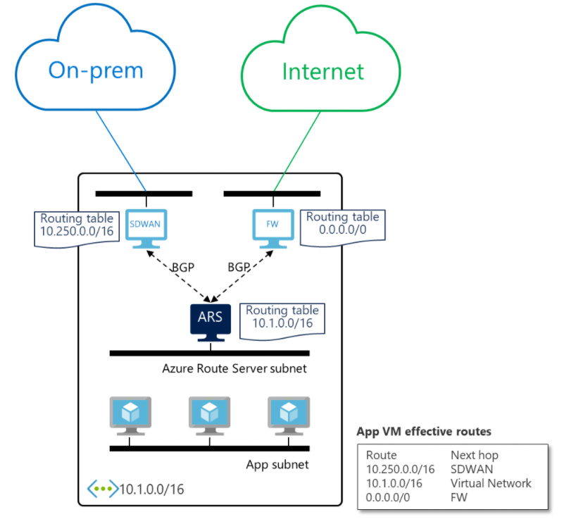

# Что такое сервер маршрутизации Azure (предварительная версия)? 

Сервер маршрутизации Azure упрощает динамическую маршрутизацию между виртуальными сетевыми модулями (NVA) и виртуальной сетью. Он позволяет обмениваться сведениями о маршрутизации напрямую с помощью протокола BGP между любыми NVA, которые поддерживают этот протокол, и программно-определяемой сетью Azure (SDN) в виртуальной сети Azure без необходимости вручную настраивать и обслуживать таблицы маршрутов. Сервер маршрутизации Azure — это полностью управляемая служба, настроенная для обеспечения высокого уровня доступности.

> [!IMPORTANT]
> Сервер маршрутизации Azure (предварительная версия) сейчас предоставляется в общедоступной предварительной версии.
> Эта предварительная версия предоставляется без соглашения об уровне обслуживания и не рекомендована для использования рабочей среде. Некоторые функции могут не поддерживаться или их возможности могут быть ограничены.
> Дополнительные сведения см. в статье [Дополнительные условия использования предварительных выпусков Microsoft Azure](https://azure.microsoft.com/support/legal/preview-supplemental-terms/).

## Как это работает?

На приведенной ниже схеме показано, как сервер маршрутизации Azure работает с SDWAN NVA и NVA для обеспечения безопасности в виртуальной сети. После установки пиринга BGP сервер маршрутизации Azure получит локальный маршрут (10.250.0.0/16) от устройства SDWAN и маршрут по умолчанию (0.0.0.0/0) от брандмауэра. Затем эти маршруты автоматически настраиваются на виртуальных машинах в виртуальной сети. В результате весь трафик, предназначенный для локальной сети, будет отправляться на устройство SDWAN, а весь Интернет-трафик — в брандмауэр. В обратном направлении сервер маршрутизации Azure отправляет адрес виртуальной сети (10.1.0.0/16) в оба NVA. Устройство SDWAN может передавать его дальше в локальную сеть.

## Основные преимущества 

Сервер маршрутизации Azure упрощает настройку и развертывание NVA, а также управление им в виртуальной сети.  

* Вам больше не нужно вручную обновлять таблицу маршрутизации в NVA при каждом обновлении адресов виртуальной сети. 

* Также нет необходимости вручную обновлять [определяемые пользователем маршруты](../virtual-network/virtual-networks-udr-overview.md) каждый раз, когда NVA объявляет новые маршруты или отзывает старые. 

* Кроме того, не требуется настраивать подсистему балансировки нагрузки перед NVA для обеспечения устойчивости или производительности. При установке пиринга нескольких экземпляров NVA с сервером маршрутизации Azure можно настроить атрибуты BGP на NVA. Эти атрибуты BGP укажут серверу маршрутизации Azure, какой экземпляр NVA должен быть активным или пассивным. 

* Интерфейс между NVA и сервером маршрутизации Azure основан на общем стандартном протоколе. При условии, что NVA поддерживает BGP, вы можете использовать пиринг с сервером маршрутизации Azure. Дополнительные сведения см. в разделе [Какие протоколы маршрутизации поддерживает сервер маршрутизации Azure](route-server-faq.md#protocol).

* Вы можете развернуть сервер маршрутизации Azure в любой новой или существующей виртуальной сети. 

## ВОПРОСЫ И ОТВЕТЫ

См. раздел с [вопросами и ответами о сервере маршрутизации Azure](route-server-faq.md).

## Дальнейшие действия

- [Узнайте, как настроить сервер маршрутизации Azure.](quickstart-configure-route-server-portal.md)
- [Узнайте, как сервер маршрутизации Azure работает с Azure ExpressRoute и Azure VPN.](expressroute-vpn-support.md)
