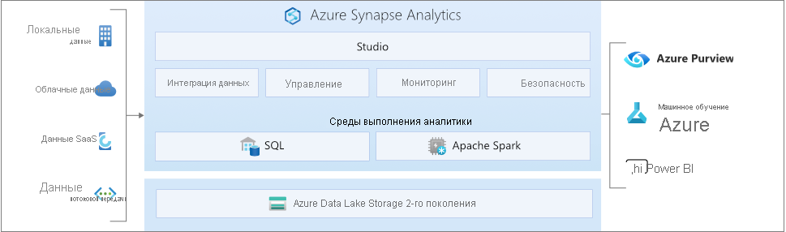

# Что такое Azure Synapse Analytics?

**Azure Synapse** — это корпоративная служба аналитики, которая ускоряет извлечение аналитических сведений в разных хранилищах данных и системах больших данных. Azure Synapse сочетает в себе лучшие **технологии SQL**, используемые в корпоративных хранилищах данных, **технологии Spark**, используемые при работе с большими данными, **конвейеры** для интеграции данных и их извлечения, преобразования и загрузки, а также возможности глубокой интеграции с другими службами Azure, такими как **Power BI**, **CosmosDB** и **AzureML**.

## Ведущая в отрасли система SQL

**Synapse SQL** — это система распределенных запросов для T-SQL, которая поддерживает сценарии хранения и виртуализации данных, а также расширяет возможности T-SQL для реализации сценариев потовокой передачи и машинного обучения.

* Synapse SQL предлагает **бессерверные** модели и модели **выделенных ресурсов**. Для прогнозируемой производительности и затрат можно создавать выделенные пулы SQL, чтобы резервировать вычислительные мощности для данных, хранящихся в таблицах SQL. Для незапланированных или пакетных рабочих нагрузок используйте бессерверную конечную точку SQL, которая всегда доступна.
* Используйте встроенные возможности **потоковой передачи** для передачи данных из облачных источников данных в таблицы SQL.
* Объедините возможности искусственного интеллекта с SQL с помощью моделей **машинного обучения** для оценки данных с использованием [функции T-SQL PREDICT](/sql/t-sql/queries/predict-transact-sql?view=azure-sqldw-latest&preserve-view=true).

## Подсистема Apache Spark, являющаяся отраслевым стандартом

Решение **Apache Spark для Azure Synapse** плотно интегрировано с Apache Spark — самой популярной подсистемой обработки больших данных с открытым кодом. Она обеспечивает подготовку, инжиниринг, извлечение, преобразование и загрузку данных, а также машинное обучение.

* Модели машинного обучения с алгоритмами SparkML и интеграцией Azure ML для Apache Spark 2.4 со встроенной поддержкой Linux Foundation Delta Lake.
* Упрощенная модель ресурсов, которая освобождает вас от необходимости заниматься управлением кластерами.
* Быстрый запуск подсистемы Spark и быстрое автомасштабирование.
* Встроенная поддержка .NET для Spark, позволяющая использовать опыт работы с языком C# и существующий код .NET в приложении Spark.

## Работа с Data Lake

Azure Synapse устраняет традиционные технологические барьеры, препятствующие совместному использованию SQL и Spark. Вы можете легко сочетать их в соответствии со своими потребностями и опытом.

* Таблицы, созданные на основе файлов в озере данных, поглощаются Spark или Hive.
* SQL и Spark могут напрямую изучать и анализировать файлы Parquet, CSV, TSV и JSON, хранящиеся в озере данных.
* Быстрая масштабируемая передача данных между базами данных SQL и Spark

## Встроенная интеграция данных

Azure Synapse включает тот же механизм интеграции данных и возможности, что и Фабрика данных Azure. Это позволяет создавать многофункциональные конвейеры для извлечения, преобразования и загрузки данных в большом масштабе в самой службе Azure Synapse Analytics.

* Прием данных из более чем 90 источников.
* Извлечение, преобразование и загрузка без кода с помощью действий потока данных.
* Управление записными книжками, заданиями Spark, хранимыми процедурами, скриптами SQL и т. д.

## Унифицированное управление, мониторинг и обеспечение безопасности

Azure Synapse предоставляет предприятиям единый способ управления ресурсами аналитики, мониторинга использования и активности, а также обеспечения безопасности:

* Назначение пользователям ролей для упрощения доступа к ресурсам аналитики.
* Детальное управление доступом к данным и коду.
* Единая панель мониторинга, предназначенная для мониторинга ресурсов, использования и пользователей в SQL и Spark.

## Унифицированное взаимодействие с пользователем.

**Synapse Studio** — это интерфейс для взаимодействия с пользователем, который объединяет все возможности для специалистов по работе с данными. Он позволяет выполнять все задачи, требуемые для создания полного решения аналитики.

* Единый интерфейс для выполнения ключевых задач специалистов по работе с данными, включая прием, исследование, подготовку, оркестрацию и визуализацию.
* Самые высокие в отрасли показатели продуктивности при написании кода SQL или Spark: разработка, отладка и оптимизация производительности.
* Интеграция с корпоративным процессом CI/CD.

## Присоединяйтесь к сообществу Synapse

- [Microsoft Q&A:](/answers/topics/azure-synapse-analytics.html) технические вопросы.
- [Stack Overflow](https://stackoverflow.com/questions/tagged/azure-synapse). Вопросы по разработке.

## Дальнейшие действия

* [Начало работы с Azure Synapse Analytics](get-started.md)
* [Создание рабочей области](quickstart-create-workspace.md)
* [Использование бессерверного пула SQL](quickstart-sql-on-demand.md)
