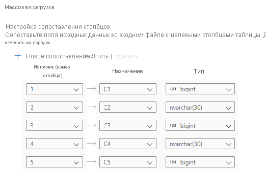

# Краткое руководство. Массовая загрузка в Synapse Studio

Благодаря мастеру массовой загрузки в Synapse Studio загружать данные стало гораздо проще. Synapse Studio — это компонент Azure Synapse Analytics. Этот мастер массовой загрузки поможет вам создать скрипт T-SQL с использованием [инструкции COPY](/sql/t-sql/statements/copy-into-transact-sql?view=azure-sqldw-latest&preserve-view=true) для массовой загрузки данных в выделенный пул SQL. 

## Точки входа в мастер массовой загрузки

Вы можете выполнить массовую загрузку данных, щелкнув правой кнопкой мыши показанную ниже область в Synapse Studio — файл или папку из учетной записи хранения Azure, которая подключена к рабочей области.

## Предварительные требования

- Мастер создает инструкцию COPY, которая использует сквозную передачу через Azure AD для аутентификации. У [пользователя Azure AD должны быть разрешения на доступ](./sql-data-warehouse/quickstart-bulk-load-copy-tsql-examples.md#d-azure-active-directory-authentication) к рабочей области по меньшей мере с ролью Azure участника данных BLOB-объектов хранилища в учетной записи Azure Data Lake Storage 2-го поколения. 

- У вас должны быть [разрешения на использование инструкции COPY](/sql/t-sql/statements/copy-into-transact-sql?view=azure-sqldw-latest&preserve-view=true#permissions) и разрешения на создание таблиц, если для загрузки будет создаваться новая таблица.

- У соответствующей службы, связанной с учетной записью Data Lake Storage 2-го поколения, *должны быть разрешения на доступ к файлу или папке* для загрузки. Например, если для связанной службы используется способ проверки подлинности с помощью управляемого удостоверения, управляемое удостоверение рабочей области должно иметь по меньшей мере роль читателя для BLOB-объектов хранилища в учетной записи хранения.

- Если в рабочей области включена виртуальная сеть, убедитесь, что для интегрированной среды выполнения, связанной с соответствующими службами учетной записи Data Lake Storage 2-го поколения для определения исходных данных и файлов ошибок, включена интерактивная разработка. Интерактивная разработка требуется для автоматического обнаружения схемы, а также просмотра содержимого исходного файла и учетных записей хранения Data Lake Storage 2-го поколения в мастере.

## Шаги

1. На панели **Исходное место хранения** выберите учетную запись хранения и файл или папку, из которых вы загружаете данные. Мастер попытается автоматически обнаружить файлы Parquet и текстовые файлы с разделителями (CSV), включая сопоставление исходных полей из файла с соответствующими типами данных SQL. 

   

2. Выберите параметры формата файла, включая параметры ошибок, если в процессе выполнения массовой загрузки были отклонены строки. Кроме того, выбрав элемент **Предварительный просмотр данных**, вы увидите, как инструкция COPY будет анализировать файл. Это поможет вам настроить параметры формата файла. Выбирайте элемент **Предварительный просмотр данных** при каждом изменении параметра формата файла, чтобы увидеть, как инструкция COPY анализирует файл с обновленными параметрами.

    

   > [!NOTE]  
   >
   > - Мастер массовой загрузки не поддерживает предварительный просмотр данных с признаками конца поля в виде нескольких символов. Если задан такой признак конца поля, мастер массовой загрузки выведет данные для предварительного просмотра в одном столбце. 
   > - При выборе параметра **Вывод имен столбцов** мастер массовой загрузки будет анализировать имена столбцов из первой строки, указанной в поле **Первая строка**. Мастер массовой загрузки автоматически увеличит значение `FIRSTROW` в инструкции COPY на 1, чтобы пропустить эту строку заголовка. 
   > - В инструкции COPY поддерживается указание признаков конца строки в виде нескольких символов. При этом мастер массовой загрузки не поддерживает такую возможность и выдаст ошибку.

3. Выберите выделенный пул SQL, который вы используете для загрузки, и укажите, куда загружать данные — в существующую или новую таблицу.
   
4. Выберите элемент **Настроить сопоставление столбцов**, чтобы проверить правильность сопоставления. Обратите внимание, что имена столбцов будут автоматически обнаружены, если включен параметр **Вывод имен столбцов**. Для новых таблиц очень важно настроить сопоставление столбцов, так как это позволяет обновлять типы данных для целевого столбца.

   
5. Выберите элемент **Открыть скрипт**. Будет создан скрипт T-SQL с инструкцией COPY для загрузки данных из озера данных.
   

## Дальнейшие действия

- Дополнительные сведения о возможностях инструкции COPY см. в [этой статье](/sql/t-sql/statements/copy-into-transact-sql?view=azure-sqldw-latest&preserve-view=true#syntax).
- Информацию об использовании процесса ETL (извлечение, преобразование и загрузка) см. в статье с [общими сведениями о загрузке данных](./sql-data-warehouse/design-elt-data-loading.md#what-is-elt).
