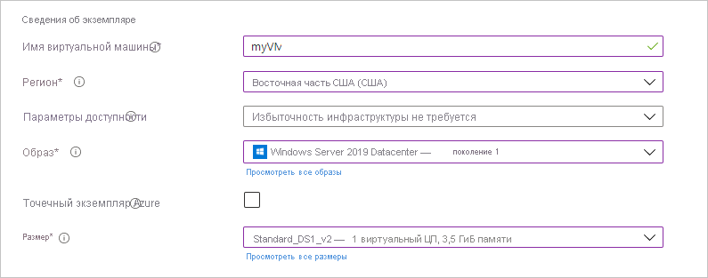
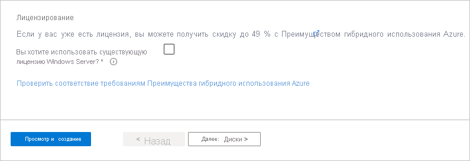

# <a name="quickstart-create-a-windows-virtual-machine-in-the-azure-portal"></a>Краткое руководство. Создание виртуальной машины Windows на портале Azure

Виртуальные машины Azure можно создать на портале Azure. В этом случае для создания виртуальных машин и всех связанных ресурсов используется пользовательский интерфейс в браузере. В этом кратком руководстве показано, как с помощью портала Azure развернуть в Azure виртуальную машину Windows под управлением Windows Server 2019. Чтобы проверить работу виртуальной машины, вы подключитесь к ней по протоколу удаленного рабочего стола (RDP) и установите веб-сервер IIS.

Если у вас еще нет подписки Azure, [создайте бесплатную учетную запись](https://azure.microsoft.com/free/?WT.mc_id=A261C142F), прежде чем начинать работу.

## <a name="sign-in-to-azure"></a>Вход в Azure

Войдите на портал Azure по адресу https://portal.azure.com.

## <a name="create-virtual-machine"></a>Создание виртуальной машины

1. В поле поиска введите **виртуальные машины**.
1. В разделе **Службы** выберите **Виртуальные машины**.
1. На странице **Виртуальные машины** выберите **Добавить**, а затем — **Виртуальная машина**. 
1. На вкладке **Основные сведения** в разделе **Сведения о проекте** убедитесь, что выбрана правильная подписка, и при необходимости щелкните **Создать** для группы ресурсов. Введите *myResourceGroup* в качестве имени. 

    

1. В разделе **Подробности об экземпляре** введите *myVM* в поле **Имя виртуальной машины** и выберите *Восточная часть США* в поле **Регион**. Выберите *Windows Server 2019 Datacenter* для параметра **Образ** и *Standard_DS1_v2* для параметра **Размер**. Оставьте другие значения по умолчанию.

    

1. В разделе **Учетная запись администратора** укажите имя пользователя, например *azureuser*, и пароль. Пароль должен включать минимум 12 символов и соответствовать [определенным требованиям к сложности](faq.md#what-are-the-password-requirements-when-creating-a-vm).

    

1. В разделе **Правила входящего порта** щелкните **Разрешить выбранные порты**, а затем выберите **RDP (3389)** и **HTTP (80)** из раскрывающегося списка.

    

1. Оставьте остальные значения по умолчанию и нажмите кнопку **Просмотр и создание**, расположенную в нижней части страницы.

    

1. После выполнения проверки нажмите кнопку **Создать** в нижней части страницы.

1. По завершении развертывания нажмите кнопку **Перейти к ресурсу**.

    

## <a name="connect-to-virtual-machine"></a>Подключение к виртуальной машине

Создайте подключение удаленного рабочего стола к виртуальной машине. Ниже представлены инструкции для подключения к виртуальной машине с компьютера Windows. На компьютере Mac вам понадобится клиент RDP, например [Remote Desktop Client](https://apps.apple.com/app/microsoft-remote-desktop/id1295203466?mt=12) из Mac App Store.

1. На странице обзора виртуальной машины нажмите кнопку **Подключиться**, а затем выберите **RDP**. 

    
    
2. На странице **Подключение с помощью RDP** сохраните значения по умолчанию, чтобы использовать подключение по IP-адресу через порт 3389, и щелкните **Скачать RDP-файл**.

2. Откройте скачанный RDP-файл и при появлении запроса нажмите кнопку **Подключиться**. 

3. В окне **Безопасность Windows** выберите **Варианты выбора** и нажмите **Использовать другую учетную запись**. Введите имя пользователя в формате **localhost**\\*имя_пользователя*, а затем введите созданный для этой виртуальной машины пароль и нажмите кнопку **ОК**.

4. При входе в систему может появиться предупреждение о сертификате. Щелкните **Да** или **Продолжить**, чтобы создать подключение.

## <a name="install-web-server"></a>Установка веб-сервера

Чтобы проверить работу виртуальной машины, установите веб-сервер IIS. На виртуальной машине откройте командную строку PowerShell и выполните следующую команду:

```powershell
Install-WindowsFeature -name Web-Server -IncludeManagementTools
```

После этого закройте RDP-подключение к виртуальной машине.


## <a name="view-the-iis-welcome-page"></a>Просмотр страницы приветствия IIS

На портале выберите виртуальную машину и в обзоре виртуальной машины наведите указатель мыши на IP-адрес, чтобы показать пункт **Копировать в буфер обмена**. Скопируйте IP-адрес и вставьте его на вкладку браузера. Откроется страница приветствия IIS по умолчанию, которая будет иметь следующий вид:


## <a name="clean-up-resources"></a>Очистка ресурсов

Если группа ресурсов, виртуальная машина и все связанные с ними ресурсы вам больше не требуются, их можно удалить. 

Перейдите в группу ресурсов для виртуальной машины и выберите **Удалить группу ресурсов**. Подтвердите имя группы ресурсов, чтобы завершить удаление ресурсов.

## <a name="next-steps"></a>Дальнейшие действия

При работе с этим кратким руководством вы развернули простую виртуальную машину, открыли сетевой порт для веб-трафика и установили базовый веб-сервер. Дополнительные сведения о виртуальных машинах Azure см. в руководстве по работе с виртуальными машинами Windows.

> [!div class="nextstepaction"]
> [Создание виртуальных машин Windows и управление ими с помощью модуля Azure PowerShell](./tutorial-manage-vm.md)
