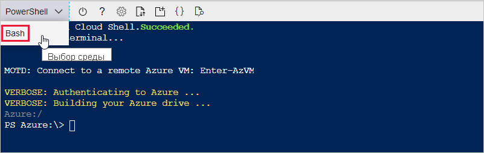

В следующих разделах показано, как настроить терминал и использовать Azure CLI для создания центра Интернета вещей. Чтобы настроить терминал, выполняющий команды Azure CLI, используйте Azure Cloud Shell на основе браузера или локальный терминал.
* Сведения об использовании Cloud Shell см. в разделе [Запуск Cloud Shell](#launch-the-cloud-shell). 
* Чтобы использовать локальный терминал, пропустите следующий раздел и ознакомьтесь со сведениями в разделе [Открытие локального терминала](#open-a-local-terminal).

## <a name="launch-the-cloud-shell"></a>Запуск Cloud Shell
Используя инструкции из этого раздела, вы создадите сеанс Cloud Shell и настроите окружение терминала.

Войдите на портал Azure по адресу https://portal.azure.com.  

Чтобы запустить Cloud Shell:

1. На **портале Azure** в правом верхнем углу в строке меню нажмите кнопку Cloud Shell. 

    

    > [!NOTE]
    > Если вы используете Cloud Shell в первый раз, вам будет предложено создать хранилище, необходимое для использования Cloud Shell.  Выберите подписку для создания учетной записи хранения и общей папки для службы файлов Microsoft Azure. 

2. Выберите предпочтительную среду CLI в раскрывающемся списке **Выбор среды**. В этом кратком руководстве используется среда **Bash**. Все приведенные ниже команды CLI также работают в среде PowerShell. 

    

3. Пропустите следующий раздел и перейдите к разделу [Установка расширения Интернета вещей Azure](#install-the-azure-iot-extension). 

## <a name="open-a-local-terminal"></a>Открытие локального терминала
Если вы решили использовать локальный терминал, а не Cloud Shell, выполните инструкции из этого раздела.  

1. Откройте локальный терминал.
1. Выполните команду [az login](/cli/azure/reference-index#az_login).

   ```azurecli
   az login
   ```

    Если в CLI можно запустить браузер по умолчанию, откроется браузер со страницей входа.

    Если нет, самостоятельно откройте в браузере страницу https://aka.ms/devicelogin и введите код авторизации, отображаемый в терминале.

    Если веб-браузер недоступен или его не удается открыть, используйте поток кода устройства с применением `az login --use-device-code`.

1. Выполните вход в браузере с помощью учетных данных.

    Дополнительные сведения о различных методах проверки подлинности см. в статье [Вход с помощью Azure CLI]( /cli/azure/authenticate-azure-cli ).

1. Перейдите к следующему разделу [Установка расширения Интернет вещей Azure](#install-the-azure-iot-extension). 

## <a name="install-the-azure-iot-extension"></a>Установка расширения Интернета вещей Azure
Используя инструкции из этого раздела, вы установите расширение Интернета вещей Microsoft Azure для Azure CLI в оболочке CLI. Расширение Интернета вещей добавляет в Azure CLI специальные команды Центра Интернета вещей, IoT Edge и службы подготовки устройств Интернета вещей (DPS).

> [!IMPORTANT]
> Команды терминала в оставшейся части этого краткого руководства работают одинаково как в Cloud Shell, так и в локальном терминале. Чтобы выполнить команду, выберите **Копировать** и скопируйте блок кода из этого краткого руководства. Затем вставьте его в оболочку CLI и запустите.

Выполните команду [az extension add](/cli/azure/extension#az-extension-add). 

   ```azurecli
   az extension add --name azure-iot
   ```
[!INCLUDE [iot-hub-cli-version-info](iot-hub-cli-version-info.md)]

## <a name="create-an-iot-hub"></a>Создание Центра Интернета вещей
В этом разделе описано, как использовать Azure CLI для создания центра Интернета вещей и группы ресурсов.  Группа ресурсов Azure является логическим контейнером, в котором происходит развертывание ресурсов Azure и управление ими. Центр Интернета вещей действует в качестве центра сообщений для двусторонней связи между приложением Интернета вещей и устройствами. 

Чтобы создать центр Интернета вещей и группу ресурсов, выполните следующие действия:

1. Выполните команду [az group create](/cli/azure/group#az-group-create), чтобы создать группу ресурсов. В следующей команде создается группа ресурсов с именем *MyResourceGroup* в расположении *eastus*. 
    >[!NOTE]
    > При необходимости можно задать альтернативное расположение. Чтобы отобразить доступные расположения, выполните команду `az account list-locations`. В рамках работы с этим учебником используется *eastus*, как показано в примере команды. 

    ```azurecli
    az group create --name MyResourceGroup --location eastus
    ```

1. Создайте Центр Интернета вещей с помощью команды [az iot hub create](/cli/azure/iot/hub#az-iot-hub-create). Создание Центра Интернета вещей может занять несколько минут. 

    *YourIotHubName* Замените этот заполнитель и окружающие фигурные скобки в указанной ниже команде именем своего центра Интернета вещей. Имя центра Интернета вещей должно быть уникальным по всему Azure. Используйте имя центра Интернета вещей при работе с оставшейся частью этого краткого руководства везде вместо заполнителя.

    ```azurecli
    az iot hub create --resource-group MyResourceGroup --name {YourIoTHubName}
    ```

## <a name="create-a-simulated-device"></a>Создайте виртуальное устройство.
Используя инструкции из этого раздела вы создадите имитированное устройство Интернета вещей, подключенное к центру Интернета вещей. 

Чтобы создать имитированное устройство, выполните приведенные ниже действия.
1. В оболочке CLI выполните команду [az iot hub device-identity create](/cli/azure/ext/azure-iot/iot/hub/device-identity#ext-azure-iot-az-iot-hub-device-identity-create). При этом создается удостоверение имитированного устройства. 

    *YourIotHubName* Замените этот заполнитель именем вашего центра Интернета вещей. 

    *myDevice*. Это имя можно использовать непосредственно для имитированного устройства при работе с оставшейся частью этой статьи. При необходимости можете использовать другое имя. 

    ```azurecli
    az iot hub device-identity create --device-id myDevice --hub-name {YourIoTHubName} 
    ```

1.  Выполните команду [az iot hub device-identity connection-string show](/cli/azure/ext/azure-iot/iot/hub/device-identity/connection-string#ext_azure_iot_az_iot_hub_device_identity_connection_string_show). 

    ```azurecli
    az iot hub device-identity connection-string show --device-id myDevice --hub-name {YourIoTHubName}
    ```

    Выходные данные строки подключения имеют следующий формат:

    ```Output
    HostName=<your IoT Hub name>.azure-devices.net;DeviceId=<your device id>;SharedAccessKey=<some value>
    ```

1. Сохраните строку подключения в безопасном расположении. 

> [!NOTE]
> Не закрывайте оболочку CLI. Оно понадобится вам на последующих шагах.